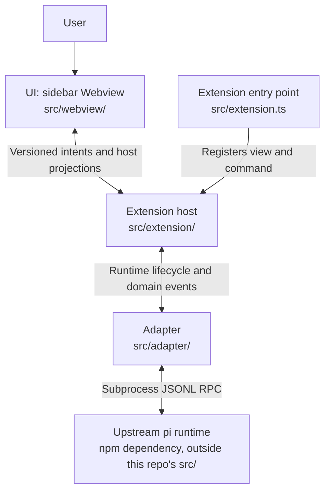

# pi VS Code system architecture

English | [中文](vscode-extension-architecture.zh.md)

- Type: Architecture
- Status: Proposed
- Created: 2026-09-19
- Authority: structure, boundaries, and owners (not implemented features)
- Related gates: [`../reference/architecture-gates.md`](../reference/architecture-gates.md)
- Sibling reference: [`pi-desktop`](https://github.com/earendil-works/pi-desktop) (Electron presentation layer; same pi integration principles, different host)
- Upstream: [pi](https://github.com/earendil-works/pi) coding-agent runtime (read-only sibling checkout `../pi` during development)

> Proposed architecture. Do not describe capabilities as shipped until spikes and Accepted ADRs close the related gates.

## 1. Context

**pi VS Code** is a VS Code extension that presents [pi](https://github.com/earendil-works/pi) as a **sidebar chat companion** while the user edits code—similar in placement to GitHub Copilot Chat and OpenAI Codex: **Explorer stays on the primary (left) sidebar**; pi chat lives in a **Webview View**, preferring the **Secondary Side Bar** (right) when the host supports it.

The extension is a **presentation and orchestration layer**. It does not reimplement pi’s agent loop, providers, tools, compaction, or session file semantics.

## 2. Layer model

| Layer | Responsibility | Owner (this repo) |
|-------|----------------|-------------------|
| **UI (Webview)** | Chat layout, streaming display, local UI state only | `src/webview/` |
| **Extension host** | Activation, commands, configuration, `SecretStorage`, workspace trust policy, webview lifecycle, validated `postMessage` bridge | `src/extension/` |
| **Adapter** | pi SDK or RPC subprocess → internal domain events consumed by host + webview | `src/adapter/` |
| **Runtime (upstream)** | Models, tools, sessions, project resources | pi packages / subprocess |

The diagram shows the current layers and call direction. ACTIVE and historical records establish implementation scope and product acceptance; the diagram does not certify complete boundary verification.

<!-- docs-i18n: localized-mermaid -->

## 3. UI placement (product default)

| Surface | Role | Default |
|---------|------|---------|
| **Primary sidebar** | Explorer, SCM, etc. | Unchanged (user keeps file tree on the left) |
| **Secondary Side Bar** | pi chat **Webview View** | **Preferred** default dock (VS Code `viewsContainers.secondarySidebar`) |
| **Primary sidebar fallback** | Same webview view container | Compatibility direction; verify the target host, without promising automatic fallback |
| **Editor-area panel** | Full-tab chat | **Parking lot** (optional later; not MVP default) |

The `pi-vscode.focusChat` command reveals the existing container and focuses chat from the editor title or Command Palette. Placement compatibility requires target-host verification.

## 4. Trust boundaries

- **Secrets** (API keys, tokens): extension host only (`SecretStorage` / env policy). **Never** pass to webview HTML/JS or webview `localStorage`.
- **Webview**: no `require`, no direct pi SDK, no filesystem or shell. Only structured messages in the [message contract](../reference/webview-messages.md).
- **Workspace access**: host reads/writes files per user action and VS Code workspace trust; webview requests capabilities via messages, host validates.
- **Sessions**: do not read/write pi session files for product session features unless an Accepted ADR explicitly allows; prefer SDK/RPC session APIs.
- **Honesty**: do not describe the webview or extension host as a security sandbox against untrusted code; pi retains tool and shell capabilities per upstream design.

## 5. Main flows and lifecycle

1. **Open**: user opens pi view in secondary sidebar → host creates/retains `WebviewView` → webview loads an inline page script with strict CSP and a nonce.
2. **Chat**: webview sends user input message → host → adapter → pi runtime stream → host forwards bounded presentation projections to webview (filtering cannot guarantee arbitrary output is secret-free).
3. **View disposal and runtime shutdown**: disposing or replacing a Webview calls `PiChatViewProvider.clearView()` to release view listeners and view-bound operations; it does not stop the runtime or clear host-owned chat/pending settings. A recreated view resynchronizes from the host. Provider disposal (including extension teardown) unsubscribes runtime events, clears chat/pending settings and approvals/grants, requests `runtime.stop()`, and releases view/workspace listeners. The adapter owns bounded subprocess shutdown; this does not guarantee cancellation of every descendant process.

## 6. Architecture gates

The [gate table](../reference/architecture-gates.md) owns status and acceptance scope; [ADR 0001](../decisions/0001-build-baseline.md) preserves the minimum host/sidebar/RPC baseline decision. [ACTIVE](../../ACTIVE.md) tracks unresolved boundaries and missing ADR conditions. Existing code or a closed scoped WI does not establish the complete architectural conclusion.

## 7. Controlled execution ownership (WI-010 closed, 2026-09-21)

- **Host policy:** `src/extension/toolApproval.ts` owns pending approval cards and session grants. Only canonical in-workspace regular-file `read` auto-allows. Search/list ask; nonexistent/unresolvable targets are once-only. Existing file grants bind tool + canonical path; shell grants bind tool + canonical cwd + complete input. No persistent grants or Unrestricted mode. Canonicalization is not protection against all check/use races.
- **Execution boundary:** `src/adapter/approvalGate.ts` is bundled as `dist/approval-gate.mjs` (build and package declarations include it). Its public asynchronous `tool_call` hook waits on `ctx.ui.confirm`; product protocol v1 binds runtime/cwd, request/tool-call IDs and complete input. `src/adapter/pi-rpc-runtime.ts` owns dialog replies and validates hello/readiness. There is no generic approval RPC or title-based authority. Missing bundle refuses startup; failed hello/get_state stops startup, not a usable no-tools fallback.
- **Exclusive profile:** CLI uses `--tools read,write,edit,bash,powershell,grep,find,ls --no-extensions -e <bundled gate>` with the existing resource flag. Third-party extension discovery is disabled even when resources are approved. Other context/resource categories are not thereby all excluded. The bundled extension runs as user code; this is not a sandbox and cannot promise complete shell/network containment.
- **Projection and lifecycle:** `runtimeLifecycle.ts` defines activity/final-message/runtime-error events and narrow `abortTask` / approval-handler injection. `activityProjection.ts` correlates actual thinking by message/content index and tools by tool-call ID, replaces cumulative outputs, and bounds display fields. `PiChatViewProvider` owns projected timeline, execution state and approval lifetime. Stop cancels pending approvals before adapter `clear_queue` + `abort`; no settlement/failure causes runtime shutdown and explicit error. Successful Stop retains same-live-session grants; replacement/disconnect clears them. Deferred settings wait for settlement and completion of stopping. No side-effect rollback or automatic task retry.
- **Contract/security:** [contract-webview-messages](../reference/webview-messages.md) records exact inbound actions and bounded DTOs. No generic commands or raw runtime/stderr forwarding; credential-pattern filtering is best-effort, not complete secret removal from arbitrary outputs. Incremental UI, per-item and reserved aggregate overflow notices, stable expansion/focus/scroll, full approval input, grant revocation and draft-preserving Stop are implemented and covered by UI tests. Four development F5 checks were confirmed by the maintainer: thinking/state, read/tool cards, denied write without side effects then allowed writes, and Stop during a long harmless command. The scoped WI is closed; installed-VSIX and exhaustive manual matrix acceptance are not implied.

**Environment and coverage:** [`controlledEnvironment.ts`](../../src/adapter/controlledEnvironment.ts) forces `PI_OFFLINE=1` / `PI_TELEMETRY=0` while retaining trusted user provider configuration and credential commands; those commands are outside tool-approval coverage. Offline restricts startup networking/missing-package installation, not inference or tool networking.

**Evidence and maturity:** [WI-010 history](../archive/2026-09-21-closed-wi-history.md#wi-010) owns version-matched approval fixtures, offline/extracted-package checks, four development F5 observations and their limits. Architecture remains Proposed/Direction. Installed-VSIX, broad external-provider and complete boundary verification/ADR remain gaps; ACTIVE tracks their current conditions.

## 8. Model-settings ownership (WI-008/WI-009)

`PiChatViewProvider` owns applied settings and separate `pendingModel` / `pendingThinkingLevel` intents. Idle changes apply immediately; during an active reply, each pending field retains its latest choice. After the current session's `agent_settled`, `modelBusy` serializes model mutation, capability refresh and validated thinking mutation. Failures read back actual state without mutation retry. Generation/runtime-session/catalog tokens reject obsolete completions; intent survives view recreation but clears on workspace/eligibility change, runtime replacement and provider disposal.

The Webview presents applied/pending state and sends allowlisted intents; the adapter maps public RPC. The [message contract](../reference/webview-messages.md) owns detailed errors, Stop ordering and cleanup semantics; [REQ-002](../product-requirements.md#req-002--model-readiness) owns the visible controls.

The maintainer confirmed the deferred-selection main path at 19:44 on 2026-09-21: the current reply stays unchanged, settings apply after settlement, and the next message uses them. Idle selection and baseline UI were also confirmed. Failed readback, restart cleanup and approval/Stop interleavings lack complete independent manual coverage; WI-008/WI-009 still await consolidation and explicit closure. [ACTIVE](../../ACTIVE.md) owns the latest acceptance record.
