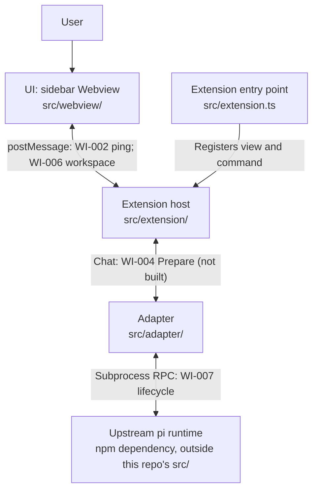

# pi VS Code system architecture

English | [中文](vscode-extension-architecture.zh.md)

- Type: Architecture
- Status: Proposed
- Created: 2026-09-19
- Authority: structure, boundaries, and owners (not implemented features)
- Related gates: [`../reference/architecture-gates.md`](../reference/architecture-gates.md)
- Sibling reference: [`pi-desktop`](https://github.com/earendil-works/pi-desktop) (Electron presentation layer; same pi integration principles, different host)
- Upstream: [pi](https://github.com/earendil-works/pi) coding-agent runtime (read-only sibling checkout `../pi` during development)

> Proposed architecture. Do not describe capabilities as shipped until spikes and Accepted ADRs close the related gates.

## 1. Context

**pi VS Code** is a VS Code extension that presents [pi](https://github.com/earendil-works/pi) as a **sidebar chat companion** while the user edits code—similar in placement to GitHub Copilot Chat and OpenAI Codex: **Explorer stays on the primary (left) sidebar**; pi chat lives in a **Webview View**, preferring the **Secondary Side Bar** (right) when the host supports it.

The extension is a **presentation and orchestration layer**. It does not reimplement pi’s agent loop, providers, tools, compaction, or session file semantics.

## 2. Layer model

| Layer | Responsibility | Owner (this repo) |
|-------|----------------|-------------------|
| **UI (Webview)** | Chat layout, streaming display, local UI state only | `src/webview/` |
| **Extension host** | Activation, commands, configuration, `SecretStorage`, workspace trust policy, webview lifecycle, validated `postMessage` bridge | `src/extension/` |
| **Adapter** | pi SDK or RPC subprocess → internal domain events consumed by host + webview | `src/adapter/` |
| **Runtime (upstream)** | Models, tools, sessions, project resources | pi packages / subprocess |

The diagram shows the target boundaries; edge labels distinguish the current scaffold from later work. WI-001 selected subprocess RPC for the runtime probe, not end-user chat.

<!-- docs-i18n: localized-mermaid -->

## 3. UI placement (product default)

| Surface | Role | Default |
|---------|------|---------|
| **Primary sidebar** | Explorer, SCM, etc. | Unchanged (user keeps file tree on the left) |
| **Secondary Side Bar** | pi chat **Webview View** | **Preferred** default dock (VS Code `viewsContainers.secondarySidebar`) |
| **Primary sidebar fallback** | Same webview view container | When Secondary Side Bar API or host fork does not support aux bar |
| **Editor-area panel** | Full-tab chat | **Parking lot** (optional later; not MVP default) |

Commands (planned): open/focus pi sidebar; on older VS Code, document drag-to-right workflow.

## 4. Trust boundaries

- **Secrets** (API keys, tokens): extension host only (`SecretStorage` / env policy). **Never** pass to webview HTML/JS or webview `localStorage`.
- **Webview**: no `require`, no direct pi SDK, no filesystem or shell. Only structured messages defined in `docs/reference/` (outline before WI-002+).
- **Workspace access**: host reads/writes files per user action and VS Code workspace trust; webview requests capabilities via messages, host validates.
- **Sessions**: do not read/write pi session files for product session features unless an Accepted ADR explicitly allows; prefer SDK/RPC session APIs.
- **Honesty**: do not describe the webview or extension host as a security sandbox against untrusted code; pi retains tool and shell capabilities per upstream design.

## 5. Main flows (target)

1. **Open**: user opens pi view in secondary sidebar → host creates/retains `WebviewView` → webview loads bundled script with strict CSP.
2. **Chat (later WIs)**: webview sends user input message → host → adapter → pi runtime stream → host forwards sanitized events to webview.
3. **Shutdown**: deactivate extension / dispose webview → adapter stops runtime / child process with timeout; no zombie subprocess (WI-001 spike proves clean exit).

## 6. Open decisions (gates)

See [`../reference/architecture-gates.md`](../reference/architecture-gates.md):

- `gate-extension-host-baseline` — build, F5, package
- `gate-sidebar-chat-shell` — secondary-sidebar webview placeholder
- `gate-webview-trust` — message schema, CSP, secret isolation (before real chat)
- `gate-runtime-host` — pi in-process SDK vs subprocess RPC

## 7. Implementation snapshot (through WI-007; not gate closure)

As of WI-004 Build, the repo adds a **minimal plain-text chat slice**: allowlisted `sendChat`, host-owned in-memory transcript, RPC `prompt` with `text_delta` projection and `--no-tools` startup on the existing WI-007 subprocess path. Earlier slices remain: secondary-sidebar Webview bridge (WI-002), workspace/resource choice (WI-006), and RPC readiness (WI-007). Trust and session-streaming gates remain Open per [`architecture-gates.md`](../reference/architecture-gates.md). Maintainer F5 acceptance of streaming is still outstanding in ACTIVE.
