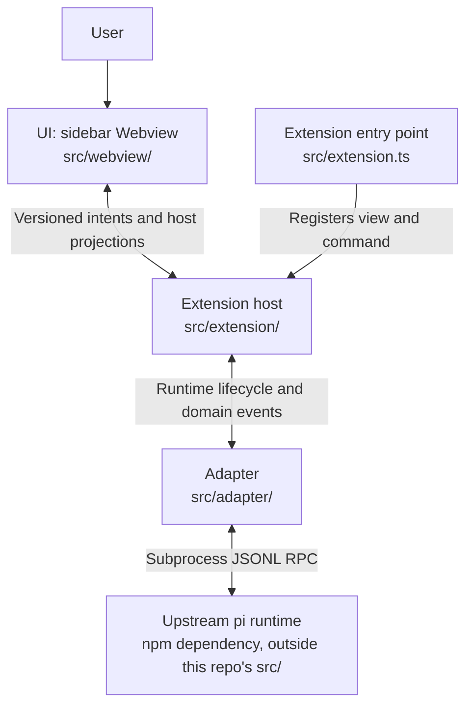

# pi VS Code system architecture

English | [中文](vscode-extension-architecture.zh.md)

- Type: Architecture
- Status: Proposed
- Created: 2026-09-19
- Authority: structure, boundaries, and owners (not implemented features)
- Related gates: [`../reference/architecture-gates.md`](../reference/architecture-gates.md)
- Sibling reference: [`pi-desktop`](https://github.com/earendil-works/pi-desktop) (Electron presentation layer; same pi integration principles, different host)
- Upstream: [pi](https://github.com/earendil-works/pi) coding-agent runtime (read-only sibling checkout `../pi` during development)

> Proposed architecture. Do not describe capabilities as shipped until spikes and Accepted ADRs close the related gates.

## 1. Context

**pi VS Code** is a VS Code extension that presents [pi](https://github.com/earendil-works/pi) as a **sidebar chat companion** while the user edits code—similar in placement to GitHub Copilot Chat and OpenAI Codex: **Explorer stays on the primary (left) sidebar**; pi chat lives in a **Webview View**, preferring the **Secondary Side Bar** (right) when the host supports it.

The extension is a **presentation and orchestration layer**. It does not reimplement pi’s agent loop, providers, tools, compaction, or session file semantics.

## 2. Layer model

| Layer | Responsibility | Owner (this repo) |
|-------|----------------|-------------------|
| **UI (Webview)** | Chat layout, streaming display, local UI state only | `src/webview/` |
| **Extension host** | Activation, commands, configuration, `SecretStorage`, workspace trust policy, webview lifecycle, validated `postMessage` bridge | `src/extension/` |
| **Adapter** | pi SDK or RPC subprocess → internal domain events consumed by host + webview | `src/adapter/` |
| **Runtime (upstream)** | Models, tools, sessions, project resources | pi packages / subprocess |

The diagram shows the current layers and call direction. ACTIVE and historical records establish implementation scope and product acceptance; the diagram does not certify complete boundary verification.

<!-- docs-i18n: localized-mermaid -->

## 3. UI placement (product default)

| Surface | Role | Default |
|---------|------|---------|
| **Primary sidebar** | Explorer, SCM, etc. | Unchanged (user keeps file tree on the left) |
| **Secondary Side Bar** | pi chat **Webview View** | **Preferred** default dock (VS Code `viewsContainers.secondarySidebar`) |
| **Primary sidebar fallback** | Same webview view container | Compatibility direction; verify the target host, without promising automatic fallback |
| **Editor-area panel** | Full-tab chat | **Parking lot** (optional later; not MVP default) |

The `pi-vscode.focusChat` command reveals the existing container and focuses chat from the editor title or Command Palette. Placement compatibility requires target-host verification.

## 4. Trust boundaries

- **Secrets** (API keys, tokens): extension host only (`SecretStorage` / env policy). **Never** pass to webview HTML/JS or webview `localStorage`.
- **Webview**: no `require`, no direct pi SDK, no filesystem or shell. Only structured messages in the [message contract](../reference/webview-messages.md).
- **Workspace access**: host reads/writes files per user action and VS Code workspace trust; webview requests capabilities via messages, host validates.
- **Sessions**: do not read/write pi session files for product session features unless an Accepted ADR explicitly allows; prefer SDK/RPC session APIs.
- **Honesty**: do not describe the webview or extension host as a security sandbox against untrusted code; pi retains tool and shell capabilities per upstream design.

## 5. Main flows and lifecycle

1. **Open**: user opens pi view in secondary sidebar → host creates/retains `WebviewView` → webview loads the packaged React/TypeScript application (`dist/webview/webview.js` and `webview.css`) through `asWebviewUri`, strict CSP and a script nonce. `localResourceRoots` contains only that asset directory.
2. **Chat**: webview sends user input message → host → adapter → pi runtime stream → host forwards bounded presentation projections to webview (filtering cannot guarantee arbitrary output is secret-free).
3. **View disposal and runtime shutdown**: disposing or replacing a Webview calls `PiChatViewProvider.clearView()` to release view listeners and view-bound operations; it does not stop the runtime or clear host-owned chat/pending settings. A recreated view resynchronizes from the host. Provider disposal (including extension teardown) unsubscribes runtime events, clears chat/pending settings and approvals/grants, requests `runtime.stop()`, and releases view/workspace listeners. The adapter owns bounded subprocess shutdown; this does not guarantee cancellation of every descendant process.

**Implemented WI-015 frontend boundary (acceptance pending):** `src/extension/webviewHtml.ts` owns the minimal resource shell; the browser entry is `src/webview/main.tsx`. `webviewProtocol.ts` contains shared pure DTO types, while `webviewMessages.ts` keeps the privileged inbound allowlist validator. Browser `bridge.ts` owns transport/listener lifetime; `webview-client.ts` reconciles host projections, view/generation identity and acknowledged drafts; `saved-history-client.ts` owns the retained-history page and correlated chunk-preview state; `client-state.ts` owns presentation types, limits and availability derivation without depending on the transport implementation. React components own presentation, expansion and transient controls. No browser module imports Node, VS Code or pi runtime code. Host execution, approval and attachment policy remain authoritative. Vite builds browser assets; esbuild builds the extension and bundled approval extension. The browser-only preview substitutes a synthetic host at the same application entry and is excluded from the production entry. [ADR 0003](../decisions/0003-react-webview.md) remains Draft; [ACTIVE](../../ACTIVE.md) records checks and remaining acceptance.

**Planned WI-013 relationship (Paused, not delivered; 2026-09-22):** The maintainer previously paused WI-014 for WI-015 frontend migration; [ACTIVE](../../ACTIVE.md) now resumes attachments after the migration’s implementation verification. The interaction proposal is retained, not completed. [Draft ADR 0002](../decisions/0002-interaction-contract-route.md) records the historical document-route approval and the September 22 amendment: assess scoped loading/standard interactions on unmodified released pi using documented public APIs; upstream enhancement is optional, not a baseline delivery prerequisite. Product scope belongs to [REQ-009](../product-requirements.md#req-009--representative-pi-compatibility). The [Planned interaction contract](../reference/webview-messages.md#planned-wi-013-local-interaction-contract) owns candidate host eligibility, adapter evidence and view intents without changing these layers or today's controlled-chat implementation. Resolve loading/approval, supported-operation and ownership-loss recovery gaps for the selected slice; document approval is not Build or ADR acceptance.

## 6. Architecture gates

The [gate table](../reference/architecture-gates.md) owns status and acceptance scope; [ADR 0001](../decisions/0001-build-baseline.md) preserves the minimum host/sidebar/RPC baseline decision. [ACTIVE](../../ACTIVE.md) tracks unresolved boundaries and missing ADR conditions. Existing code or a closed scoped WI does not establish the complete architectural conclusion.

## 7. Controlled execution ownership (WI-010 closed, 2026-09-21)

- **Host policy:** `src/extension/toolApproval.ts` owns pending approval cards and session grants. Only canonical in-workspace regular-file `read` auto-allows. Search/list ask; nonexistent/unresolvable targets are once-only. Existing file grants bind tool + canonical path; shell grants bind tool + canonical cwd + complete input. No persistent grants or Unrestricted mode. Canonicalization is not protection against all check/use races.
- **Contract ownership:** `src/extension/approvalProtocol.ts` owns the pure bundled-gate envelope type and validator; the adapter consumes this host-owned contract without importing approval policy. `src/adapter/runtime-errors.ts` owns normalization and bounds for runtime errors. `toolApproval.ts` retains authorization decisions and filesystem scope inspection.
- **Execution boundary:** `src/adapter/approvalGate.ts` is bundled as `dist/approval-gate.mjs` (build and package declarations include it). Its public asynchronous `tool_call` hook waits on `ctx.ui.confirm`; product protocol v1 binds runtime/cwd, request/tool-call IDs and complete input. `src/adapter/pi-rpc-runtime.ts` owns dialog replies and validates hello/readiness. There is no generic approval RPC or title-based authority. Missing bundle refuses startup; failed hello/get_state stops startup, not a usable no-tools fallback.
- **Exclusive profile:** CLI uses `--tools read,write,edit,bash,powershell,grep,find,ls --no-extensions -e <bundled gate>` with the existing resource flag. Third-party extension discovery is disabled even when resources are approved. Other context/resource categories are not thereby all excluded. The bundled extension runs as user code; this is not a sandbox and cannot promise complete shell/network containment.
- **Projection and lifecycle:** `runtimeLifecycle.ts` defines activity/final-message/runtime-error events and narrow `abortTask` / approval-handler injection. `activityProjection.ts` correlates actual thinking by message/content index and tools by tool-call ID, replaces cumulative outputs, and bounds display fields. `PiChatViewProvider` owns projected timeline, execution state and approval lifetime. Stop cancels pending approvals before adapter `clear_queue` + `abort`; no settlement/failure causes runtime shutdown and explicit error. Successful Stop retains same-live-session grants; replacement/disconnect clears them. Deferred settings wait for settlement and completion of stopping. No side-effect rollback or automatic task retry.
- **Contract/security:** [contract-webview-messages](../reference/webview-messages.md) records exact inbound actions and bounded DTOs. No generic commands or raw runtime/stderr forwarding; credential-pattern filtering is best-effort, not complete secret removal from arbitrary outputs. Incremental UI, per-item and reserved aggregate overflow notices, stable expansion/focus/scroll, full approval input, grant revocation and draft-preserving Stop are implemented and covered by UI tests. Four development F5 checks were confirmed by the maintainer: thinking/state, read/tool cards, denied write without side effects then allowed writes, and Stop during a long harmless command. The scoped WI is closed; installed-VSIX and exhaustive manual matrix acceptance are not implied.

**WI-016 T016-01 addition:** host `writeProtection.ts` maps declared built-in write/edit targets to live VS Code document metadata and filesystem identity. `ToolApprovals` checks before offering and before granting authorization, with one deadline and epoch across asynchronous checks; it rechecks grant revocation and only creates a session grant after protection passes. The existing bounded error projection explains denial; no Webview filesystem capability, auto-save, persistence, or tool replacement is introduced. This public pre-execution hook cannot provide an atomic editor/write lock or cover opaque shell/extension bypasses. The [message contract](../reference/webview-messages.md) owns details, and ACTIVE owns current evidence; T016-02 `ChangeReview` owns bounded memory-only captures, coalesced workspace observations and readonly virtual-document diffs. Adapter completion events are independent of the activity-display cap. Webview receives metadata and opaque IDs only; final authorization failure discards provisional captures, and runtime replacement invalidates snapshots/late work.

**Environment and coverage:** [`controlledEnvironment.ts`](../../src/adapter/controlledEnvironment.ts) forces `PI_OFFLINE=1` / `PI_TELEMETRY=0` while retaining trusted user provider configuration and credential commands; those commands are outside tool-approval coverage. Offline restricts startup networking/missing-package installation, not inference or tool networking.

**Evidence and maturity:** [WI-010 history](../archive/2026-09-21-closed-wi-history.md#wi-010) owns version-matched approval fixtures, offline/extracted-package checks, four development F5 observations and their limits. Architecture remains Proposed/Direction. Installed-VSIX, broad external-provider and complete boundary verification/ADR remain gaps; ACTIVE tracks their current conditions.

## 8. Model-settings ownership (WI-008/WI-009)

`ModelSettings` (`src/extension/modelSettings.ts`) owns applied settings, separate `pendingModel` / `pendingThinkingLevel` intents and in-flight operation invalidation. `PiChatViewProvider` supplies runtime/workspace identity and execution eligibility, calls reset/cancellation at lifecycle transitions, and composes the readonly model snapshot into the Webview projection. Idle changes apply immediately; during an active reply, each pending field retains its latest choice. After the current session's `agent_settled`, `modelBusy` serializes model mutation, capability refresh and validated thinking mutation. Failures read back actual state without mutation retry. Generation/runtime-session/catalog tokens reject obsolete completions; intent survives view recreation but clears on workspace/eligibility change, runtime replacement and provider disposal.

The Webview presents applied/pending state and sends allowlisted intents; the adapter maps public RPC. The [message contract](../reference/webview-messages.md) owns detailed errors, Stop ordering and cleanup semantics; [REQ-002](../product-requirements.md#req-002--model-readiness) owns the visible controls.

The maintainer confirmed the deferred-selection main path at 19:44 on 2026-09-21: the current reply stays unchanged, settings apply after settlement, and the next message uses them. Idle selection and baseline UI were also confirmed. Failed readback, restart cleanup and approval/Stop interleavings lack complete independent manual coverage; WI-008/WI-009 still await consolidation and explicit closure. [ACTIVE](../../ACTIVE.md) owns the latest acceptance record.

### Saved-session helper (WI-017 Build)

Agent execution remains subprocess RPC. A separate, short-lived adapter helper imports the declared release's public SessionManager for current-project catalogue, identity checks and active-branch history; the extension host does not load the pi SDK or parse session files. Production packaging includes dist/session-worker.mjs and the declared release dependency. The helper has bounded input/output, deadline/cancellation and observed-close handling. Host owns native handoff confirmation, Stop/settlement, current resource policy, fresh grants and opaque UI capabilities. Runtime readiness verifies the requested public session ID and path; a mismatch stays unready. UI history windows and immutable retained-text chunks do not define model context or restore current workspace files. See the [message contract](../reference/webview-messages.md#wi-017-t017-03--bounded-restored-history-and-retained-text-build-contract) and ACTIVE for implementation/verification status; no gate/ADR acceptance follows from this Build boundary.
