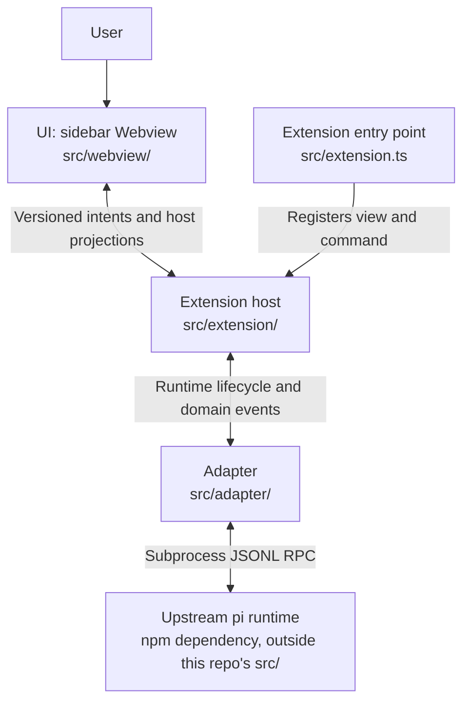

# pi VS Code system architecture

English | [中文](vscode-extension-architecture.zh.md)

- Type: Architecture
- Status: Accepted
- Created: 2026-09-19
- Authority: structure, boundaries, and owners (not implemented features)
- Related gates: [`../reference/architecture-gates.md`](../reference/architecture-gates.md)
- Sibling reference: [`pi-desktop`](https://github.com/earendil-works/pi-desktop) (Electron presentation layer; same pi integration principles, different host)
- Upstream: [pi](https://github.com/earendil-works/pi) coding-agent runtime (read-only sibling checkout `../pi` during development)

> Accepted structural boundaries under ADR0001–0004. Actual feature/environment delivery remains scoped to the linked WI evidence; this is not whole-PRD acceptance or release certification.

## 1. Context

**pi VS Code** is a VS Code extension that presents [pi](https://github.com/earendil-works/pi) as a **sidebar chat companion** while the user edits code—similar in placement to GitHub Copilot Chat and OpenAI Codex: **Explorer stays on the primary (left) sidebar**; pi chat lives in a **Webview View**, preferring the **Secondary Side Bar** (right) when the host supports it.

The extension is a **presentation and orchestration layer**. It does not reimplement pi’s agent loop, providers, tools, compaction, or session file semantics.

## 2. Layer model

| Layer | Responsibility | Owner (this repo) |
|-------|----------------|-------------------|
| **UI (Webview)** | Chat layout, streaming display, local UI state only | `src/webview/` |
| **Extension host** | Activation, commands, configuration, `SecretStorage`, workspace trust policy, webview lifecycle, validated `postMessage` bridge | `src/extension/` |
| **Adapter** | pi SDK or RPC subprocess → internal domain events consumed by host + webview | `src/adapter/` |
| **Runtime (upstream)** | Models, tools, sessions, project resources | pi packages / subprocess |

The diagram shows the current layers and call direction. ACTIVE and historical records establish implementation scope and product acceptance; the diagram does not certify complete boundary verification.

<!-- docs-i18n: localized-mermaid -->

```mermaid
flowchart TD
    U["User"] --> W["UI: sidebar Webview<br/>src/webview/"]
    W <-->|"Versioned intents and host projections"| H["Extension host<br/>src/extension/"]
    H <-->|"Runtime lifecycle and domain events"| A["Adapter<br/>src/adapter/"]
    A <-->|"Subprocess JSONL RPC"| P["Upstream pi runtime<br/>npm dependency, outside this repo's src/"]
    E["Extension entry point<br/>src/extension.ts"] -->|"Registers view and command"| H
```

### Source directories

Directories group existing responsibilities within each layer; they are not separate npm packages or additional runtime layers.

| Directory | Responsibility |
|-----------|----------------|
| `src/extension/bridge/` | Webview resource shell, inbound message validation and input limits |
| `src/extension/contracts/` | Host-owned Webview DTOs, runtime/session interfaces and approval envelope contract |
| `src/extension/models/` | Model catalogue validation and applied/pending settings |
| `src/extension/draft/` | Draft submission and editor attachment capture |
| `src/extension/editor-tools/` | Approval policy, dirty-editor protection and change review |
| `src/extension/sessions/` | Host-side saved-history reading and preview coordination |
| `src/adapter/runtime/` | Live pi RPC process, request pairing, frame translation, task occupancy, model parsing and activity/error projection |
| `src/adapter/sessions/` | Public pi session API helper and history projection |

Directory `index.ts` files expose operations and type-only contracts consumed across module directories. Module-owned types live in local `types.ts` files, while cross-layer Webview DTOs, runtime lifecycle and session interfaces retain their single host-owned source in `src/extension/contracts/`. Imports within a module can still target its implementation files. `src/extension.ts` assembles host and adapter entries. Browser code imports host-owned contracts only as types; standalone session-worker and approval-gate build entries remain explicit implementation files.

`piChatViewProvider.ts` remains at the host root as coordinator. The adapter root retains the independently bundled `approvalGate.ts` and the environment/path helpers used by both runtime and session integration. Contracts remain host-owned; browser consumers use pure shared types, not privileged implementations. Module tests live in each module's `tests/`; layer `tests/` directories retain cross-module coordination tests and shared fixtures. Build output locations are unchanged.

## 3. UI placement (product default)

| Surface | Role | Default |
|---------|------|---------|
| **Primary sidebar** | Explorer, SCM, etc. | Unchanged (user keeps file tree on the left) |
| **Secondary Side Bar** | pi chat **Webview View** | **Preferred** default dock (VS Code `viewsContainers.secondarySidebar`) |
| **Primary sidebar fallback** | Registered Pi webview in the host fallback location | Verified on 1.105.1 in Explorer; Focus Chat discovers whether the dedicated container exists before revealing it. Other hosts need separate evidence. |
| **Editor-area panel** | Full-tab chat | **Parking lot** (optional later; not MVP default) |

The `pi-vscode.focusChat` command reveals the existing container and focuses chat from the editor title or Command Palette. Placement compatibility requires target-host verification.

## 4. Trust boundaries

- **Secrets** (API keys, tokens): extension host only (`SecretStorage` / env policy). **Never** pass to webview HTML/JS or webview `localStorage`.
- **Webview**: no `require`, no direct pi SDK, no filesystem or shell. Only structured messages in the [message contract](../reference/webview-messages.md).
- **Workspace access**: host reads/writes files per user action and VS Code workspace trust; webview requests capabilities via messages, host validates.
- **Sessions**: do not read/write pi session files for product session features unless an Accepted ADR explicitly allows; prefer SDK/RPC session APIs.
- **Honesty**: do not describe the webview or extension host as a security sandbox against untrusted code; pi retains tool and shell capabilities per upstream design.

## 5. Main flows and lifecycle

1. **Open**: user opens pi view in secondary sidebar → host creates/retains `WebviewView` → webview loads the packaged React/TypeScript application (`dist/webview/webview.js` and `webview.css`) through `asWebviewUri`, strict CSP and a script nonce. `localResourceRoots` contains only that asset directory.
2. **Chat**: webview sends user input message → host → adapter → pi runtime stream → host forwards bounded presentation projections to webview (filtering cannot guarantee arbitrary output is secret-free).
3. **View disposal and runtime shutdown**: disposing or replacing a Webview calls `PiChatViewProvider.clearView()` to release view listeners and view-bound operations; it does not stop the runtime or clear host-owned chat/pending settings. A recreated view resynchronizes from the host. Provider disposal (including extension teardown) unsubscribes runtime events, clears chat/pending settings and approvals/grants, requests `runtime.stop()`, and releases view/workspace listeners. The adapter owns bounded subprocess shutdown; this does not guarantee cancellation of every descendant process.

**Accepted WI-015/WI-019 frontend boundary:** Host `bridge/webviewHtml.ts` supplies the resource shell; `main.tsx` mounts shared React presentation through `mountChat` from `chat/index.ts` (or `mountSettings` for the settings surface). `chat/types.ts` owns mount and page-language contracts. The real bridge owns transport lifetime; WebviewClient retains projection, identity and draft authority; the host owns execution, approvals, attachments, sessions and persistence. Browser modules import no Node, VS Code or pi runtime code. Vite builds the browser; esbuild builds host/gate. After agent-delegated Q16 evaluation, production and preview share chat composition, styles, messages/activity/safe Markdown, sessions/history/approval/review controls. Preview alone owns synthetic bridge/scenarios/timers and developer controls; the production graph excludes preview and tests. The historical baseline-app fixture has been removed; Attachment snapshot, Saved session and transcript presentation live only in the production chat composition. Unmount releases client/root/listeners; synthetic owners additionally release their timers. Markdown uses allowlisted React elements, no HTML injection or embedded resources, no new host intents and no changes to literal approval/attachment input. [Accepted ADR 0003](../decisions/0003-react-webview.md) records delegated acceptance and separate host/package evidence; [ACTIVE](../../ACTIVE.md) owns remaining work.

**Accepted WI-026 option A (maintainer F5 visual acceptance, 2026-09-29):** `bridge/settingsPanel.ts` owns one editor-area WebviewPanel, revealed on repeated `openSettings`. It uses the same packaged CSP/assets, a distinct random viewId, and the current host generation. Its inbound allowlist permits only bootstrap, UI language and provider/default intents; it never projects workspace/chat, drafts, approvals or history. ProviderConfig and default-to-session application stay with PiChatViewProvider and the existing host services. Closing the panel removes only its own listeners and view identity; chat/runtime continue. Provider disposal also disposes the settings panel. `main.tsx` selects `settings/index.tsx` using a host-authored surface marker; this does not give the renderer authority to select host capabilities.

UI language remains presentation-only, with packs and the local store in `chat/`. The coordinator now owns a shared in-memory locale (English initially), emits validated `uiLanguageState` to both views, and accepts `setUiLanguage`. Recreating either view restores the host locale; host restart resets it. This supersedes WI-019's mount-only language lifetime. Switching language preserves client, draft, conversation and literal content; no disk preference is introduced. Preview Reset retains its own language store. Decision: none; the existing low-trust renderer/privileged host boundary, persistence and runtime integration strategy remain unchanged. The maintainer confirmed F5 visual acceptance on 2026-09-29; installed VSIX remains unverified.

The candidate no-folder welcome permits draft editing through the existing client `edit` / versioned `updateDraft` path (already independent of runtime readiness). Its Send handler only opens `chat/no-folder-prompt.tsx`, never calls task submission in that state. The prompt uses the existing named `openFolder` intent; host workspace/trust/resource eligibility remains authoritative. It owns no separate draft, workspace selection, persistence or replay. Native modal lifetime and return focus belong to candidate presentation; other blocked states retain their existing eligibility rules.

Unix control endpoints retain their recovery-directory path when it fits the 103-byte portable socket limit. Longer paths use a bounded `/tmp/pi-vscode-<SHA-256>.sock` name derived from the absolute recovery directory and run ID. The supervisor retains binding, mode `0600` and cleanup ownership; it does not remove existing endpoints before binding. Fence/receipt storage and Windows named pipes are unchanged.

**Accepted WI-013 boundary (2026-09-28 Asia/Shanghai):** [Accepted ADR0002](../decisions/0002-interaction-contract-route.md) defines explicit trusted loading, host-owned standard interactions, public adapter seams, passive supervision and a persistent recovery fence; exact v3 DTOs belong to the [message contract](../reference/webview-messages.md). [Delegated acceptance](../archive/2026-09-28-wi-013-acceptance.md) separates real-target, native F5, installed, multiwindow evidence and limits; it does not establish ecosystem-wide compatibility or close the three broad gates.

### RPC process strategy (WI-028)

`createPiRpcRuntime` requires a `RuntimeProcess` from `runtime/process/types.ts`. It remains the lifecycle and use-case orchestrator: start, send, model operations, restart checks and Stop. Three internal modules own distinct RPC work and are not a host API:

- **Request pairing** (`rpc-replies.ts`) owns request identities, pending replies, dispatch, timeouts, cleanup on connection loss and the pauseable remaining startup budget. Write callback, backpressure and the one-attempt send token stay with send orchestration so an RPC reply is not treated as write completion.
- **Frame translation** (`rpc-frames.ts`) owns JSONL parse, classification, `ActivityProjection` and ordered `RuntimeEvent` mapping. It does not access the subprocess, write streams or run approval callbacks; the orchestrator routes classified hello, feedback, dialog and approval results to the existing components.
- **Task occupancy** (`rpc-occupancy.ts`) owns named transitions for send, ACK, extension-command, agent, Stop, dialog and approval occupancy. Send admission, restart checks, release classification and Stop completion share this state without collapsing into one idle flag. Task end and ACK arrival stay independent; ending an extension command is not agent settlement.

RPC still owns readiness, session identity and the shared five-second Stop observation budget. Connection loss revokes adapter capabilities before cleanup; stale results from a prior connection stay isolated. Its `RuntimeLink` exposes only stdin, stdout and loss subscription; it has no native termination capability. Process strategies own launch cancellation, release serialization, cleanup and policy-specific recovery messages. Release classifies idle versus uncertain work before RPC state is cleared, including the gap before an arriving link is attached.

Production composition selects `createManagedProcess(createRuntimeOwner(...))`. Clean release ends and retires observed work; uncertainty detaches and drains output without closing input or automatically ending the owned child. Pending launch and missing exit evidence block recovery/replacement. The existing owner remains the authority for persistent fences and exact-child receipts under ADR0002. The direct spawn strategy is explicitly selected only by the attachment spike and retains bounded SIGTERM/SIGKILL cleanup; a dependency-graph test excludes it and test helpers from production. Runtime tests use a shared in-memory process/byte transport, with separate native-strategy and production-composition regressions. The host lifecycle and Webview contracts, pi version and recovery storage are unchanged. Current verification and unverified host/package evidence belong to ACTIVE.

WI-033 strengthens these existing owners: frame translation uses the pure `rpc-events.ts` decoder before `ActivityProjection`; request pairing validates the expected command and boolean result and separates local transport failures from remote responses. The orchestrator routes protocol faults through existing uncertain release. Decoder types are adapter-internal, not host/Webview contracts. The [message contract](../reference/webview-messages.md#runtime-protocol-failures-wi-033) owns failure and compatibility behavior. This changes neither process ownership nor ADR0002 recovery policy.

### Internal host capability modules

The host remains one bundled extension. `PiChatViewProvider` owns workspace/view identity, runtime readiness, the live execution projection, Stop and sequential session handoff. It composes concrete internal modules; there is no dynamic loader, third-party host API or general command bus.

| Module | Owned implementation | Interface used by the coordinator |
|--------|----------------------|-----------------------------------|
| `DraftSubmission` | Acknowledged text, attachment capture/confirmation, bounded immutable submission history, preview chunks, document subscriptions and preparation cancellation | Validated draft intents, publication, reset/view lifecycle, preparation cancellation, settlement and readonly revision/ACK status |
| `EditorTools` | Approval policy composition, dirty-editor checks and optional `ChangeReview` resources | pi approval callback, validated tool/review intents, task notifications, cancellation/reset/disposal |
| `ModelSettings` | Applied/pending model settings and stale-operation invalidation | Selection, load/apply, reset/cancel and readonly projection |
| `SavedHistory` | Restored-session history window, correlated text previews and cancellation | Restore, page/preview, publish/reset and helper-settlement barrier |

Modules receive narrow capabilities and readonly context, never the Provider or its mutable state. Draft admission notifies the coordinator synchronously before the one-attempt runtime send; delivery acknowledgement and task settlement remain distinct. A draft reset invalidates admitted late replies with a module-owned epoch. View loss only cancels uncommitted preparation/preview; acknowledged drafts and admitted submissions remain host-owned. The coordinator still owns native session confirmation and the cross-module handoff order.

`EditorToolOptions.changeReview: false` is an internal composition choice exercised by tests. It omits review snapshots, watchers and the virtual-document provider while retaining approvals and dirty-editor protection. Production keeps the default enabled; no user setting or Webview permission to disable protection is added. This proves one optional capability can be omitted, not that every feature is independently switchable.

Module tests use VS Code fixtures without constructing the Provider; composition tests additionally cover chat/stream/Stop with review omitted. Existing attachment, approval, model and session-handoff regressions cover their interactions. Current checks and real-host limitations belong to ACTIVE; this internal refactor does not accept the architecture gates or implement generic pi extension UI.

## 6. Architecture gates

The [gate table](../reference/architecture-gates.md) owns status and acceptance scope; [ADR 0001](../decisions/0001-build-baseline.md) preserves the minimum host/sidebar/RPC baseline decision. [ACTIVE](../../ACTIVE.md) tracks unresolved boundaries and missing ADR conditions. Existing code or a closed scoped WI does not establish the complete architectural conclusion.

## 7. Controlled execution ownership (WI-010 closed, 2026-09-21)

- **Host policy:** `src/extension/editor-tools/toolApproval.ts` owns pending approval cards and session grants. Only canonical in-workspace regular-file `read` auto-allows. Search/list ask; nonexistent/unresolvable targets are once-only. Existing file grants bind tool + canonical path; shell grants bind tool + canonical cwd + complete input. No persistent grants or Unrestricted mode. Canonicalization is not protection against all check/use races.
- **Contract ownership:** `src/extension/contracts/approvalProtocol.ts` owns the pure bundled-gate envelope type and validator; the adapter consumes this host-owned contract without importing approval policy. `src/adapter/runtime/runtime-errors.ts` owns normalization and bounds for runtime errors. `toolApproval.ts` retains authorization decisions and filesystem scope inspection.
- **Execution boundary:** `src/adapter/approvalGate.ts` is bundled as `dist/approval-gate.mjs` (build and package declarations include it). Its public asynchronous `tool_call` hook waits on `ctx.ui.confirm`; product protocol v1 binds runtime/cwd, request/tool-call IDs and complete input. `src/adapter/runtime/pi-rpc-runtime.ts` owns dialog replies and validates hello/readiness. There is no generic approval RPC or title-based authority. Missing bundle refuses startup; failed hello/get_state stops startup, not a usable no-tools fallback.
- **Exclusive profile:** CLI uses `--tools read,write,edit,bash,powershell,grep,find,ls --no-extensions -e <bundled gate>` with the existing resource flag. Third-party extension discovery is disabled even when resources are approved. Other context/resource categories are not thereby all excluded. The bundled extension runs as user code; this is not a sandbox and cannot promise complete shell/network containment.
- **Projection and lifecycle:** `runtimeLifecycle.ts` defines activity/final-message/runtime-error events and narrow `abortTask` / approval-handler injection. `activityProjection.ts` correlates actual thinking by message/content index and tools by tool-call ID, replaces cumulative outputs, and bounds display fields. `PiChatViewProvider` owns the projected timeline and execution state; `EditorTools` owns approval lifetime and is reset/cancelled by the coordinator. Stop cancels pending approvals before adapter `clear_queue` + `abort`; failure or unconfirmed settlement revokes transport/answer admission with an explicit error while retaining exact-child observation under ADR0002; it does not automatically kill uncertain work. Successful Stop retains same-live-session grants; replacement/disconnect clears them. Deferred settings wait for settlement and completion of stopping. No side-effect rollback or automatic task retry.
- **Contract/security:** [contract-webview-messages](../reference/webview-messages.md) records exact inbound actions and bounded DTOs. No generic commands or raw runtime/stderr forwarding; credential-pattern filtering is best-effort, not complete secret removal from arbitrary outputs. Incremental UI, per-item and reserved aggregate overflow notices, stable expansion/focus/scroll, full approval input, grant revocation and draft-preserving Stop are implemented and covered by UI tests. Four development F5 checks were confirmed by the maintainer: thinking/state, read/tool cards, denied write without side effects then allowed writes, and Stop during a long harmless command. The scoped WI is closed; installed-VSIX and exhaustive manual matrix acceptance are not implied.

**WI-016 T016-01 addition:** host `writeProtection.ts` maps declared built-in write/edit targets to live VS Code document metadata and filesystem identity. `ToolApprovals` checks before offering and before granting authorization, with one deadline and epoch across asynchronous checks; it rechecks grant revocation and only creates a session grant after protection passes. The existing bounded error projection explains denial; no Webview filesystem capability, auto-save, persistence, or tool replacement is introduced. This public pre-execution hook cannot provide an atomic editor/write lock or cover opaque shell/extension bypasses. The [message contract](../reference/webview-messages.md) owns details, and ACTIVE owns current evidence; T016-02 `ChangeReview` owns bounded memory-only captures, coalesced workspace observations and readonly virtual-document diffs. Adapter completion events are independent of the activity-display cap. Webview receives metadata and opaque IDs only; final authorization failure discards provisional captures, and runtime replacement invalidates snapshots/late work.

**Environment and coverage:** [`controlledEnvironment.ts`](../../src/adapter/controlledEnvironment.ts) forces `PI_OFFLINE=1` / `PI_TELEMETRY=0` while retaining trusted user provider configuration and credential commands; those commands are outside tool-approval coverage. Offline restricts startup networking/missing-package installation, not inference or tool networking.

**Evidence and maturity:** The [original WI-010 history](../archive/2026-09-21-closed-wi-history.md#wi-010) retains its historical version and limits. [ADR0004](../decisions/0004-trust-and-lifecycle.md) separately accepts the remaining trust/lifecycle boundaries after current source review, public-pi probes, actual native F5 and installed-VSIX checks. These boundaries are Evolvable; universal provider/OS/fork support is not claimed. Final WI-010 closure and evidence are linked from ACTIVE.

## 8. Model-settings ownership (WI-008/WI-009)

`ModelSettings` (`src/extension/models/modelSettings.ts`) owns applied settings, separate `pendingModel` / `pendingThinkingLevel` intents and in-flight operation invalidation. `PiChatViewProvider` supplies runtime/workspace identity and execution eligibility, calls reset/cancellation at lifecycle transitions, and composes the readonly model snapshot into the Webview projection. Idle changes apply immediately; during an active reply, each pending field retains its latest choice. After the current session's `agent_settled`, `modelBusy` serializes model mutation, capability refresh and validated thinking mutation. Failures read back actual state without mutation retry. Generation/runtime-session/catalog tokens reject obsolete completions; intent survives view recreation but clears on workspace/eligibility change, runtime replacement and provider disposal.

The Webview presents applied/pending state and sends allowlisted intents; the adapter maps public RPC. The [message contract](../reference/webview-messages.md) owns detailed errors, Stop ordering and cleanup semantics; [REQ-002](../product-requirements.md#req-002--model-readiness) owns the visible controls.

The maintainer confirmed the deferred-selection main path at 19:44 on 2026-09-21: the current reply stays unchanged, settings apply after settlement, and the next message uses them. Idle selection and baseline UI were also confirmed. Failed readback, restart cleanup and approval/Stop interleavings lack complete independent manual coverage; WI-008/WI-009 still await consolidation and explicit closure. [ACTIVE](../../ACTIVE.md) owns the latest acceptance record.

### Saved-session helper (WI-017)

Agent execution remains subprocess RPC. A separate, short-lived adapter helper imports the declared release's public SessionManager for current-project catalogue, identity checks and active-branch history; the extension host does not load the pi SDK or parse session files. Production packaging includes dist/session-worker.mjs and the declared release dependency. The helper protocol version, size limits and request/response validation have one source in `session-worker-protocol.ts`. The host owns process lifecycle; the worker owns SessionManager calls and stream IO. The helper has bounded input/output, deadline/cancellation and observed-close handling. Host owns native handoff confirmation, Stop/settlement, current resource policy, fresh grants and opaque UI capabilities. Runtime readiness verifies the requested public session ID and path; a mismatch stays unready. UI history windows and immutable retained-text chunks do not define model context or restore current workspace files. See the [message contract](../reference/webview-messages.md#wi-017-t017-03--bounded-restored-history-and-retained-text-contract) and ACTIVE for implementation/verification status; [delegated WI-017 acceptance](../archive/2026-09-28-wi-017-session-acceptance.md) does not automatically accept broader gates/ADRs.
