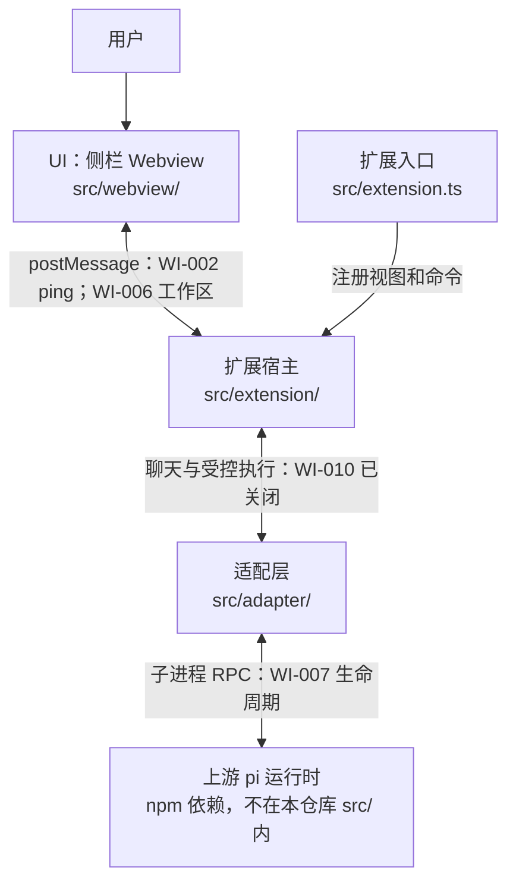

# pi VS Code 系统架构

[English](vscode-extension-architecture.md) | 中文

- 翻译状态：Machine Draft
- 权威原文：[vscode-extension-architecture.md](vscode-extension-architecture.md)
- 原文版本：Uncommitted baseline
- 最近同步：2026-09-21

- 类型：Architecture
- 状态：Proposed
- 创建：2026-09-19
- 权威范围：结构、边界与所有者（不表示功能已实现）
- 相关 gate：[`../reference/architecture-gates.zh.md`](../reference/architecture-gates.zh.md)
- 同级参考：pi-desktop（Electron 呈现层；pi 集成原则相同，宿主不同）
- 上游：[pi](https://github.com/earendil-works/pi) coding-agent runtime（开发期只读同级检出 `../pi`）

> 拟议架构。相关 gate 经 spike 与 Accepted ADR 关闭前，不得将能力描述为已交付。

## 1. 背景

**pi VS Code** 是在用户写代码时提供 **侧栏聊天伴侣** 的 VS Code 扩展，布局对标 GitHub Copilot Chat / OpenAI Codex：**左侧主侧栏保留资源管理器**；pi 聊天在 **Webview View** 中，在宿主支持时 **优先放在辅助侧栏（右侧）**。

扩展是 **呈现与编排层**，不重写 pi 的 agent 循环、provider、工具、压缩或会话文件语义。

## 2. 分层

| 层 | 职责 | 本仓所有者（计划路径） |
|----|------|------------------------|
| **UI（Webview）** | 聊天布局、流式展示、仅 UI 状态 | `src/webview/` |
| **Extension host** | 激活、命令、配置、`SecretStorage`、工作区信任、webview 生命周期、经校验的 `postMessage` | `src/extension/` |
| **Adapter** | pi SDK 或 RPC 子进程 → 内部领域事件 | `src/adapter/` |
| **Runtime（上游）** | 模型、工具、会话、项目资源 | pi 包 / 子进程 |

下图展示目标边界；连线标注区分现有脚手架与后续工作。WI-001 选择子进程 RPC 用于运行时探针，尚非用户聊天能力。

<!-- docs-i18n: localized-mermaid -->

## 3. UI 布局（产品默认）

| 表面 | 作用 | 默认 |
|------|------|------|
| **主侧栏** | Explorer、SCM 等 | 不变（文件树在左） |
| **辅助侧栏** | pi 聊天 **Webview View** | **首选** 停靠（`viewsContainers.secondarySidebar`） |
| **主侧栏回退** | 同一 webview 容器 | 不支持辅助侧栏 API 或宿主分叉时 |
| **编辑区 Panel** | 整页聊天 | **停车场**（可选，非 MVP 默认） |

## 4. 信任边界

- **密钥**：仅 extension host（`SecretStorage` / 环境策略），**不得**进入 webview 或 webview `localStorage`。
- **Webview**：无 `require`、无直连 pi SDK、无文件系统/shell；仅 `docs/reference/` 中定义的结构化消息（WI-002+ 前写提纲）。
- **工作区**：host 按用户操作与 VS Code 信任读写；webview 经消息请求能力，host 校验。
- **会话**：除非 Accepted ADR 明确允许，会话功能不随意读写 pi 会话文件；优先 SDK/RPC。
- **诚实性**：不把 webview/extension host 宣传为对抗不可信代码的沙箱；工具与 shell 能力仍由上游 pi 设计决定。

## 5. 主流程（目标）

1. **打开**：用户在辅助侧栏打开 pi 视图 → host 创建/保留 `WebviewView` → 带严格 CSP 加载打包脚本。
2. **聊天（后续 WI）**：webview 发用户输入 → host → adapter → pi 流式 → host 转发脱敏事件到 webview。
3. **关闭**：停用扩展 / dispose webview → adapter 在超时内停止 runtime/子进程（WI-001 spike 证明干净退出）。

## 6. 未决事项（gate）

见 [`../reference/architecture-gates.zh.md`](../reference/architecture-gates.zh.md)。

## 7. 受控执行所有权（WI-010 已关闭，2026-09-21）

- **宿主策略：** `src/extension/toolApproval.ts` 拥有待审批卡与会话授权。仅工作区内 canonical 普通文件 `read` 自动允许。搜索／列目录询问；不存在／无法解析目标仅允许一次。既有文件授权绑定工具 + canonical 路径；shell 绑定工具 + canonical cwd + 完整输入。不持久化授权，不提供自由执行模式。规范化不能防止所有检查／使用竞态。
- **执行边界：** `src/adapter/approvalGate.ts` 打包为 `dist/approval-gate.mjs`（构建与 package 声明已包含）。公开异步 `tool_call` hook 通过 `ctx.ui.confirm` 等待；产品 v1 协议绑定 runtime／cwd、request／tool-call ID 与完整输入。`src/adapter/pi-rpc-runtime.ts` 拥有对话回复并校验 hello／就绪。不存在通用审批 RPC 或按标题授权。文件缺失拒绝启动；hello/get_state 失败停止启动，不是可用的无工具回退。
- **独占配置：** CLI 使用 `--tools read,write,edit,bash,powershell,grep,find,ls --no-extensions -e <bundled gate>`，并保留资源 flag。即使同意资源，也禁用第三方扩展发现。其他上下文／资源类别不因此全部排除。自带扩展以用户代码权限运行；不是沙箱，不承诺完整约束 shell／网络。
- **投影与生命周期：** `runtimeLifecycle.ts` 定义活动／最终消息／运行时错误事件及窄 `abortTask`／审批 handler 注入。`activityProjection.ts` 按消息／内容索引关联真实 thinking，按 tool-call ID 关联工具，替换累计输出并限制展示字段。`PiChatViewProvider` 拥有投影时间线、执行状态与审批生命周期。Stop 在 adapter `clear_queue` + `abort` 前取消待审批；未 settled／失败则关闭运行时并明确报错。成功 Stop 保留同一运行会话授权；替换／断开清除。延后设置等待 settled 及停止完成。不回滚副作用、不自动重试任务。
- **契约／安全：** [contract-webview-messages](../reference/webview-messages.zh.md) 记录精确入站动作与有界 DTO。不开放通用命令，不转发原始 runtime／stderr；凭证模式过滤尽力而为，不保证任意输出完全无密钥。增量 UI、逐项及预留总量超限提示、稳定展开／焦点／滚动、完整审批输入、授权撤销与保留草稿的 Stop 已实现并有 UI 测试覆盖。维护者已确认四项开发态 F5：thinking／状态、读取／工具卡、拒绝写入无副作用后允许写入、长时间无害命令 Stop。限定 WI 已关闭；不推断已安装 VSIX 或完整手动矩阵验收。

**证据与成熟度：** 离线 `scripts/spikes/spike-approval.mjs` 针对已安装 `0.86.1`，使用隔离 fixture provider／配置，无真实 provider 凭证。两个写调用验证允许／拒绝、超时及迟到回复、Stop、加载失败；加载失败夹具使用 `--no-tools`，与生产启动拒绝区分。额外 fixture 扩展仅测试使用，不是产品第三方加载。已报告 73 tests、compile／lint 与九个真实审批夹具通过，新增运行中 PowerShell Stop 及发现／settings／package 扩展排除 marker。`controlledEnvironment.ts` 用 `PI_OFFLINE=1`、`PI_TELEMETRY=0` 覆盖继承值，保留可信用户 provider 配置及凭证命令；后者不属于工具 gate 覆盖。Offline 限制启动网络／缺包安装，不隔离推理／网络：`scripts/spikes/spike-offline-inference.mjs` 用 `--offline`、缺包配置及实际 loopback HTTP 推理验证，环境覆盖另有单元测试。完整依赖 `dist/pi-vscode-validation.vsix`（139.71 MB、14,080 entries）通过 `scripts/packaging/verify-vsix.mjs`：在独立于仓库路径的解压目录验证固定 CLI、生产依赖和 gate hello/get_state，探针不启用工具。以上为此前报告的检查，不是本次文档收尾重跑。已安装 VSIX 激活／运行、外部 provider 全面验收及完整授权／生命周期／安全验证仍有 gap；上方四项开发态 F5 单独作为收尾证据。WI-008／WI-009 延后选择 F5（含审批／Stop 顺序）仍待确认。架构保持 Proposed／Direction；`gate-project-trust`、`gate-webview-trust`、`gate-session-streaming` 仍 Open，边界 ADR 在 ACTIVE 保持 pending。

## 8. 实现快照（WI-008 / WI-009 Build；不表示关闭 gate）

侧栏 Webview 采用**聊天优先重设计**：紧凑头部 + runtime 状态点、卡片式设置空态、用户消息右侧 pill、底部圆角 composer 卡，内含**单个模型 · thinking 合并 chip**、锚定 Popover 与图标发送键。Popover 包含可折叠模型列表与粗离散 thinking 滑块：固定 `#168BFF` 填充／滑块头、无黄色轮廓、蓝色键盘焦点光晕；其余样式使用主题 token。

已批准的仅下一轮生效扩展涉及行为，而非纯表现层：`PiChatViewProvider` 拥有 `pendingModel`／`pendingThinkingLevel`，在 `chatBusy` 时分别覆盖最新意图，不改变已应用设置。空闲选择立即应用。当前 session 的 `agent_settled` 后，`applyPendingSettings` 在 `modelBusy` 保护下串行执行模型修改、能力刷新及已校验的 thinking 修改；应用期间禁止发送与选择。失败回读实际状态，不重试修改，显示有界错误并清空待应用意图。代次／session／目录 token 拒绝过期结果；宿主意图跨视图重建保留，但工作区／资格变化、运行时替换或 provider 释放会清除。Webview 仅展示 applied 与 pending 状态并发送既有 allowlist 命令；adapter 映射公开 RPC。见[消息契约](../reference/webview-messages.zh.md)。

当前 manifest 与已安装 pi 为 `0.86.1`；其公开 `docs/rpc.md` 将 `agent_settled` 定义为不再有自动重试、压缩重试或排队续跑。`turn_end`／低层 `agent_end` 不是此完成边界。WI-004 的 `0.85.1` 证据保持为历史记录。WI-008／WI-009 本身保留有界纯文本、宿主内存 transcript 与 `--no-tools`；延后选择本身未增加 Stop。WI-010 现以 §7 的受控执行替代该启动配置。

维护者已 F5 验收空闲模型／thinking 切换后流式回复、折叠／Esc／键盘／浅色主题及无目录／未信任／资源设置。新延后选择仍待 F5；WI-008／WI-009 保持开放。此前桥／工作区／运行时切片保留；信任与会话流式 gate 仍 Open，见 [`architecture-gates.zh.md`](../reference/architecture-gates.zh.md)。
