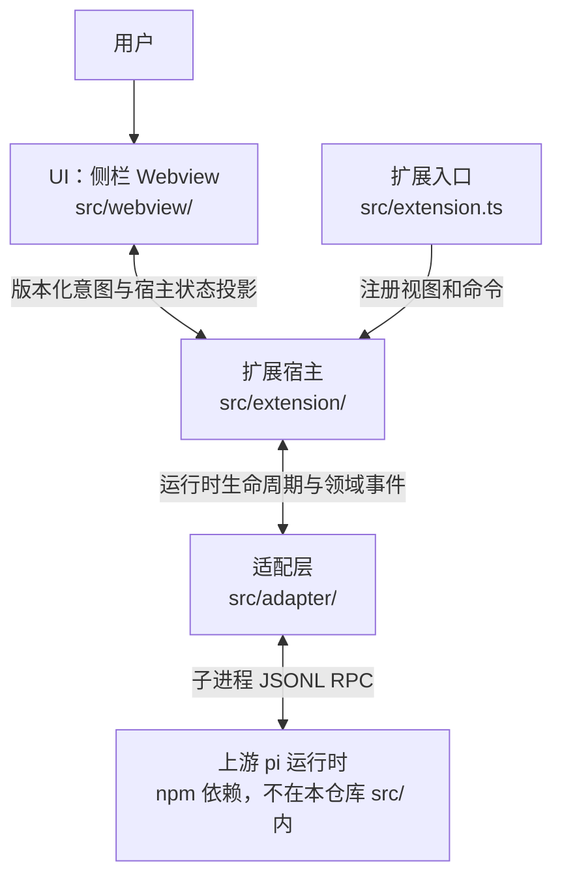

# pi VS Code 系统架构

[English](vscode-extension-architecture.md) | 中文

- 翻译状态：Machine Draft
- 权威原文：[vscode-extension-architecture.md](vscode-extension-architecture.md)
- 原文版本：Uncommitted baseline
- 最近同步：2026-09-22

- 类型：Architecture
- 状态：Proposed
- 创建：2026-09-19
- 权威范围：结构、边界与所有者（不表示功能已实现）
- 相关 gate：[`../reference/architecture-gates.zh.md`](../reference/architecture-gates.zh.md)
- 同级参考：pi-desktop（Electron 呈现层；pi 集成原则相同，宿主不同）
- 上游：[pi](https://github.com/earendil-works/pi) coding-agent runtime（开发期只读同级检出 `../pi`）

> 拟议架构。相关 gate 经 spike 与 Accepted ADR 关闭前，不得将能力描述为已交付。

## 1. 背景

**pi VS Code** 是在用户写代码时提供 **侧栏聊天伴侣** 的 VS Code 扩展，布局对标 GitHub Copilot Chat / OpenAI Codex：**左侧主侧栏保留资源管理器**；pi 聊天在 **Webview View** 中，在宿主支持时 **优先放在辅助侧栏（右侧）**。

扩展是 **呈现与编排层**，不重写 pi 的 agent 循环、provider、工具、压缩或会话文件语义。

## 2. 分层

| 层 | 职责 | 本仓所有者 |
|----|------|------------------------|
| **UI（Webview）** | 聊天布局、流式展示、仅 UI 状态 | `src/webview/` |
| **Extension host** | 激活、命令、配置、`SecretStorage`、工作区信任、webview 生命周期、经校验的 `postMessage` | `src/extension/` |
| **Adapter** | pi SDK 或 RPC 子进程 → 内部领域事件 | `src/adapter/` |
| **Runtime（上游）** | 模型、工具、会话、项目资源 | pi 包 / 子进程 |

下图展示当前分层与调用方向。实现范围和产品验收以 ACTIVE 及历史记录为准；本图不证明完整边界已经验收。

<!-- docs-i18n: localized-mermaid -->

## 3. UI 布局（产品默认）

| 表面 | 作用 | 默认 |
|------|------|------|
| **主侧栏** | Explorer、SCM 等 | 不变（文件树在左） |
| **辅助侧栏** | pi 聊天 **Webview View** | **首选** 停靠（`viewsContainers.secondarySidebar`） |
| **主侧栏回退** | 同一 webview 容器 | 兼容方向；须验证具体宿主支持，不承诺自动回退 |
| **编辑区 Panel** | 整页聊天 | **停车场**（可选，非 MVP 默认） |

命令 `pi-vscode.focusChat` 从编辑器标题或命令面板显示现有容器并聚焦聊天视图。位置兼容性须在目标宿主验证。

## 4. 信任边界

- **密钥**：仅 extension host（`SecretStorage` / 环境策略），**不得**进入 webview 或 webview `localStorage`。
- **Webview**：无 `require`、无直连 pi SDK、无文件系统/shell；仅[消息契约](../reference/webview-messages.zh.md)中定义的结构化消息。
- **工作区**：host 按用户操作与 VS Code 信任读写；webview 经消息请求能力，host 校验。
- **会话**：除非 Accepted ADR 明确允许，会话功能不随意读写 pi 会话文件；优先 SDK/RPC。
- **诚实性**：不把 webview/extension host 宣传为对抗不可信代码的沙箱；工具与 shell 能力仍由上游 pi 设计决定。

## 5. 主流程与生命周期

1. **打开**：用户在辅助侧栏打开 pi 视图 → host 创建/保留 `WebviewView` → 加载带严格 CSP 和 nonce 的内联页面脚本。
2. **聊天**：webview 发用户输入 → host → adapter → pi 流式 → host 转发有界展示投影到 webview（过滤不保证任意输出完全无敏感信息）。
3. **视图释放与运行时关闭**：释放或替换 Webview 时，`PiChatViewProvider.clearView()` 清理视图监听及视图绑定操作，不停止运行时，也不清空宿主聊天／待选设置；重建视图后从宿主重新同步。Provider 释放（含扩展清理）时，取消运行时事件订阅，清空聊天／待选设置及审批／授权，请求 `runtime.stop()`，并释放视图／工作区监听。Adapter 负责有超时边界的子进程关闭；这不保证取消所有后代进程。

## 6. 架构 Gate

[Gate 表](../reference/architecture-gates.zh.md)是状态与接受范围的唯一入口；[ADR 0001](../decisions/0001-build-baseline.zh.md)保存最小宿主／侧栏／RPC 基线决定。当前未决边界和 ADR 缺少条件由 [ACTIVE](../../ACTIVE.md)跟踪。代码存在或限定 WI 关闭不等于完整架构结论已接受。

## 7. 受控执行所有权（WI-010 已关闭，2026-09-21）

- **宿主策略：** `src/extension/toolApproval.ts` 拥有待审批卡与会话授权。仅工作区内 canonical 普通文件 `read` 自动允许。搜索／列目录询问；不存在／无法解析目标仅允许一次。既有文件授权绑定工具 + canonical 路径；shell 绑定工具 + canonical cwd + 完整输入。不持久化授权，不提供自由执行模式。规范化不能防止所有检查／使用竞态。
- **执行边界：** `src/adapter/approvalGate.ts` 打包为 `dist/approval-gate.mjs`（构建与 package 声明已包含）。公开异步 `tool_call` hook 通过 `ctx.ui.confirm` 等待；产品 v1 协议绑定 runtime／cwd、request／tool-call ID 与完整输入。`src/adapter/pi-rpc-runtime.ts` 拥有对话回复并校验 hello／就绪。不存在通用审批 RPC 或按标题授权。文件缺失拒绝启动；hello/get_state 失败停止启动，不是可用的无工具回退。
- **独占配置：** CLI 使用 `--tools read,write,edit,bash,powershell,grep,find,ls --no-extensions -e <bundled gate>`，并保留资源 flag。即使同意资源，也禁用第三方扩展发现。其他上下文／资源类别不因此全部排除。自带扩展以用户代码权限运行；不是沙箱，不承诺完整约束 shell／网络。
- **投影与生命周期：** `runtimeLifecycle.ts` 定义活动／最终消息／运行时错误事件及窄 `abortTask`／审批 handler 注入。`activityProjection.ts` 按消息／内容索引关联真实 thinking，按 tool-call ID 关联工具，替换累计输出并限制展示字段。`PiChatViewProvider` 拥有投影时间线、执行状态与审批生命周期。Stop 在 adapter `clear_queue` + `abort` 前取消待审批；未 settled／失败则关闭运行时并明确报错。成功 Stop 保留同一运行会话授权；替换／断开清除。延后设置等待 settled 及停止完成。不回滚副作用、不自动重试任务。
- **契约／安全：** [contract-webview-messages](../reference/webview-messages.zh.md) 记录精确入站动作与有界 DTO。不开放通用命令，不转发原始 runtime／stderr；凭证模式过滤尽力而为，不保证任意输出完全无密钥。增量 UI、逐项及预留总量超限提示、稳定展开／焦点／滚动、完整审批输入、授权撤销与保留草稿的 Stop 已实现并有 UI 测试覆盖。维护者已确认四项开发态 F5：thinking／状态、读取／工具卡、拒绝写入无副作用后允许写入、长时间无害命令 Stop。限定 WI 已关闭；不推断已安装 VSIX 或完整手动矩阵验收。

**环境与覆盖：** [`controlledEnvironment.ts`](../../src/adapter/controlledEnvironment.ts)强制 `PI_OFFLINE=1`／`PI_TELEMETRY=0`，保留可信用户 provider 配置及凭证命令；后者在工具审批范围外。Offline 限制启动网络／缺包安装，不隔离推理或工具网络。

**证据与成熟度：** [WI-010 历史](../archive/2026-09-21-closed-wi-history.zh.md#wi-010)保存版本匹配的真实审批夹具、离线／解压包验证、四项开发态 F5 及其限制。架构保持 Proposed／Direction；已安装 VSIX、外部 provider 全面覆盖及完整边界验证／ADR 仍有缺口，当前条件见 ACTIVE。

## 8. 模型设置所有权（WI-008／WI-009）

`PiChatViewProvider` 拥有已应用设置与独立的 `pendingModel`／`pendingThinkingLevel`。空闲时立即应用，活动回复期间分别记录最新意图；当前会话 `agent_settled` 后，在 `modelBusy` 下串行修改模型、刷新能力、校验并修改 thinking。失败回读实际状态，不自动重试修改。代次／运行时 session／目录 token 拒绝过期完成；意图跨视图重建保留，工作区／资格变化、运行时替换及 provider 释放会清除。

Webview 仅展示已应用／待应用状态并发送允许列表意图；adapter 映射公开 RPC。具体错误、Stop 交错及清理语义见[消息契约](../reference/webview-messages.zh.md)，界面要求见 [REQ-002](../product-requirements.zh.md#req-002--模型就绪)。

维护者已于 2026-09-21 19:44 确认延后选择主路径：当前回复不变，settled 后应用，下一条使用新配置；空闲选择和基础 UI 也已确认。失败回读、重启清理及审批／Stop 交错等边界未获完整独立手测；WI-008／WI-009 仍待汇总及明确收尾。最新验收记录见 [ACTIVE](../../ACTIVE.md)。
