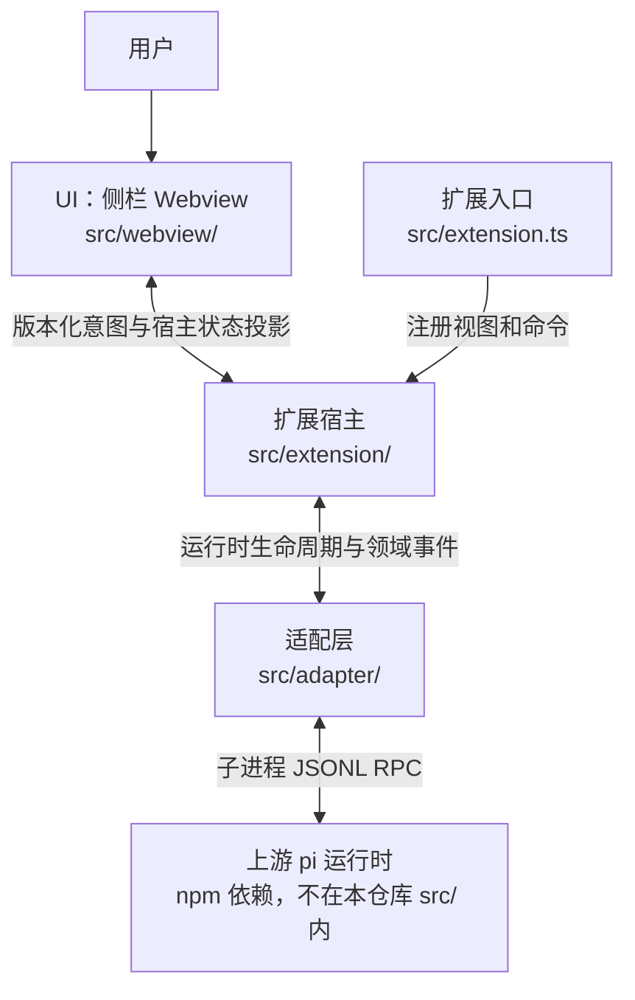

# pi VS Code 系统架构

[English](vscode-extension-architecture.md) | 中文

- 翻译状态：Machine Draft
- 权威原文：[vscode-extension-architecture.md](vscode-extension-architecture.md)
- 原文版本：Uncommitted baseline
- 最近同步：2026-09-28

- 类型：Architecture
- 状态：Accepted
- 创建：2026-09-19
- 权威范围：结构、边界与所有者（不表示功能已实现）
- 相关 gate：[`../reference/architecture-gates.zh.md`](../reference/architecture-gates.zh.md)
- 同级参考：pi-desktop（Electron 呈现层；pi 集成原则相同，宿主不同）
- 上游：[pi](https://github.com/earendil-works/pi) coding-agent runtime（开发期只读同级检出 `../pi`）

> ADR0001～0004 已接受的结构边界。实际功能／环境交付仍以对应 WI 证据为限；不代表整份 PRD 接受或发布认证。

## 1. 背景

**pi VS Code** 是在用户写代码时提供 **侧栏聊天伴侣** 的 VS Code 扩展，布局对标 GitHub Copilot Chat / OpenAI Codex：**左侧主侧栏保留资源管理器**；pi 聊天在 **Webview View** 中，在宿主支持时 **优先放在辅助侧栏（右侧）**。

扩展是 **呈现与编排层**，不重写 pi 的 agent 循环、provider、工具、压缩或会话文件语义。

## 2. 分层

| 层 | 职责 | 本仓所有者 |
|----|------|------------------------|
| **UI（Webview）** | 聊天布局、流式展示、仅 UI 状态 | `src/webview/` |
| **Extension host** | 激活、命令、配置、`SecretStorage`、工作区信任、webview 生命周期、经校验的 `postMessage` | `src/extension/` |
| **Adapter** | pi SDK 或 RPC 子进程 → 内部领域事件 | `src/adapter/` |
| **Runtime（上游）** | 模型、工具、会话、项目资源 | pi 包 / 子进程 |

下图展示当前分层与调用方向。实现范围和产品验收以 ACTIVE 及历史记录为准；本图不证明完整边界已经验收。

<!-- docs-i18n: localized-mermaid -->

```mermaid
flowchart TD
    U["用户"] --> W["UI：侧栏 Webview<br/>src/webview/"]
    W <-->|"版本化意图与宿主状态投影"| H["扩展宿主<br/>src/extension/"]
    H <-->|"运行时生命周期与领域事件"| A["适配层<br/>src/adapter/"]
    A <-->|"子进程 JSONL RPC"| P["上游 pi 运行时<br/>npm 依赖，不在本仓库 src/ 内"]
    E["扩展入口<br/>src/extension.ts"] -->|"注册视图和命令"| H
```

### 源码目录

目录在各层内部聚合已有职责，不代表独立 npm 包或额外运行时层次。

| 目录 | 职责 |
|------|------|
| `src/extension/bridge/` | Webview 资源壳、入站消息校验与输入限制 |
| `src/extension/contracts/` | 宿主拥有的 Webview DTO、运行时／会话接口与审批 envelope 契约 |
| `src/extension/models/` | 模型目录校验与已应用／待应用设置 |
| `src/extension/draft/` | 草稿提交与编辑器附件捕获 |
| `src/extension/editor-tools/` | 审批策略、未保存文件保护与修改审阅 |
| `src/extension/sessions/` | 宿主侧保存历史阅读与预览协调 |
| `src/adapter/runtime/` | 实时 pi RPC 进程、分帧、模型解析及活动／错误投影 |
| `src/adapter/sessions/` | 公开 pi 会话 API helper 与历史投影 |

目录 `index.ts` 对跨模块目录的调用者暴露所需操作与纯类型契约。模块自有类型放在本目录 `types.ts`，跨层 Webview DTO、运行时生命周期和会话接口仍以 `src/extension/contracts/` 为单一宿主权威。模块内部仍可直接导入实现文件。`src/extension.ts` 装配宿主与适配层入口。浏览器代码仅以类型方式导入宿主拥有的契约；单独打包的 session-worker 和 approval-gate 入口保持明确的实现文件路径。

`piChatViewProvider.ts` 留在宿主根目录承担协调。适配层根目录保留独立打包的 `approvalGate.ts` 及运行时／会话集成共同使用的环境和路径辅助模块。契约仍归宿主拥有；浏览器消费纯共享类型，不导入特权实现。模块测试放在各模块的 `tests/`；层级 `tests/` 保留跨模块协调测试和共享夹具。构建产物位置不变。

## 3. UI 布局（产品默认）

| 表面 | 作用 | 默认 |
|------|------|------|
| **主侧栏** | Explorer、SCM 等 | 不变（文件树在左） |
| **辅助侧栏** | pi 聊天 **Webview View** | **首选** 停靠（`viewsContainers.secondarySidebar`） |
| **主侧栏回退** | 宿主回退位置中已注册的 Pi webview | 1.105.1 的 Explorer 回退已验证；Focus Chat 先发现专用容器是否存在再展开。其他宿主须单独取证。 |
| **编辑区 Panel** | 整页聊天 | **停车场**（可选，非 MVP 默认） |

命令 `pi-vscode.focusChat` 从编辑器标题或命令面板显示现有容器并聚焦聊天视图。位置兼容性须在目标宿主验证。

## 4. 信任边界

- **密钥**：仅 extension host（`SecretStorage` / 环境策略），**不得**进入 webview 或 webview `localStorage`。
- **Webview**：无 `require`、无直连 pi SDK、无文件系统/shell；仅[消息契约](../reference/webview-messages.zh.md)中定义的结构化消息。
- **工作区**：host 按用户操作与 VS Code 信任读写；webview 经消息请求能力，host 校验。
- **会话**：除非 Accepted ADR 明确允许，会话功能不随意读写 pi 会话文件；优先 SDK/RPC。
- **诚实性**：不把 webview/extension host 宣传为对抗不可信代码的沙箱；工具与 shell 能力仍由上游 pi 设计决定。

## 5. 主流程与生命周期

1. **打开**：用户在辅助侧栏打开 pi 视图 → host 创建/保留 `WebviewView` → 通过 `asWebviewUri`、严格 CSP 与脚本 nonce 加载打包的 React／TypeScript 应用（`dist/webview/webview.js` 和 `webview.css`）；`localResourceRoots` 仅包含该资源目录。
2. **聊天**：webview 发用户输入 → host → adapter → pi 流式 → host 转发有界展示投影到 webview（过滤不保证任意输出完全无敏感信息）。
3. **视图释放与运行时关闭**：释放或替换 Webview 时，`PiChatViewProvider.clearView()` 清理视图监听及视图绑定操作，不停止运行时，也不清空宿主聊天／待选设置；重建视图后从宿主重新同步。Provider 释放（含扩展清理）时，取消运行时事件订阅，清空聊天／待选设置及审批／授权，请求 `runtime.stop()`，并释放视图／工作区监听。Adapter 负责有超时边界的子进程关闭；这不保证取消所有后代进程。

**已接受 WI-015／WI-019 前端边界：** host `bridge/webviewHtml.ts` 仅提供资源壳，`main.tsx` 经 `mount.tsx` 与 `chat/index.ts` 挂载共享 React 展示。`chat/types.ts` 定义挂载与页面语言契约。真实 bridge 管理传输寿命，WebviewClient 保持投影、身份与草稿权威；host 保持执行、审批、附件、会话与持久化权威。浏览器不导入 Node、VS Code 或 pi 运行时代码。Vite 构建浏览器，esbuild 构建 host／gate。Q16 由代理按本次委托完成评估后，正式与预览共享 chat 组合、样式、消息／活动／安全 Markdown、会话／历史／审批／审阅控件。预览 owner 仅保留合成 bridge、场景、计时器及开发控件，生产图排除 preview 和 tests。历史 baseline-app 夹具已删除；Attachment snapshot、Saved session 与转录仅由生产 chat 组合呈现。卸载释放 client、root 及监听；合成 owner 另释放自己的定时器。Markdown 仅由白名单 React 元素呈现，不注入 HTML／嵌入资源，不新增 host 意图或改变审批／附件原文。[Accepted ADR 0003](../decisions/0003-react-webview.zh.md) 记录委托验收与独立宿主／安装证据；[ACTIVE](../../ACTIVE.md) 持有剩余工作。

**已接受的 WI-026 方案 A（2026-09-29，维护者 F5 视觉验收）：** `bridge/settingsPanel.ts` 拥有单实例编辑区 WebviewPanel，重复 `openSettings` 揭示已有页面。它使用相同打包资源和 CSP、独立随机 viewId 及当前宿主 generation；入站白名单只允许 bootstrap、界面语言和供应商／默认意图，不投影工作区／聊天、草稿、审批或历史。ProviderConfig 和默认应用到会话仍由 PiChatViewProvider 及现有宿主服务处理。关闭面板只清理自己的监听与标识，聊天／runtime 继续；Provider dispose 同时释放设置面板。`main.tsx` 按宿主写入的 surface 标记选择 `settings/index.tsx`，该标记不授权渲染器改变宿主能力。

界面语言仍属展示层，语言包及本地 store 留在 `chat/`。协调器新增共享内存 locale（初始英文），向两个视图投影经验证的 `uiLanguageState` 并接收 `setUiLanguage`。任一视图重建恢复宿主语言，宿主重启重置；这替代 WI-019 仅挂载期的语言寿命。切换保留 client、草稿、会话与原文，不引入磁盘偏好；预览 Reset 保留自身语言 store。Decision none：既有低信任渲染器／特权宿主边界、持久化和 runtime 集成策略不变。维护者于 2026-09-29 确认 F5 视觉验收；安装 VSIX 仍未验证。

候选无文件夹欢迎页通过既有 client `edit`／版本化 `updateDraft` 编辑草稿（该路径原本独立于运行时就绪状态）。其发送分支只打开 `chat/no-folder-prompt.tsx`，不会在该状态调用任务提交。提示使用既有命名 `openFolder` 意图；工作区／信任／资源资格继续由 host 决定。不另持草稿、不选择工作区、不持久化或重放。原生弹窗寿命与返回焦点归候选展示负责，其他阻断状态保留既有资格规则。

Unix 控制端点在路径不超过 103 字节时继续使用恢复目录内的 socket；超长路径使用由绝对恢复目录与 run ID 派生的有界 `/tmp/pi-vscode-<SHA-256>.sock`。supervisor 继续负责绑定、`0600` 权限与清理；绑定前不删除已有端点。fence／receipt 存储及 Windows named pipe 不变。

**WI-013已接受边界（2026-09-28 Asia/Shanghai）：** [Accepted ADR0002](../decisions/0002-interaction-contract-route.zh.md)规定显式受信加载、host-owned标准交互、公开adapter seam、被动supervisor与持久恢复fence；精确v3 DTO归[消息契约](../reference/webview-messages.zh.md)。[委托验收](../archive/2026-09-28-wi-013-acceptance.zh.md)分别记录真实扩展、原生F5、安装、多窗口及限制，不表示全生态兼容或三项广泛gates关闭。

### 宿主内部能力模块

宿主仍作为一个扩展统一打包。`PiChatViewProvider` 拥有工作区／视图身份、运行时就绪状态、实时执行投影、Stop 与顺序会话交接，组合具体内部模块；不引入动态加载、第三方宿主 API 或通用命令总线。

| 模块 | 拥有的实现 | 协调者使用的接口 |
|------|------------|------------------|
| `DraftSubmission` | 已确认正文、附件捕获／确认、有界不可变提交历史、分块预览、文档订阅及准备取消 | 已校验草稿意图、发布、重置／视图生命周期、准备取消、完成通知与只读修订号／ACK 状态 |
| `EditorTools` | 审批策略组合、未保存文件检查及可选 `ChangeReview` 资源 | pi 审批回调、已校验工具／审阅意图、任务通知、取消／重置／释放 |
| `ModelSettings` | 已应用／待应用模型设置与过期操作失效 | 选择、加载／应用、重置／取消及只读投影 |
| `SavedHistory` | 恢复会话的历史窗口、请求关联文本预览与取消 | 恢复、分页／预览、发布／重置及 helper 完成屏障 |

模块接收窄能力与只读上下文，不持有 Provider 或其可写状态。草稿接纳在单次运行时发送前同步通知协调者；交付 ACK 与任务完成仍是不同事实。草稿重置通过模块自身 epoch 使已接纳提交的迟到回包失效。视图关闭只取消未提交准备／预览，已确认草稿及已接纳提交仍归宿主管理。协调者继续拥有原生会话确认及跨模块交接顺序。

`EditorToolOptions.changeReview: false` 是由测试验证的内部组合选择：不创建审阅快照、watcher 与虚拟文档 provider，但保留审批及未保存文件保护。生产默认仍启用，不新增用户设置或由 Webview 关闭保护的权限。这证明一个可选能力可省略，不代表所有功能均已独立可切换。

模块测试使用 VS Code 夹具，不构造 Provider；组合测试额外覆盖省略审阅后的聊天／流式／Stop。既有附件、审批、模型与会话交接回归覆盖它们的交互。当前检查和真实宿主限制归 ACTIVE 管理；内部重构不接受架构 gate，也不实现通用 pi 扩展 UI。

## 6. 架构 Gate

[Gate 表](../reference/architecture-gates.zh.md)是状态与接受范围的唯一入口；[ADR 0001](../decisions/0001-build-baseline.zh.md)保存最小宿主／侧栏／RPC 基线决定。当前未决边界和 ADR 缺少条件由 [ACTIVE](../../ACTIVE.md)跟踪。代码存在或限定 WI 关闭不等于完整架构结论已接受。

## 7. 受控执行所有权（WI-010 已关闭，2026-09-21）

- **宿主策略：** `src/extension/editor-tools/toolApproval.ts` 拥有待审批卡与会话授权。仅工作区内 canonical 普通文件 `read` 自动允许。搜索／列目录询问；不存在／无法解析目标仅允许一次。既有文件授权绑定工具 + canonical 路径；shell 绑定工具 + canonical cwd + 完整输入。不持久化授权，不提供自由执行模式。规范化不能防止所有检查／使用竞态。
- **契约所有权：** `src/extension/contracts/approvalProtocol.ts` 拥有纯捆绑 gate envelope 类型与校验器；adapter 消费这一宿主契约，不导入审批策略。`src/adapter/runtime/runtime-errors.ts` 拥有运行时错误归一化与长度限制。`toolApproval.ts` 保留授权决策及文件系统范围检查。
- **执行边界：** `src/adapter/approvalGate.ts` 打包为 `dist/approval-gate.mjs`（构建与 package 声明已包含）。公开异步 `tool_call` hook 通过 `ctx.ui.confirm` 等待；产品 v1 协议绑定 runtime／cwd、request／tool-call ID 与完整输入。`src/adapter/runtime/pi-rpc-runtime.ts` 拥有对话回复并校验 hello／就绪。不存在通用审批 RPC 或按标题授权。文件缺失拒绝启动；hello/get_state 失败停止启动，不是可用的无工具回退。
- **独占配置：** CLI 使用 `--tools read,write,edit,bash,powershell,grep,find,ls --no-extensions -e <bundled gate>`，并保留资源 flag。即使同意资源，也禁用第三方扩展发现。其他上下文／资源类别不因此全部排除。自带扩展以用户代码权限运行；不是沙箱，不承诺完整约束 shell／网络。
- **投影与生命周期：** `runtimeLifecycle.ts` 定义活动／最终消息／运行时错误事件及窄 `abortTask`／审批 handler 注入。`activityProjection.ts` 按消息／内容索引关联真实 thinking，按 tool-call ID 关联工具，替换累计输出并限制展示字段。`PiChatViewProvider` 拥有投影时间线及执行状态；`EditorTools` 拥有审批生命周期，由协调者通知重置／取消。Stop 在 adapter `clear_queue` + `abort` 前取消待审批；未 settled／失败则明确报错并撤销 transport／answer 接纳，按 ADR0002 保留 exact-child 观察；不自动杀死不确定工作。成功 Stop 保留同一运行会话授权；替换／断开清除。延后设置等待 settled 及停止完成。不回滚副作用、不自动重试任务。
- **契约／安全：** [contract-webview-messages](../reference/webview-messages.zh.md) 记录精确入站动作与有界 DTO。不开放通用命令，不转发原始 runtime／stderr；凭证模式过滤尽力而为，不保证任意输出完全无密钥。增量 UI、逐项及预留总量超限提示、稳定展开／焦点／滚动、完整审批输入、授权撤销与保留草稿的 Stop 已实现并有 UI 测试覆盖。维护者已确认四项开发态 F5：thinking／状态、读取／工具卡、拒绝写入无副作用后允许写入、长时间无害命令 Stop。限定 WI 已关闭；不推断已安装 VSIX 或完整手动矩阵验收。

**WI-016 T016-01 补充：** host `writeProtection.ts` 将声明版本的内置 write/edit 目标映射到活跃 VS Code 文档元数据和文件系统身份。`ToolApprovals` 在提供审批及授权放行前检查，异步过程共用到期点和 epoch；重检 grant 撤销，并仅在保护通过后创建 session grant。沿用有界错误投影解释拒绝，不新增 Webview 文件权限、自动保存、持久化或工具替换。公开执行前 hook 不能提供编辑器／写入原子锁，也不能覆盖不透明 shell／扩展绕过。[消息契约](../reference/webview-messages.zh.md) 管理细节，ACTIVE 管理当前证据；T016-02 `ChangeReview` 管理有界的纯内存快照、合并后的工作区观察和只读虚拟文档 diff。Adapter 完成事件独立于 activity 展示限额。Webview 只接收元数据与不透明 ID；最终授权失败丢弃临时快照，runtime 替换使快照／迟到工作失效。

**环境与覆盖：** [`controlledEnvironment.ts`](../../src/adapter/controlledEnvironment.ts)强制 `PI_OFFLINE=1`／`PI_TELEMETRY=0`，保留可信用户 provider 配置及凭证命令；后者在工具审批范围外。Offline 限制启动网络／缺包安装，不隔离推理或工具网络。

**证据与成熟度：** [原WI-010历史](../archive/2026-09-21-closed-wi-history.zh.md#wi-010)保留其版本与限制。[ADR0004](../decisions/0004-trust-and-lifecycle.zh.md)经当前源码审查、公开pi探针、实际原生F5与安装VSIX验证，另行接受剩余信任／生命周期边界。该范围达到Evolvable，不声称全provider／OS／fork支持。最终WI-010收尾及证据由ACTIVE链接。

## 8. 模型设置所有权（WI-008／WI-009）

`ModelSettings`（`src/extension/models/modelSettings.ts`）拥有已应用设置、独立的 `pendingModel`／`pendingThinkingLevel` 与在途操作失效管理。`PiChatViewProvider` 提供运行时／工作区身份与执行资格，在生命周期变化时调用重置／取消，并将只读模型快照合入 Webview 投影。空闲时立即应用，活动回复期间分别记录最新意图；当前会话 `agent_settled` 后，在 `modelBusy` 下串行修改模型、刷新能力、校验并修改 thinking。失败回读实际状态，不自动重试修改。代次／运行时 session／目录 token 拒绝过期完成；意图跨视图重建保留，工作区／资格变化、运行时替换及 provider 释放会清除。

Webview 仅展示已应用／待应用状态并发送允许列表意图；adapter 映射公开 RPC。具体错误、Stop 交错及清理语义见[消息契约](../reference/webview-messages.zh.md)，界面要求见 [REQ-002](../product-requirements.zh.md#req-002--模型就绪)。

维护者已于 2026-09-21 19:44 确认延后选择主路径：当前回复不变，settled 后应用，下一条使用新配置；空闲选择和基础 UI 也已确认。失败回读、重启清理及审批／Stop 交错等边界未获完整独立手测；WI-008／WI-009 仍待汇总及明确收尾。最新验收记录见 [ACTIVE](../../ACTIVE.md)。

### 保存会话 helper（WI-017）

Agent 执行仍使用 subprocess RPC；独立短生命周期 adapter helper 导入声明发行版的公开 SessionManager，负责当前项目列表、身份校验与活动分支历史；extension host 不加载 pi SDK、不解析 session 文件。生产包包含 dist/session-worker.mjs 与声明发行依赖。Helper 有输入／输出上限、期限／取消与实际 close 观察。Host 拥有原生交接确认、Stop／settlement、当前资源策略、fresh grants 及不透明 UI 能力。运行时就绪校验请求的公开会话 ID 与路径，不匹配则保持未就绪。UI 历史窗口与不可变保留文本分块不定义模型上下文、不恢复当前工作区文件。参见[消息契约](../reference/webview-messages.zh.md#wi-017-t017-03--有界恢复历史与保留文本契约)及 ACTIVE 的实现／验证状态；[WI-017委托接受](../archive/2026-09-28-wi-017-session-acceptance.zh.md)不自动接受广泛gate／ADR。
