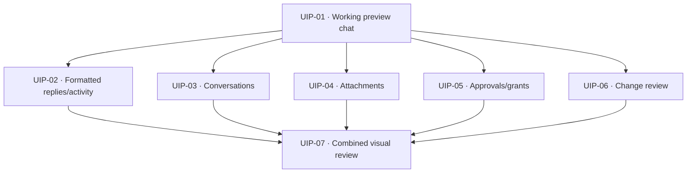
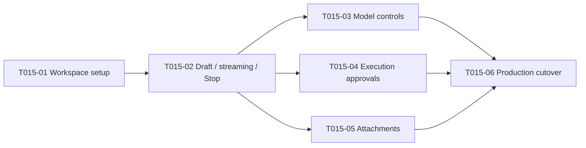

# Webview frontend framework discussion

English | [中文](2026-09-22-webview-framework.zh.md)

- Type: Discussion
- Status: Open
- Created: 2026-09-22
- Authority: investigation and historical proposals only; current work, Build approval and acceptance are owned by [ACTIVE](../../ACTIVE.md); framework direction is recorded in Draft ADR 0003; no acceptance claim

## Visual redesign interview (2026-09-23, confirmed)

The Q1–Q16 interview is complete. The maintainer confirmed the shared understanding and authorized interactive-preview creation, then invoked to-spec to obtain this local Draft first. [ACTIVE](../../ACTIVE.md) owns approval and scheduling; the [PRD visual direction](../product-requirements.md#visual-redesign-direction-2026-09-23) owns the confirmed product choices. The synthesis below proposes technical seams without extending that authorization. No new project-specific vocabulary was introduced; the glossary is unchanged.

Source inspection is pinned to Roo commit `b867ec9145750d0ae1ff7f02d35406e9bf2a0b16`. Its [ChatTextArea](https://github.com/RooCodeInc/Roo-Code/blob/b867ec9145750d0ae1ff7f02d35406e9bf2a0b16/webview-ui/src/components/chat/ChatTextArea.tsx) is coupled to Roo extension state, model/mode/auto-approval controls and host messages for mentions/search. [ChatView](https://github.com/RooCodeInc/Roo-Code/blob/b867ec9145750d0ae1ff7f02d35406e9bf2a0b16/webview-ui/src/components/chat/ChatView.tsx) depends on Roo message/ask types and virtualized rendering. These are implementation references, not drop-in pi components. [App](https://github.com/RooCodeInc/Roo-Code/blob/b867ec9145750d0ae1ff7f02d35406e9bf2a0b16/webview-ui/src/App.tsx) retains the chat view while navigating other views, a useful state-preservation pattern to assess against pi's existing draft/focus/approval lifecycle.

Further source findings: [ToolUseBlock](https://github.com/RooCodeInc/Roo-Code/blob/b867ec9145750d0ae1ff7f02d35406e9bf2a0b16/webview-ui/src/components/common/ToolUseBlock.tsx) provides compact collapsible tool presentation; [HistoryPreview](https://github.com/RooCodeInc/Roo-Code/blob/b867ec9145750d0ae1ff7f02d35406e9bf2a0b16/webview-ui/src/components/history/HistoryPreview.tsx) offers recent groups and a full-history entry; [index.css](https://github.com/RooCodeInc/Roo-Code/blob/b867ec9145750d0ae1ff7f02d35406e9bf2a0b16/webview-ui/src/index.css) maps styling to VS Code theme tokens. The [frontend manifest](https://github.com/RooCodeInc/Roo-Code/blob/b867ec9145750d0ae1ff7f02d35406e9bf2a0b16/webview-ui/package.json) includes React 18, Tailwind 4, Radix, Lucide, autosizing/virtualization and Roo workspace dependencies; copying whole components would import a larger framework/protocol surface than pi needs. The source [license](https://github.com/RooCodeInc/Roo-Code/blob/b867ec9145750d0ae1ff7f02d35406e9bf2a0b16/LICENSE) is Apache-2.0. No code was copied and no new dependency selected. This is source review, not a running Roo UI comparison.

Local evidence: `app.tsx` places sessions/review/grants above the conversation/composer; `attachment-panel.tsx` always renders explanatory copy, three actions, draft status and capacity. `conversation.tsx` already defaults activity details to collapsed, so compact activity is not a wholly missing capability. The screenshot comparison also has different widths and includes preview-only controls; future visual acceptance must compare equal widths and distinguish preview chrome from the product. The existing PRD preserves applied/pending settings, complete approval information, Stop, attachment snapshots and keyboard/theme accessibility; simplification cannot silently remove these semantics.

Further local contract evidence: [activityProjection.ts](../../src/adapter/activityProjection.ts) correlates activity by assistant message ID, not by user turn. The session catalogue supplies title/excerpt/modified metadata, sorted newest first and paged; a recent list can use that existing projection. [toolApproval.ts](../../src/extension/toolApproval.ts) permits up to eight pending approvals, each with its own identity and expiry. Frontend navigation and selective expansion must not renew expiry, batch-authorize requests or silently switch the live session.

The design tree covered scope/density/viewport, navigation, composer/attachments, activity, approvals/review, message rendering and preview-first delivery. Those product branches are settled; visual acceptance of the future artifact and technical verification are still outstanding. Current implementation work and unresolved verification remain owned by ACTIVE.

## Scoped interactive-preview Draft

### Status and traceability

**Draft — local synthesis, 2026-09-23.** The requested slice is a working browser preview of the confirmed visual redesign. Product choices belong to the [PRD visual direction](../product-requirements.md#visual-redesign-direction-2026-09-23); their interview IDs Q1–Q16 are trace labels, not new requirements. [ACTIVE](../../ACTIVE.md) records the explicit preview authorization and the subsequent documentation-only to-spec task. This Draft does not grant additional Build scope, publish a tracker item or establish delivery. The initial synthesis retained WI-017 as the implementation WI. The maintainer has since selected the preview as WI-019, with UIP-01 first; ACTIVE records the serial handoff and retains WI-017 pending acceptance. Frontend file organization has since been updated; candidate visual-preview implementation has not started.

| Slice concern | Canonical requirement |
|---------------|-----------------------|
| Workspace/availability and model/thinking presentation | [REQ-001](../product-requirements.md#req-001--project-and-trust-visibility), [REQ-002](../product-requirements.md#req-002--model-readiness) |
| Explicit file/selection context and retained snapshots | [REQ-003](../product-requirements.md#req-003--explicit-editor-context) |
| Readable output, compact activity, Stop and approval | [REQ-004](../product-requirements.md#req-004--observable-task-execution), [REQ-005](../product-requirements.md#req-005--stop-and-recovery), [REQ-006](../product-requirements.md#req-006--execution-approval-strategies) |
| Applied-change review and current-project conversations | [REQ-007](../product-requirements.md#req-007--post-edit-change-review), [REQ-008](../product-requirements.md#req-008--session-continuity) |

Evidence is the pinned Roo source and current repository observations above, the supplied screenshots, the [architecture](../architecture/vscode-extension-architecture.md), [message contract](../reference/webview-messages.md) and [ADR 0003](../decisions/0003-react-webview.md). The screenshots have different widths; they support a visual direction, not measured parity. ADR 0003 stays Draft and the existing gates remain Open.

### Problem and intended outcome

The present screen exposes configuration/status prose, attachments and secondary actions at similar visual weight to the conversation. The outcome is a preview in which the conversation and composer are the primary surfaces, secondary content appears when relevant, and consequential actions remain understandable and reachable. It must let the maintainer operate the proposed layout in representative states rather than judge a single static happy-path screenshot. Q5–Q16 in the PRD own the exact behavior; this section does not redefine it.

### Scoped user stories

All five stories express confirmed behavior in a synthetic preview; the implementation techniques below remain proposals.

| Story | User outcome and PRD trace | Preview demonstration |
|-------|---------------------------|-----------------------|
| Find and resume a conversation | Discover recent/current-project conversations without losing current work; Q5/Q10, REQ-008 | Empty/recent state, paged list, return with draft/reading position intact, explicit synthetic New/Restore confirmation including cancellation. |
| Compose with explicit context | Add, inspect and remove context without a permanently expanded attachment panel; Q6/Q12, REQ-002/003 | Working menu/chips, model/thinking selector, retained-text preview, changed-source confirmation and capacity failure. Existing applied/pending setting semantics remain visible. |
| Follow and control a reply | Read formatted output and inspect actual activity while retaining control; Q2/Q9/Q13, REQ-004/005 | Incremental Markdown/code copy, per-assistant-message activity expansion, Stop/stopping/settled and draft preservation. |
| Decide an action | Understand and individually answer pending actions; Q7/Q11/Q14/Q15, REQ-006 | Multiple identified requests, complete command/scope, one-call/session-scope/deny choices when eligible, expiry, and grant inspection/revocation. |
| Inspect results and recover | Reach captured diffs and understand limits/errors without persistent empty panels; Q8/Q11/Q12, REQ-001/007 | Conditional review entry with attribution/unavailable states, labelled simulated native navigation, no-model/workspace/error recovery states. |

### Proposed implementation approach

Keep React/TypeScript, ordinary CSS/VS Code theme tokens, the existing browser build and `WebviewClient`/`WebviewBridge` roles from ADR 0003. Reuse the pi projection/intents contract; Roo supplies layout and interaction evidence, not a copied agent state machine, approval protocol or dependency stack. No new API, storage format or runtime behavior is selected here.

**Preview isolation is necessary.** Today both entries call [mountApp](../../src/webview/mount.tsx) and render the same application. Changing that shared root/CSS immediately would change the production sidebar before Q16 visual confirmation. Proposed approach: a preview-only candidate composition and scoped styles, reusing the existing client and synthetic bridge; keep the packaged root and production imports unchanged until visual approval. This is a temporary design candidate, not a permanent second product frontend or a runtime feature toggle. After approval, integration should converge on one shared application and retire the temporary composition. The exact mount seam is an implementation choice; it must preserve the current owner/cleanup contract and be tested through the candidate's real entry.

Components own navigation, expansion, selected pending-card identity and presentation only. The client continues owning reconciled projections and acknowledged drafts; the host remains authoritative for permissions, expiry, session identity and execution. Navigating the list must not dispose/restart the client, reset a draft or send a session mutation. Removing/expiring a selected approval selects another valid pending item without reviving the old one. Activity aggregation uses existing assistant-message IDs, not inferred whole-turn attribution.

Extend synthetic fixtures at the bridge seam for missing combinations rather than hard-code independent policy into buttons. Visible actions must produce the corresponding simulated transition or an explicit simulated native-action result. Reset/hot refresh/unmount must dispose the owned React root, client, bridge listeners and timers. No pi process, credential, workspace read or provider request belongs in this slice.

Basic Markdown needs a renderer decision and tests before use: plain attachment/approval text remains literal; raw HTML, executable URL schemes and embedded remote resources must not acquire capabilities. Links/copy need explicit success, rejection and unavailable behavior. Native host routing is a later integration concern under the existing allowlist rules; a browser-only success cannot prove that host path. Preserve incomplete streamed Markdown as readable text, bounded output and stable focus/scroll. No renderer, icon library, clipboard host operation or new production dependency is approved by naming this need.

### Testing and acceptance plan

The confirmed evidence sequence is interactive browser review, then production integration and real-host verification after visual approval. The specific automated seams and sample dimensions below are **proposed engineering verification**, not tests already run or separately confirmed implementation details. Use the existing [testing playbook](../guides/agent/testing.md), not a new runner/tier.

| Behavioral seam | Proposed checks and existing prior art |
|-----------------|---------------------------------------|
| Mounted candidate + real client + synthetic bridge | Exercise navigation during streaming, draft/scroll/expansion preservation, correct named intents, multiple approval selection/expiry, literal snapshots, changed-context refusal and Markdown/copy failure. Reuse the [React harness pattern](../../src/webview/tests/react-harness.ts), [execution UI cases](../../src/webview/tests/execution-ui.spec.ts), [preview session cases](../../src/webview/tests/preview-sessions.spec.ts) and [attachment fixture cases](../../src/webview/tests/preview-attachments.spec.ts); adjust the mount seam for the candidate instead of testing only the old App. |
| Real browser + synthetic fixtures | Observe empty/new, conversation, active execution, pending approvals, changed attachments and errors, plus history/review interactions. Proposed sample: dark at 280/320/360/400/600px widths; light/high-contrast at 360px; a 320×500px approval/review stress state and ordinary 800px-height views. Record actual dimensions/theme and screenshots; verify keyboard/focus, local scrolling, long labels/code, menu dismissal and reachable Stop/input. jsdom does not prove layout. |
| Production isolation and later integration | Preview-stage compile/lint and collected behavior tests must pass, and import/build inspection must show the candidate/fixtures do not become the packaged entry or leak scoped styles into it. Existing [session handoff regressions](../../src/webview/tests/session-handoff.spec.ts) remain relevant. After visual approval, plan F5/installed-VSIX checks separately; simulated file selection, diff opening and confirmations do not satisfy them. |

Preview Build checks will use the existing compile/lint/test commands and documentation verification, with static Webview asset verification where relevant. This documentation-only synthesis runs documentation/diff checks only. The earlier script-migration run reported two session/attachment test failures; those are historical baseline evidence, not a current run or a reason to weaken assertions. Re-establish and report the current baseline during Build, preserving unrelated work.

The preview is reviewable when all five stories have operable demonstrations, representative failure/empty states are reachable, its synthetic nature is clear outside the product canvas, and the maintainer can evaluate the PRD's compact layout at the selected widths. Passing tests does not approve appearance, production integration, the full PRD or any gate.

### Architecture review and remaining uncertainty

Review disposition: **document first** for the current to-spec request; proposed preview decision class **none**, maturity **Direction**. This is a source-based assessment, not implementation certification. All governance dimensions were considered; related dimensions are grouped below.

| Dimensions | Status | Evidence and disposition |
|------------|--------|--------------------------|
| Requirements/domain (6–7) | pass | PRD Q1–Q16, existing glossary and ACTIVE approval identify the slice; no new domain vocabulary or whole-turn identity is invented. |
| Decomposition/interfaces/dependencies (1–3) | gap | Architecture and mount/client/bridge identify owners; candidate-only composition, scoped CSS and the mount test seam must be demonstrated before declaring isolation. Resolve in preview Build. |
| Contracts/state/ownership/concurrency/cleanup (4–5, 8–11) | gap | Message contract, client and fixture lifecycle provide prior art. New navigation/card selection must preserve IDs, expiry and cleanup under interleaving tests; no new host state machine is proposed. |
| Security/privacy (12, 14) | gap | L0 and literal rendering already set the boundary; Markdown, links and clipboard add presentation paths that require explicit safe behavior and failure tests before use. |
| Data/persistence (13) | N/A | No new persistent writer or store in this slice; saved-session and snapshot behavior is simulated via existing contracts. Production persistence acceptance is outside preview scope. |
| Performance/test/build/compatibility/UX (15–19) | gap | Existing bounded projections, runner, build and theme tokens are usable evidence; rendering/long-content interaction, production exclusion and proposed browser matrix need fresh results. No performance or host-compatibility claim yet. |

**Out of scope:** production cutover before visual confirmation, implementing the outstanding backend requirements, Plan mode, parallel/global sessions, checkpoint rollback, image/PDF context, tables/syntax highlighting, copying Roo wholesale, replacing the React/CSS stack, releasing/publishing or creating commits. The current product's unresolved backend work remains visible in ACTIVE.

**Open engineering details:** candidate mount/style isolation, renderer/link/copy implementation and fixture coverage; resolve these inside the approved scope using the current contracts. Escalate only a real product or consequential boundary change. **Pending maintainer decision:** visual acceptance of the future interactive preview. No further design interview or tracker destination is required to complete this Draft.

## Interactive-preview candidate slices

**Local planning draft, 2026-09-23; all entries are Candidate.** Parent: [scoped interactive-preview Draft](#scoped-interactive-preview-draft). Behavior: [PRD visual direction](../product-requirements.md#visual-redesign-direction-2026-09-23). Boundaries: [architecture](../architecture/vscode-extension-architecture.md), [message contract](../reference/webview-messages.md), [ADR 0003](../decisions/0003-react-webview.md). The `UIP-01`–`UIP-07` IDs identify local candidate slices, not new WIs or external issues. [ACTIVE](../../ACTIVE.md) alone owns existing preview authorization and serial WI selection/handoff. Agreement with this breakdown confirms planning, not extra Build scope; earlier explicit preview authorization remains valid without being requested again.

### Slicing method and shared checks

Use bounded **expand–contract** at the presentation entry: add the candidate alongside the packaged UI, grow it through working behaviors with green checks, then present the whole preview for visual review. Production convergence/removal occurs only in the later, visually approved integration phase; it is not an eighth implicit ticket. No worktree, integration branch, parallel implementation WI or prerequisite general refactor is required. Candidate mount/style isolation belongs inside the first working chat slice, not a standalone infrastructure ticket.

Every slice crosses only the needed path: user interaction → candidate React view → existing client/validated bridge → deterministic synthetic response → visible result, with owned cleanup. No real host/runtime layer is added merely to make a slice “vertical.” Missing candidate scenarios are explicitly unavailable until their owning slice lands; do not display successful placeholder actions. Prior slices remain working and covered after each addition.

For **each** slice, run applicable compile/lint and collected mounted behavior regressions, verify the exact added cases are collected, inspect browser behavior at its relevant widths/themes, and check production entry/style isolation. Baseline test failures must be reported and investigated separately, not hidden by replacing assertions. Use existing test seams from the parent Draft; the last slice does not postpone feature-specific tests. Proposal details such as exact DOM/component names or dependency choices remain implementation decisions within the recorded boundaries.

### 1. UIP-01 — An isolated preview can compose, reply and stop

- **Status:** Candidate; [approval/selection](../../ACTIVE.md).
- **Source:** parent Draft, PRD Q1–Q4/Q12; [REQ-001](../product-requirements.md#req-001--project-and-trust-visibility), [REQ-002](../product-requirements.md#req-002--model-readiness), [REQ-004](../product-requirements.md#req-004--observable-task-execution), [REQ-005](../product-requirements.md#req-005--stop-and-recovery).
- **What it delivers:** a candidate-only browser entry with scoped theme styles, bottom composer and a complete plain-text send → synthetic stream → Stop/settled loop. Reuse the working model/thinking control and distinguish ready, loading, no-model, workspace-blocked and runtime-error states.
- **Acceptance:** typing and acknowledged send work without duplication; newer drafts survive streaming/Stop; applied versus pending model settings remain truthful; blocked states offer the appropriate simulated recovery. Reset/unmount releases timers/listeners. At 320/400px, input and Stop remain reachable. Production keeps its existing application/styles; candidate assets and fixtures do not become its entry.
- **Blocked by:** None. Dependency-ready only; serial WI selection/handoff and the existing approval record still apply.
- **Limits / open questions:** no redesigned session/attachment/approval/review paths yet, no Markdown. Resolve the smallest candidate mount seam here, without moving policy into the UI or introducing a general framework.

### 2. UIP-02 — Read formatted replies and inspect compact activity

- **Status:** Candidate; [approval/selection](../../ACTIVE.md).
- **Source:** parent Draft, PRD Q2/Q9/Q13; [REQ-004](../product-requirements.md#req-004--observable-task-execution), [REQ-005](../product-requirements.md#req-005--stop-and-recovery).
- **What it delivers:** streamed basic Markdown/code copying and one activity summary per assistant message, with tool/thinking details expanded on demand.
- **Acceptance:** headings/lists/links/code remain readable across partial stream updates; copying returns exact code or a visible failure. Hostile HTML/URLs and embedded remote resources stay inert; approval/attachment text is not passed through the renderer. Expansion/focus/deliberate scroll survive updates, including activity preceding text; truncation and execution failure are visible. No model-generated activity summary.
- **Blocked by:** UIP-01.
- **Limits / open questions:** tables/highlighting and whole-user-turn aggregation are excluded. Resolve renderer/link/copy mechanics and safe browser behavior within this slice; native host routing is not established by preview success.

### 3. UIP-03 — Browse and switch conversations without losing current work

- **Status:** Candidate; [approval/selection](../../ACTIVE.md).
- **Source:** parent Draft, PRD Q5/Q10; [REQ-008](../product-requirements.md#req-008--session-continuity), [REQ-005](../product-requirements.md#req-005--stop-and-recovery).
- **What it delivers:** recent sessions on the empty page, top New/history navigation, a paged current-project list and synthetic New/Restore/cancel paths. The list replaces only the message area; the composer/Stop remain mounted.
- **Acceptance:** list loading/empty/error/page bounds work; navigation alone never sends a switch intent or clears a draft. Return restores the reading position. Cancelled/failed handoff retains current work; committed synthetic handoff applies the existing identity/reset behavior without replay. Restored conversation/history is inspectable through existing bounded history presentation. Streaming can continue and Stop remains available while browsing.
- **Blocked by:** UIP-01.
- **Limits / open questions:** reuse the existing bounded title/excerpt/modified projection, not a new session store or global discovery. UIP-07 covers navigation interleaved with redesigned approvals; this slice must already preserve the shared action area.

### 4. UIP-04 — Attach and confirm context through a compact composer

- **Status:** Candidate; [approval/selection](../../ACTIVE.md).
- **Source:** parent Draft, PRD Q6/Q12; [REQ-003](../product-requirements.md#req-003--explicit-editor-context), [REQ-005](../product-requirements.md#req-005--stop-and-recovery).
- **What it delivers:** `+` menu, file/selection chips, preview/removal, changed-source confirmation and retained attachment-history access, connected to synthetic acquisition/admission rather than cosmetic buttons.
- **Acceptance:** a mixed file/selection draft sends the confirmed snapshots; changed files and old selections require their existing distinct confirmation, never auto-send. Capacity/preparation failure and cancellation preserve the draft. History paging and full literal snapshot preview remain available during streaming; only the chosen item changes. Normal empty counters/prose are absent while relevant limitations and actionable errors remain discoverable. Keyboard menus and long chip labels work in a narrow sidebar.
- **Blocked by:** UIP-01.
- **Limits / open questions:** no real filesystem/native picker, new attachment formats, storage or budget changes. Changing draft-chip layout must not make historical snapshots look like current files.

### 5. UIP-05 — Decide pending actions and inspect session grants

- **Status:** Candidate; [approval/selection](../../ACTIVE.md).
- **Source:** parent Draft, PRD Q7/Q11/Q12/Q14/Q15; [REQ-006](../product-requirements.md#req-006--execution-approval-strategies), [REQ-005](../product-requirements.md#req-005--stop-and-recovery).
- **What it delivers:** an approval area above the composer, a selectable pending list/count, default oldest-request expansion and a compact permissions/grant inspection/revocation entry.
- **Acceptance:** tool/target/scope and full command are directly available, with literal large-input details. Choosing a card does not approve it or reset expiry. Test up to the current eight-request bound, independent decisions, expiration/removal of the selected card, ineligible session grants, stale replies, denial and Stop locking/cancellation. At short height, decision controls and Stop remain reachable while details scroll locally; local focus does not activate a replacement request inadvertently.
- **Blocked by:** UIP-01.
- **Limits / open questions:** preserve the current controlled policy, host identities and deadlines; no new unrestricted mode or batch approval. Genuine tool execution is not part of the demo.

### 6. UIP-06 — Inspect captured changes from an unobtrusive entry

- **Status:** Candidate; [approval/selection](../../ACTIVE.md).
- **Source:** parent Draft, PRD Q8/Q11; [REQ-007](../product-requirements.md#req-007--post-edit-change-review).
- **What it delivers:** no empty review panel, a compact entry when bounded review data exists, expandable/paged file results and clearly labelled simulated diff/source actions.
- **Acceptance:** synthetic operation completion exposes the correct entry; counts/labels distinguish captured, tool-reported, observed and unavailable information. Long names, paging, lost/changed captures and generation reset remain understandable; navigation uses existing opaque intents. Collapsing/restoring the list does not disturb the draft. Final competition with approvals is checked in UIP-07.
- **Blocked by:** UIP-01.
- **Limits / open questions:** no real editor/diff opening, new capture mechanism, whole-task attribution, rollback or per-turn review grouping. Native outcomes remain a later host check.

### 7. UIP-07 — Deliver the combined preview for visual review

- **Status:** Candidate; [approval/selection](../../ACTIVE.md).
- **Source:** parent Draft testing/acceptance, PRD Q3/Q10/Q11/Q16 and the REQ-001–008 links above.
- **What it delivers:** one usable preview with representative scenario controls outside the product canvas, combined interaction regressions and a recorded browser review matrix. This is the maintainable review artifact, not production cutover.
- **Acceptance:** exercise stream + list navigation + incoming/expiring approvals, approval + review in a short viewport, attachment preparation/confirmation + Stop, and New/Restore with existing draft/history state. Confirm feature actions work together, input/focus/reading position are stable and reset leaves no old listeners/timers. Run the parent's proposed width/theme/keyboard matrix, capture representative screenshots and actual conditions, provide launch instructions and identify simulations. Re-run required combined checks and verify the packaged entry excludes the candidate. Record visual acceptance as pending until the maintainer inspects the result.
- **Blocked by:** UIP-02, UIP-03, UIP-04, UIP-05, UIP-06.
- **Limits / open questions:** all individual behavior checks must already pass; this slice handles cross-feature composition and review evidence only. No F5/installed-VSIX parity claim, publication, gate closure or automatic production switch follows.

### Dependency graph and review

<!-- docs-i18n: localized-mermaid -->

Seven nodes, ten direct edges; no cycles or transitively redundant edges. UIP-02–06 each depend only on the working candidate/client seam; sharing composer files is a coordination concern, not a semantic blocker. UIP-07 inherits UIP-01 transitively. Suggested **serial** order is 01 → 02 → 03 → 04 → 05 → 06 → 07; the fan-out does not authorize parallel work or additional WIs.

Coverage: startup/composer/model/Stop 01; formatted output/activity 02; sessions 03; attachment snapshots 04; approval/grants 05; change review 06; combined state/layout evidence 07. No separate prefactoring or deferred “write all tests” ticket is needed. Review question: is this granularity and dependency structure appropriate, or should specific candidates merge/split? The review concerns planning; existing approval remains in ACTIVE.

## Confirmed goal

The maintainer confirmed long-term component composition/state maintenance, then selected React + TypeScript, a compact IDE-native visual refresh preserving functional behavior, and browser preview with fast refresh. WI-014 was paused for WI-015, whose T015-01–06 Build was approved on 2026-09-22. React/Vite implementation and executable verification are now recorded in [ACTIVE](../../ACTIVE.md), alongside pending maintainer acceptance and the resumed WI-014; this discussion is not the current task ledger. Framework rationale and approval limits are recorded in [Draft ADR 0003](../decisions/0003-react-webview.md).

## Repository evidence

The pre-migration implementation is now removed. Historical read-only inspection found 682 lines in `src/webview/placeholderHtml.ts`, including 432 lines of inline JavaScript inside a TypeScript string. That historical script had no TypeScript checking. It combined model controls, attachment draft/preview/history coordination, keyed message/activity/approval rendering and workspace-state reconciliation. Its keyed updates deliberately retained node identity, focus, expanded details and scroll; the current React application must preserve those behaviors. The current host shell and packaged resource loading live in [webviewHtml.ts](../../src/extension/webviewHtml.ts), and the current React application lives in [app.tsx](../../src/webview/app.tsx).

Historically, [esbuild.mjs](../../esbuild.mjs) had host, probe and approval-gate entries but no browser entry. The current browser application is Vite-driven and uses [app.tsx](../../src/webview/app.tsx); host HTML/CSP and resource loading use [webviewHtml.ts](../../src/extension/webviewHtml.ts). The removed pre-migration HTML test was `src/webview/tests/placeholder-html.spec.ts`; current shell/resource checks are in [webview-html.spec.ts](../../src/extension/tests/webview-html.spec.ts). The pre-migration UI tests used a VM with a hand-built DOM; the current [execution UI specs](../../src/webview/tests/execution-ui.spec.ts) mount the React application. This discussion records the migration rationale, not a passing application, package or host result.

## Alternatives considered before confirmation

| Candidate | Fit and cost in this repository |
|-----------|---------------------------------|
| Native TypeScript modules | Removes the string/typechecking problem with minimal runtime change; retains manual DOM reconciliation and component conventions. |
| React + TypeScript | Selected direction for the confirmed component-composition goal: explicit components and state, with a browser bundle alongside the current host build. Requires UI test migration and deliberate state/identity handling. |
| Vue | Declarative components/reactivity also fit; single-file components add compiler/tooling integration to assess. |
| Preact | JSX component alternative worth considering if measured bundle cost warrants it; compatibility of any chosen React libraries needs separate checking. |
| Lit | Web-component alternative; useful if independently reusable custom elements become a requirement, which is not currently established. |

Official references reviewed: [VS Code Webview API](https://code.visualstudio.com/api/extension-guides/webview), [React integration](https://react.dev/learn/add-react-to-an-existing-project), [React state identity](https://react.dev/learn/preserving-and-resetting-state), [Vue introduction](https://vuejs.org/guide/introduction.html), [Preact setup](https://preactjs.com/guide/v10/getting-started/), [Lit overview](https://lit.dev/docs/). The recommendation is project-specific judgment, not an official preference or benchmark result.

## Scoped synthesis (historical Prepare text, 2026-09-22)

**Historical status: Draft.** The maintainer confirmed the design interview's shared understanding and requested local synthesis. The complete scoped proposal, stories, implementation boundaries, suggested test matrix, exclusions and open items remain linked from [ACTIVE, WI-015](../../ACTIVE.md). [PRD's WI-015 visual slice](../product-requirements.md#wi-015-visual-refresh-scope-prepare-2026-09-22) owns user-visible acceptance and links the already implemented REQ-001–006 slices; [ADR 0003](../decisions/0003-react-webview.md) owns the confirmed React/TypeScript and build/test direction. ACTIVE is the current source for scope, approval, verification and acceptance, and records 2026-09-22 Build approval for all T015-01–06. React/Vite is integrated, but current verification and acceptance remain pending. This discussion does not grant a separate approval, accept the ADR or close any gate. WI-014 remains Paused with its evidence and unaccepted T014-01 conditions intact.

The original esbuild-only frontend suggestion changed to Vite after the maintainer requested browser preview and fast refresh; host esbuild remains. The earlier suggestion to wait for T014-01 acceptance was not selected: at the original Prepare stage, the maintainer prioritized WI-015. These choices are retained as rationale, not current authorization; current scope, verification and acceptance are in ACTIVE. See the previously reviewed [Vite guide](https://vite.dev/guide/) and [production build documentation](https://vite.dev/guide/build.html); the version-specific engine requirement still needs matching evidence.

## Test and integration evidence

These sources were read, not executed for the original synthesis. The agreed test direction is node:test + jsdom; mounting the application/bridge against a synthetic host and the focused integrations below was the proposed seam at that time. Current verification and acceptance remain pending and are recorded in ACTIVE; this discussion does not claim those checks passed.

| Historical/source evidence | What the original Draft carried forward |
|---------------------------|------------------------------------|
| [Execution UI specs](../../src/webview/tests/execution-ui.spec.ts) | The original VM-harness coverage captured literal chunked preview, acknowledged draft/newer edits, superseded preparation, stable nodes/expansion/focus/scroll, approval decisions/grant revocation, Stop and generation changes. Preserve those observable behaviors in the current React application; mock scroll coordinates do not establish browser layout. |
| [Model UI specs](../../src/webview/tests/model-selection.spec.ts), [workspace UI specs](../../src/webview/tests/workspace-ui.spec.ts), [Webview HTML spec](../../src/extension/tests/webview-html.spec.ts) | The original checks covered applied/pending separation, busy control gating, hostile text, keyboard-native actions and CSP. The current React/host shell uses component behavior and packaged-resource checks; retain the security assertions. |
| [Attachment host specs](../../src/extension/tests/file-attachment.spec.ts) and [existing harness](../../src/extension/tests/harness.ts) | Real host intents to captured runtime prompts already cover dirty text, source changes, admission, cancellation and lifetime. Reuse this boundary instead of proving policy only through a permissive preview mock. |
| [Provider](../../src/extension/piChatViewProvider.ts) and [message reference](../reference/webview-messages.md) | The current Webview uses v2/view identity and host draft revisions; historical v1 shapes in the reference are not a migration target. The historical resource-integration change replaced the inline script and empty localResourceRoots without transferring host authority. |
| [Test runner](../../scripts/testing/test-runner-lib.mjs), [TypeScript config](../../tsconfig.json), [lint config](../../eslint.config.mjs), [build](../../esbuild.mjs) | At synthesis time, node:test application entries were .spec.ts and bundled by esbuild. The original proposal called for browser TSX/DOM typechecking and JSX support in the pipeline; imported TSX components need not force a new test suffix/runner. Node/jsdom test helpers remain outside the production browser environment. |
| [Package manifest](../../package.json), [static Webview asset checker](../../scripts/packaging/verify-webview-assets.mjs) and [VSIX checker](../../scripts/packaging/verify-vsix.mjs) | The pre-migration package whitelist lacked frontend output. The integrated package manifest now includes the Webview bundle, and static asset inspection has a separate checker; the existing VSIX checker still performs archive and extracted pi RPC/gate readiness checks. |

## Remaining uncertainty and disposition

The React/Vite path is now integrated, but dependency/runtime compatibility, output/chunk/CSP/resource evidence, and performance observations still need current evidence. No performance baseline or host/package acceptance is claimed here; record resource size and observed rendering/input behavior rather than promising a reduction. Concrete visual dimensions/load fixtures and Windows F5/installed-package prerequisites still need evidence. Current functional limits and message budgets remain at their canonical owners, not invented afresh here.

This discussion remains Direction/background material. The Draft is reviewable; it does not certify implementation readiness, UI equivalence, host compatibility or ADR/gate acceptance. The 2026-09-22 Build approval for T015-01–06 and all current verification/acceptance status belong only in ACTIVE.

## Historical WI-015 candidate slices (to-tickets, 2026-09-22)

The six entries below are **historical Candidate** text from the original Prepare plan, local and unpublished. Current scope, approval and acceptance are owned by [ACTIVE, WI-015](../../ACTIVE.md), which records 2026-09-22 Build approval for all T015-01–06. User-visible source: [PRD WI-015](../product-requirements.md#wi-015-visual-refresh-scope-prepare-2026-09-22) and its existing REQ slices; boundaries: [architecture](../architecture/vscode-extension-architecture.md), [ADR 0003 Draft](../decisions/0003-react-webview.md) and the [message contract](../reference/webview-messages.md). These local IDs are sub-slices, not new WIs or tracker issues; this retained discussion is not a second task tracker.

### Migration method and shared checks

**Historical proposed expand–contract:** the original plan kept the existing production UI active through T015-01–05, built the new application alongside it in development preview and deterministic tests, and switched the actual provider entry in T015-06 after retaining coverage. Temporary coexistence was bounded to this migration, with no user-facing framework toggle or production mock fallback. This sequencing proposal is retained as historical context, not as a separate approval. It avoided a temporarily incomplete product and preserved WI-014's current dirty implementation rather than restoring the older Git HEAD.

Evidence for this method: the existing single workspace-state handler updates all controls, while attachment acknowledgements also govern composer eligibility and Stop. Switching the provider before all paths are present would disable or misrepresent existing behavior. No prerequisite general refactor or additional runtime layer is needed. Each early slice is demoable in the shared browser application and verifiable through real bridge/validator seams; it is not claimed as installed-product delivery.

The original candidate plan required each slice to include its own UI style, preview fixture and behavior tests, plus the relevant host regressions. Current verification results are not duplicated here; ACTIVE owns actual checks and unrun host evidence. The proposed checks included compile/lint/npm test and affected documentation checks, with .spec collection and security assertions kept effective. Browser preview shows layout; jsdom checks interactions, not layout. T015-06 adds combined F5/installed-VSIX evidence rather than postponing all tests to the last slice. The existing VSIX checker invokes pi: static asset inspection must be separately callable before any runtime-probe authorization.

### 1. T015-01 — Typed frontend boots and handles workspace setup

- **Status:** Candidate; approval remains in ACTIVE.
- **Source:** PRD WI-015 / REQ-001; ADR 0003; existing workspace/HTML specs in the evidence table.
- **What it delivers:** Vite/React/TypeScript and jsdom pipeline with a real first path: start the new application, receive workspace status, show no-folder/trust/unsupported/resource-choice states, and emit the existing native recovery/resource intents. The same components run in browser preview with fast refresh; a production-capable local asset shell is exercised by the host harness, without selecting it in the product yet.
- **Acceptance:** pin compatible dependencies and record Node/browser targets; strict browser/host types, lint and test collection work; subscribe before initial synchronization, retain current identity and show unavailable state on bridge failure; exact v2 actions pass the real validator. Host shell URI/CSP/root checks and static asset inspection establish that all referenced JS/CSS exist and no preview/Node/pi code enters the browser product bundle. Changing a component updates browser preview. Existing production regression checks remain green.
- **Blocked by:** None; dependency-ready only, still requires explicit WI-015 slice approval.
- **Limits / open questions:** includes necessary build/type/test/asset work only to deliver this path, not a standalone infrastructure program. Exact dependency pins, resource/chunk loading and browser target must be resolved before their implementation. Resource choice in preview records/simulates the intent; it does not start pi or grant real workspace trust. No chat UI or product-entry switch yet.

### 2. T015-02 — Acknowledged text draft, streamed conversation and Stop

- **Status:** Candidate; approval remains in ACTIVE.
- **Source:** REQ-004/005, existing REQ-003 draft-transaction constraints; runtime-chat/execution UI evidence and current v2 contract.
- **What it delivers:** in the new application, edit a plain-text draft, synchronize its revision, submit once, display incremental replies and bounded failures, then request Stop and render its host-reported outcome. This introduces the shared composer/conversation path consumed by later slices.
- **Acceptance:** replay deterministic host projections through the mounted app/bridge and real validator/harness seam: sending waits for valid identity/acknowledgement; old admission cannot clear newer text; preparing/sending/stopping prevent duplicate or replayed submissions; Stop retains draft and remains visible until the host settles. Streaming preserves stable message identity, focus and follow-at-bottom versus deliberate scroll. Cover initial sync, disconnect/error, obsolete events, view recreation and unmount cleanup. Show the path in browser preview; no live inference needed for these tests.
- **Blocked by:** T015-01.
- **Limits / open questions:** text-only fixture for this bounded demonstration; no claim of safe complete product replacement yet. Draft revision and preparation semantics are implemented here once and reused for attachments. Stop sends existing intent; it does not implement cancellation or invent remote settlement in React.

### 3. T015-03 — Model/thinking controls through idle and next-turn changes

- **Status:** Candidate; approval remains in ACTIVE.
- **Source:** REQ-002's WI-008/009 slices, PRD WI-015; model-selection UI/host specs.
- **What it delivers:** use the composer model popover and thinking slider, see applied versus next-turn choices during a stream, and observe host application or error/recovery without disrupting the current reply.
- **Acceptance:** UI intents validate; unavailable/loading/busy/error states gate controls correctly; selection during streaming leaves applied values unchanged until host projections change; application blocks send, failure never claims success. Keyboard/Escape/focus, model-list expansion and in-progress slider manipulation survive stream updates; preserve the approved blue slider. Preview idle/streaming/failure scenes and retain host deferred-setting regressions.
- **Blocked by:** T015-02.
- **Limits / open questions:** no new model catalog, credentials or settings persistence; theme/contrast observations do not silently change the approved styling. Host remains the settings authority.

### 4. T015-04 — Tool activity, approvals and live grants during execution

- **Status:** Candidate; approval remains in ACTIVE.
- **Source:** REQ-004/005/006's controlled-execution slices; execution UI and tool-approval host specs.
- **What it delivers:** from streamed activity to a pending approval, inspect full literal arguments/scope, choose once/session/deny, observe host continuation/failure, and inspect/revoke a grant while retaining task control.
- **Acceptance:** cumulative activity replaces content without losing expanded cards/focus/scroll; overflow/truncation stays explicit. Decisions emit the exact current request once; absent reusable scope offers no session grant; expiry/removal/Stop/view change invalidates actions and cannot revive approval. Stop locks pending approval UI and preserves draft; grant revocation is reflected from host. Demonstrate success/denial/cancellation/error with synthetic projections and retain real host policy regressions.
- **Blocked by:** T015-02.
- **Limits / open questions:** no new execution permission, third-party extension or runtime gate behavior. Approvals are not effective merely because a preview fixture advances; policy remains independently checked at the host seam.

### 5. T015-05 — Single-file attachment from draft to retained snapshot preview

- **Status:** Candidate; approval remains in ACTIVE.
- **Source:** REQ-003 T014-01 only, PRD WI-015; attachment host/execution UI specs and current v2 reference.
- **What it delivers:** request native file attachment, show host metadata/dirty state, preview literal text/remove, handle a source-change refusal, then inspect the immutable submitted snapshot/history in the new application. Reuse T015-02's draft/Stop transaction.
- **Acceptance:** UI emits only named opaque-ID/revision intents, never paths or file text; bounded preview chunks and late/obsolete responses follow the existing contract. A changed file blocks send and preserves draft; host admission does not clear newer text; uncertain delivery is not shown as success or retried. All retained history remains reachable beyond the visible message window; history-full/memory-only loss states stay explicit. Compose UI scenarios with existing host capture tests for dirty/no-save, zero dispatch on invalid source, revision cancellation and lifecycle cleanup.
- **Blocked by:** T015-02.
- **Limits / open questions:** no T014-02–05, selection, multi-attachment or persistent history. Browser mock does not prove native picker or filesystem policy; original T014-01 real-host acceptance remains pending until appropriate evidence is recorded.

### 6. T015-06 — Switch the production Webview and verify the installed application

- **Status:** Candidate; approval remains in ACTIVE.
- **Source:** PRD WI-015 and the existing REQ-001–006 slices above; ADR 0003 acceptance conditions.
- **What it delivers:** select the complete React/local-asset shell in the actual provider, remove the old inline production UI and superseded VM-only harness, and deliver the refreshed application in a VSIX. Retain migrated behavior coverage and existing host/adapter tests.
- **Acceptance:** T015-03/04/05 combined regressions cover model-setting/Stop/approval/attachment interleavings and view recreation, with no duplicate subscription or action replay. Static package inspection resolves all local assets and excludes preview inputs, without invoking pi. Demonstrate browser preview/refresh; separately record Windows F5 and installed-VSIX loading, native attachment/dirty behavior, streaming/Stop, keyboard/focus, themes, narrow/wide layouts and long bounded content. Record bundle size/load conditions, missing evidence and required user acceptance. The installed product works with the preview server stopped; there is one production UI and no fallback to mock/legacy.
- **Blocked by:** T015-03, T015-04, T015-05.
- **Limits / open questions:** this is the bounded cutover/removal and real-host integration slice, not a testing-only ticket or deferred functional rewrite. Probe/native-host tooling and allowed inference fixtures must be rechecked; no paid calls or secrets follow from this candidate. Do not delete the old path before all migrated scenarios pass. Missing acceptance keeps this slice/ADR pending, not silently passed; WI-014 and broader gates do not close automatically.

### Dependency graph and review

<!-- docs-i18n: localized-mermaid -->

Only direct prerequisites are listed; T015-06 inherits T015-01/02 transitively. T015-03/04/05 share the composer and app state but are not semantic blockers of one another. Recommended work order is 01 → 02 → 03 → 04 → 05 → 06, serial within WI-015; the fork in the graph is not authorization for parallel Build. The graph has six nodes, seven direct edges and no cycles. There is no prerequisite prefactoring ticket. Scope coverage: workspace/build/preview 01; chat/draft/Stop 02; model 03; activities/approvals/grants 04; T014-01 UI 05; complete product/cutover/installed evidence 06.

**Historical review note:** the original candidate review asked to confirm six-slice granularity, the direct dependencies and the proposed temporary preview-first expand–contract sequence; it also identified T015-01 as potentially largest because it includes the first working build/bridge/test seam. Current scope, approval and acceptance are maintained only in ACTIVE; this discussion does not create a second tracker.
