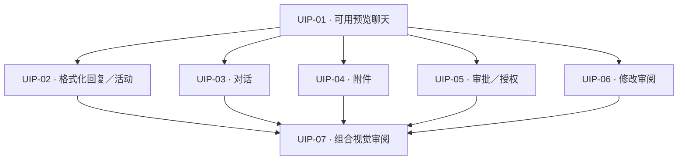
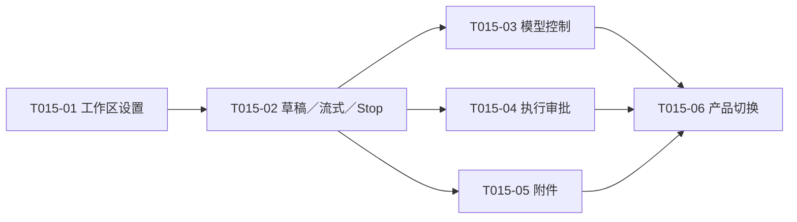

# Webview 前端框架讨论

[English](2026-09-22-webview-framework.md) | 中文

- 翻译状态：Machine Draft
- 权威原文：[2026-09-22-webview-framework.md](2026-09-22-webview-framework.md)
- 原文版本：Uncommitted baseline
- 最近同步：2026-09-23

- 类型：讨论
- 状态：Open
- 创建：2026-09-22
- 权威：仅调查与历史建议；当前工作、Build 批准与验收以 [ACTIVE](../../ACTIVE.md) 为准；框架方向另见 ADR 0003 Draft；不构成验收声明

## 视觉重设计访谈（2026-09-23，已确认）

Q1–Q16 访谈已经完成。维护者确认共同理解并授权交互预览制作，随后调用 to-spec，要求先交付此本地 Draft。[ACTIVE](../../ACTIVE.md) 管理批准与排期，[PRD 视觉方向](../product-requirements.zh.md#视觉重设计方向2026-09-23) 管理已确认的产品选择。下方综合提出技术接缝，不扩大批准范围。本轮未新增项目专属术语，词汇表不变。

源码调查固定至 Roo commit `b867ec9145750d0ae1ff7f02d35406e9bf2a0b16`。[ChatTextArea](https://github.com/RooCodeInc/Roo-Code/blob/b867ec9145750d0ae1ff7f02d35406e9bf2a0b16/webview-ui/src/components/chat/ChatTextArea.tsx) 耦合 Roo 扩展状态、模型／模式／自动审批控件以及上下文引用／搜索的 host 消息。[ChatView](https://github.com/RooCodeInc/Roo-Code/blob/b867ec9145750d0ae1ff7f02d35406e9bf2a0b16/webview-ui/src/components/chat/ChatView.tsx) 依赖 Roo 消息／ask 类型和虚拟列表。这些是实现参考，不能直接当作 pi 组件移植。[App](https://github.com/RooCodeInc/Roo-Code/blob/b867ec9145750d0ae1ff7f02d35406e9bf2a0b16/webview-ui/src/App.tsx) 导航到其他视图时保留聊天视图，是值得对照 pi 既有草稿／焦点／审批生命周期评估的状态保留方式。

补充源码发现：[ToolUseBlock](https://github.com/RooCodeInc/Roo-Code/blob/b867ec9145750d0ae1ff7f02d35406e9bf2a0b16/webview-ui/src/components/common/ToolUseBlock.tsx) 提供紧凑可折叠工具展示；[HistoryPreview](https://github.com/RooCodeInc/Roo-Code/blob/b867ec9145750d0ae1ff7f02d35406e9bf2a0b16/webview-ui/src/components/history/HistoryPreview.tsx) 提供最近分组和完整历史入口；[index.css](https://github.com/RooCodeInc/Roo-Code/blob/b867ec9145750d0ae1ff7f02d35406e9bf2a0b16/webview-ui/src/index.css) 将样式映射到 VS Code 主题变量。[前端依赖清单](https://github.com/RooCodeInc/Roo-Code/blob/b867ec9145750d0ae1ff7f02d35406e9bf2a0b16/webview-ui/package.json) 包含 React 18、Tailwind 4、Radix、Lucide、自适应输入／虚拟列表以及 Roo 工作区包；直接复制整个组件会带入超出 pi 所需的框架／协议依赖。[源码许可证](https://github.com/RooCodeInc/Roo-Code/blob/b867ec9145750d0ae1ff7f02d35406e9bf2a0b16/LICENSE) 为 Apache-2.0。本次未复制代码、未选择新依赖；这是源码审阅，不是运行中的 Roo 界面对比。

本地证据：`app.tsx` 将会话／审阅／授权放在对话与输入区周围；`attachment-panel.tsx` 常驻说明文案、三个操作、草稿状态和容量；`conversation.tsx` 已默认折叠活动详情，因此紧凑活动展示不是完全缺失的能力。截图宽度不同且含预览专用工具栏；后续视觉验收需使用相同宽度并区分预览外壳与正式产品。既有 PRD 要求保留已应用／待应用设置、完整审批信息、Stop、附件快照及键盘／主题可访问性；简化不能默默删除这些语义。

补充本地契约证据：[activityProjection.ts](../../src/adapter/activityProjection.ts) 按助手消息 ID 关联活动，没有用户整轮标识。会话目录提供标题／摘要／修改时间，按最近修改排序且分页；最近会话可使用既有投影。[toolApproval.ts](../../src/extension/toolApproval.ts) 允许最多八项待审批，每项有独立身份及有效期。前端导航和选择性展开不能延长有效期、批量授权或静默切换活跃会话。

设计树已覆盖范围／密度／视口、导航、输入／附件、活动、审批／审阅、消息渲染与预览优先交付。这些产品分支已确认；未来产物的视觉接受与技术验证仍未完成。当前实现工作与未决验证继续由 ACTIVE 管理。

## 交互预览限定 Draft

### 状态与追溯

**Draft — 本地综合，2026-09-23。** 请求的切片是已确认视觉重设计的可操作浏览器预览。产品选择归 [PRD 视觉方向](../product-requirements.zh.md#视觉重设计方向2026-09-23) 管理；访谈编号 Q1–Q16 仅用于追溯，不是新需求。[ACTIVE](../../ACTIVE.md) 记录明确的预览授权及之后仅文档的 to-spec 任务。本 Draft 不增加 Build 范围、不发布 tracker 项、不证明交付。初次综合时保留 WI-017 为实施 WI。维护者随后将预览选为 WI-019，首片 UIP-01；ACTIVE 已记录串行交接并保留 WI-017 待验收条件。随后已整理前端文件结构，候选视觉预览尚未开始实现。

| 切片关注点 | 权威需求 |
|------------|----------|
| 工作区／可用性与模型／思考展示 | [REQ-001](../product-requirements.zh.md#req-001--项目与信任可见性)、[REQ-002](../product-requirements.zh.md#req-002--模型就绪) |
| 显式文件／选区上下文与保留快照 | [REQ-003](../product-requirements.zh.md#req-003--显式编辑器上下文) |
| 可读输出、紧凑活动、Stop 与审批 | [REQ-004](../product-requirements.zh.md#req-004--可观察的任务执行)、[REQ-005](../product-requirements.zh.md#req-005--停止与恢复)、[REQ-006](../product-requirements.zh.md#req-006--执行审批策略) |
| 已应用修改审阅与当前项目对话 | [REQ-007](../product-requirements.zh.md#req-007--修改后审查)、[REQ-008](../product-requirements.zh.md#req-008--会话连续性) |

证据包括上方固定版本的 Roo 源码与本地观察、维护者截图、[架构](../architecture/vscode-extension-architecture.zh.md)、[消息契约](../reference/webview-messages.zh.md) 和 [ADR 0003](../decisions/0003-react-webview.zh.md)。截图宽度不同，只支持视觉方向，不证明量化一致。ADR 0003 保持 Draft，既有 gate 保持 Open。

### 问题与预期结果

当前页面将配置／状态说明、附件及辅助操作以接近对话的视觉权重同时展示。目标是在预览中让对话与输入成为主要区域，辅助内容按需出现，同时让重要操作保持可理解、可到达。维护者应能操作代表状态，而不是只评估一张正常路径静态图。精确行为由 PRD Q5–Q16 管理，此处不另行定义。

### 限定用户故事

五项故事均表达已确认行为在模拟预览中的呈现；后文技术方案仍为建议。

| 故事 | 用户结果与 PRD 追溯 | 预览演示 |
|------|-------------------|----------|
| 查找并继续对话 | 查找最近／当前项目对话而不丢失当前工作；Q5/Q10、REQ-008 | 空白／最近列表、分页列表、返回后草稿／阅读位置保留，明确标识的模拟新建／恢复确认与取消。 |
| 携带显式上下文输入 | 添加、查看、移除上下文，无须常驻展开附件面板；Q6/Q12、REQ-002/003 | 可操作菜单／标签、模型／思考选择、保留原文预览、来源变化确认、容量失败；保留已应用／待应用设置语义。 |
| 跟踪并控制回复 | 阅读格式化输出、查看真实投影活动，同时保留控制；Q2/Q9/Q13、REQ-004/005 | 增量 Markdown／代码复制、按助手消息展开活动、Stop／停止中／完成停止，以及草稿保留。 |
| 决定一次操作 | 理解并逐项回答待处理动作；Q7/Q11/Q14/Q15、REQ-006 | 多项带身份请求、完整命令／范围、符合条件的单次／本会话范围／拒绝选择、过期、授权查看／撤销。 |
| 查看结果并恢复 | 查看捕获差异，理解限制／错误，避免常驻空面板；Q8/Q11/Q12、REQ-001/007 | 按需审阅入口、归因／不可用状态、标明模拟的原生导航、无模型／工作区／错误恢复状态。 |

### 建议实现方案

沿用 ADR 0003 的 React／TypeScript、普通 CSS／VS Code 主题变量、既有浏览器构建和 `WebviewClient`／`WebviewBridge` 职责。复用 pi 投影／意图契约；Roo 提供布局与交互证据，不复制它的 Agent 状态机、审批协议或依赖栈。此处不选择新 API、存储格式或运行时行为。

**预览隔离是必要条件。** 当前两个入口都调用 [mountApp](../../src/webview/mount.tsx) 并渲染同一应用。直接修改共享根组件／CSS，会在 Q16 视觉确认之前改变正式侧栏。建议采用仅预览入口使用的候选页面组合和局部样式，复用既有 client 与模拟 bridge；视觉批准前保持打包根入口及正式导入不变。这是临时设计候选，不是永久第二套产品前端或运行时功能开关。批准后接入应收敛为一个共享应用，并移除临时候选组合。具体挂载接缝是实现选择，必须保留既有所有权／清理契约，并通过候选的真实入口测试。

组件仅拥有导航、展开、所选待审批卡身份和展示状态。client 继续拥有投影协调与已确认草稿；host 继续管理权限、有效期、会话身份与执行。浏览列表不能销毁／重启 client、重置草稿或发出会话变更。所选审批被移除／过期后，选择另一有效待处理项，不复活旧请求。活动汇总使用既有助手消息 ID，不推测整轮归因。

在 bridge 接缝扩充缺失组合的模拟夹具，而不是让按钮内部另写策略。可见操作须产生对应模拟转换，或明确标识的模拟原生操作结果。重置／热刷新／卸载须清理自有 React 根、client、bridge 监听与定时器。本切片不启动 pi、不接触凭证、不读工作区、不调用 provider。

基础 Markdown 使用前需要确定渲染器并验证：附件／审批仍为原文；原始 HTML、可执行 URL scheme 和嵌入远程资源不能获得能力。链接／复制须有明确成功、拒绝、不可用行为。原生 host 路由属于后续接入，并遵守既有白名单；浏览器成功不能证明宿主路径。增量 Markdown 未闭合时仍须可读，保留输出边界及焦点／滚动稳定性。提出这些需求不等于批准某个渲染器、图标库、剪贴板 host 操作或新生产依赖。

### 测试与验收方案

已确认的证据顺序是先交互浏览器审阅，再在视觉批准后正式接入与实机验证。下方具体自动化接缝与采样尺寸为**建议工程验证**，不是已运行测试或已逐项确认的实现细节。沿用[测试指南](../guides/agent/testing.zh.md)，不新建 runner／测试层级。

| 行为接缝 | 建议检查与既有先例 |
|----------|--------------------|
| 挂载候选页面＋真实 client＋模拟 bridge | 覆盖流式期间导航、草稿／滚动／展开保留、正确命名意图、多项审批选择／过期、原文快照、上下文变化拒绝、Markdown／复制失败。复用 [React harness 模式](../../src/webview/tests/react-harness.ts)、[执行 UI 用例](../../src/webview/tests/execution-ui.spec.ts)、[预览会话用例](../../src/webview/tests/preview-sessions.spec.ts) 和[附件夹具用例](../../src/webview/tests/preview-attachments.spec.ts)；为候选调整挂载接缝，不能仅测试旧 App。 |
| 真实浏览器＋模拟夹具 | 观察空白／新建、对话、执行中、待审批、附件变更、错误，并操作历史／审阅。建议采样：深色下 280/320/360/400/600px 宽；360px 下浅色／高对比；320×500px 的审批／审阅压力状态与常规 800px 高视图。记录实际尺寸／主题与截图，检查键盘／焦点、局部滚动、长标签／代码、菜单关闭、Stop／输入可达。jsdom 不证明布局。 |
| 正式入口隔离与后续接入 | 预览阶段编译／lint 及实际收集的行为测试应通过；导入／构建核对须证明候选／夹具不成为正式入口，局部样式不泄漏到正式页面。既有[会话交接回归](../../src/webview/tests/session-handoff.spec.ts) 仍相关。视觉批准后另行规划 F5／安装版 VSIX；模拟选文件、打开 diff、确认流程不能替代这些证据。 |

预览 Build 将使用既有 compile／lint／test 和文档验证命令，相关时运行静态 Webview 资源检查。本次仅文档综合只运行文档／差异检查。早前脚本迁移运行记录过两项会话／附件测试失败；这是历史基线证据，不是本次运行，也不能因此弱化断言。Build 时重新建立并报告当前基线，保留无关修改。

五项故事均可操作演示、代表失败／空状态可达、模拟性质在产品画布之外明确标识、维护者能在所选宽度评估 PRD 紧凑布局时，预览才达到可审阅状态。测试通过不自动批准外观、正式接入、整份 PRD 或任何 gate。

### 架构核对与剩余不确定性

核对结论：当前 to-spec 请求为 **document first**；建议预览决策类 **none**，成熟度 **Direction**。这是基于源码的评估，不是实现证明。已考虑治理的全部维度，下表合并相关项。

| 维度 | 状态 | 证据与处理 |
|------|------|------------|
| 需求／领域（6–7） | pass | PRD Q1–Q16、既有词汇表和 ACTIVE 批准界定切片；不创造新领域词汇或整轮身份。 |
| 分解／接口／依赖（1–3） | gap | 架构及 mount／client／bridge 明确责任；候选专用组合、局部 CSS 和挂载测试接缝须验证后才能声称隔离。预览 Build 内解决。 |
| 契约／状态／所有权／并发／清理（4–5、8–11） | gap | 消息契约、client 与夹具生命周期有先例。新导航／卡片选择须通过交错测试保留身份、有效期和清理；不提出新 host 状态机。 |
| 安全／隐私（12、14） | gap | L0 与原文渲染已有边界；Markdown、链接及剪贴板增加展示路径，使用前须明确安全行为并测失败路径。 |
| 数据／持久化（13） | N/A | 本切片不增加持久化写入者或存储；保存会话／快照通过既有契约模拟。生产持久化验收不属预览范围。 |
| 性能／测试／构建／兼容／体验（15–19） | gap | 既有有界投影、runner、构建及主题变量可用；渲染／长内容交互、正式产物排除及浏览器采样需新证据。尚无性能或宿主兼容性结论。 |

**范围外：** 视觉确认前切换正式 UI、实现剩余后端需求、Plan 模式、并行／全局会话、检查点回滚、图片／PDF 上下文、表格／语法高亮、整体复制 Roo、更换 React／CSS 技术栈、发布或创建提交。现有产品未决后端工作仍在 ACTIVE 可见。

**工程待定：** 候选挂载／样式隔离、渲染器／链接／复制实现、夹具覆盖；在已批准范围内依据当前契约解决，仅真实产品或重大边界变更才升级决策。**维护者待决：** 对未来交互预览的视觉接受。完成本 Draft 不需要继续访谈或指定 tracker 目的地。

## 交互预览候选切片

**本地计划草稿，2026-09-23；全部条目为 Candidate。** 父方案：[交互预览限定 Draft](#交互预览限定-draft)。行为：[PRD 视觉方向](../product-requirements.zh.md#视觉重设计方向2026-09-23)。边界：[架构](../architecture/vscode-extension-architecture.zh.md)、[消息契约](../reference/webview-messages.zh.md)、[ADR 0003](../decisions/0003-react-webview.zh.md)。`UIP-01`–`UIP-07` 是本地候选切片编号，不是新 WI 或外部工单。[ACTIVE](../../ACTIVE.md) 独立管理既有预览授权及串行 WI 选择／交接。认可拆分只确认计划，不增加 Build 范围；此前明确预览授权继续有效，无须再次申请。

### 切分方式与共同检查

在展示入口采用有界 **expand–contract**：在正式 UI 旁增加候选页面，逐项补齐可操作行为并保持检查通过，再提交完整预览供视觉审阅。生产收敛／删除旧形式只发生在后续视觉批准的接入阶段，不是隐含的第八项任务。无需工作树、集成分支、并行实施 WI 或前置通用重构。候选挂载／样式隔离包含在第一项可用聊天切片内，不单开基础设施任务。

每项只贯穿必要路径：用户操作 → 候选 React 页面 → 既有 client／校验 bridge → 确定性模拟响应 → 可见结果，并包含自有资源清理。不为“纵向”而增加真实 host／runtime 层。尚未完成的候选场景明确不可用，不展示虚假的成功占位操作。每项新增后，已完成切片继续可操作并受测试覆盖。

**每项**都运行适用 compile／lint 和实际收集的挂载行为回归，确认新增用例确实被收集，在相关宽度／主题观察浏览器行为，并检查正式入口／样式隔离。基线测试失败单独报告、调查，不能靠替换断言隐藏。沿用父 Draft 的测试接缝；不将功能测试推迟到最后一项。具体 DOM／组件名称或依赖选择仍是在既定边界内的实现决定。

### 1. UIP-01 — 隔离预览可输入、回复与停止

- **状态：** Candidate；[批准／选择](../../ACTIVE.md)。
- **来源：** 父 Draft，PRD Q1–Q4/Q12；[REQ-001](../product-requirements.zh.md#req-001--项目与信任可见性)、[REQ-002](../product-requirements.zh.md#req-002--模型就绪)、[REQ-004](../product-requirements.zh.md#req-004--可观察的任务执行)、[REQ-005](../product-requirements.zh.md#req-005--停止与恢复)。
- **交付：** 候选专用浏览器入口、局部主题样式、底部输入区，以及完整的纯文本发送 → 模拟流式回复 → Stop／停止完成闭环。复用可用的模型／思考控件，区分就绪、加载、无模型、工作区阻断与运行时错误。
- **验收：** 输入和确认后发送不重复；较新草稿在流式／Stop 后保留；已应用／待应用模型设置真实可辨；阻断状态提供对应模拟恢复。重置／卸载清理定时器和监听。320/400px 下输入与 Stop 可达。正式页面保留既有应用／样式，候选资源与夹具不成为其入口。
- **Blocked by：** None。仅表示依赖就绪，仍遵守串行 WI 选择／交接及既有批准记录。
- **限制／待定：** 暂无重设计的会话／附件／审批／审阅路径，无 Markdown。在本项解决最小候选挂载接缝，不把策略移入 UI、不引入通用框架。

### 2. UIP-02 — 阅读格式化回复并查看紧凑活动

- **状态：** Candidate；[批准／选择](../../ACTIVE.md)。
- **来源：** 父 Draft，PRD Q2/Q9/Q13；[REQ-004](../product-requirements.zh.md#req-004--可观察的任务执行)、[REQ-005](../product-requirements.zh.md#req-005--停止与恢复)。
- **交付：** 流式基础 Markdown／代码复制，以及每条助手消息的一行活动摘要，按需展开工具／思考详情。
- **验收：** 标题／列表／链接／代码在部分流式更新时仍可读；复制得到准确代码或可见失败。恶意 HTML／URL 和嵌入远程资源保持惰性；审批／附件原文不经过渲染器。更新时保留展开、焦点和主动阅读位置，包括活动早于正文的情形；截断／执行失败可见。不调用模型生成活动摘要。
- **Blocked by：** UIP-01。
- **限制／待定：** 不含表格／语法高亮、整轮用户任务汇总。本项解决渲染器／链接／复制机制及安全浏览器行为；预览成功不证明原生 host 路由。

### 3. UIP-03 — 浏览与切换对话而不丢失当前工作

- **状态：** Candidate；[批准／选择](../../ACTIVE.md)。
- **来源：** 父 Draft，PRD Q5/Q10；[REQ-008](../product-requirements.zh.md#req-008--会话连续性)、[REQ-005](../product-requirements.zh.md#req-005--停止与恢复)。
- **交付：** 空白页最近会话、顶部新建／历史入口、当前项目分页列表、模拟新建／恢复／取消路径。列表仅替换消息区，输入／Stop 保持挂载。
- **验收：** 列表加载／空／错误／页边界可操作；单纯导航不发送切换意图、不清空草稿；返回恢复阅读位置。取消／失败交接保留当前工作，模拟交接提交后应用既有身份／清空语义且不重放。恢复对话／历史通过既有有界历史展示可查看。浏览期间可以继续流式且 Stop 可用。
- **Blocked by：** UIP-01。
- **限制／待定：** 复用既有有界标题／摘要／修改时间投影，不增加会话存储或全局发现。UIP-07 验证与重设计审批的交错；本项必须已保留共享操作区域。

### 4. UIP-04 — 在紧凑输入区添加并确认上下文

- **状态：** Candidate；[批准／选择](../../ACTIVE.md)。
- **来源：** 父 Draft，PRD Q6/Q12；[REQ-003](../product-requirements.zh.md#req-003--显式编辑器上下文)、[REQ-005](../product-requirements.zh.md#req-005--停止与恢复)。
- **交付：** `+` 菜单、文件／选区标签、预览／移除、来源变化确认及保留附件历史入口，接通模拟获取／接纳，而不只是装饰按钮。
- **验收：** 混合文件／选区草稿发送确认过的快照；变化文件与旧选区分别遵守既有不同确认方式，不自动发送。容量／准备失败和取消保留草稿。流式期间历史分页与完整原文预览仍可用，只变更明确选中的项。隐藏常驻空计数／说明，但相关限制与可操作错误仍可发现。窄栏键盘菜单和长标签可用。
- **Blocked by：** UIP-01。
- **限制／待定：** 不接真实文件系统／原生选择器，不增加附件格式、存储或修改预算。草稿标签布局不能将历史快照冒充当前文件。

### 5. UIP-05 — 逐项决定待处理动作并查看会话授权

- **状态：** Candidate；[批准／选择](../../ACTIVE.md)。
- **来源：** 父 Draft，PRD Q7/Q11/Q12/Q14/Q15；[REQ-006](../product-requirements.zh.md#req-006--执行审批策略)、[REQ-005](../product-requirements.zh.md#req-005--停止与恢复)。
- **交付：** 输入区上方审批区域、待处理可选列表／数量、初始展开最早请求，以及紧凑权限／授权查看和撤销入口。
- **验收：** 默认可查看工具／目标／范围与完整命令，大段输入以原文详情展示。切卡不授权、不重置有效期。测试当前八项上限、逐项决定、所选卡过期／移除、不允许会话授权的请求、过期回复、拒绝及 Stop 锁定／取消。短视口详情局部滚动时，决定控件和 Stop 仍可达；局部焦点不能意外触发替代请求。
- **Blocked by：** UIP-01。
- **限制／待定：** 保留当前受控策略、host 身份与有效期，不增加无限制模式或批量审批。演示不执行真实工具。

### 6. UIP-06 — 从按需入口查看捕获的修改

- **状态：** Candidate；[批准／选择](../../ACTIVE.md)。
- **来源：** 父 Draft，PRD Q8/Q11；[REQ-007](../product-requirements.zh.md#req-007--修改后审查)。
- **交付：** 无空审阅面板；有有界审阅数据时出现紧凑入口，提供可展开／分页文件结果及明确标识的模拟 diff／源码操作。
- **验收：** 模拟操作完成后出现正确入口；计数／标签区分已捕获、工具报告、实际观察、不可用信息。长文件名、分页、捕获丢失／变化和 generation 清空保持可理解；导航使用既有不透明意图。收起／恢复列表不影响草稿。与审批同时显示的最终空间竞争在 UIP-07 检查。
- **Blocked by：** UIP-01。
- **限制／待定：** 不打开真实编辑器／diff，不增加捕获机制、完整任务归因、回滚或按轮审阅分组。原生结果留待后续宿主检查。

### 7. UIP-07 — 交付组合预览供视觉审阅

- **状态：** Candidate；[批准／选择](../../ACTIVE.md)。
- **来源：** 父 Draft 测试／验收，PRD Q3/Q10/Q11/Q16 及上方 REQ-001～008 链接。
- **交付：** 一个完整可用预览，代表场景控件位于产品画布之外，配有组合交互回归和浏览器审阅矩阵记录。这是可维护的审阅产物，不是正式切换。
- **验收：** 覆盖流式＋列表导航＋新到／过期审批、短视口审批＋审阅、附件准备／确认＋Stop、已有草稿／历史时的新建／恢复。确认功能组合可用，输入／焦点／阅读位置稳定，重置无旧监听／定时器。执行父方案建议的宽度／主题／键盘矩阵，记录代表截图和实际条件，提供启动说明并标识模拟。完成必要组合检查并验证正式入口排除候选。维护者看到产物前，视觉接受保持待定。
- **Blocked by：** UIP-02、UIP-03、UIP-04、UIP-05、UIP-06。
- **限制／待定：** 各功能行为检查应已通过，本项只负责跨功能组合和审阅证据。不因此声明 F5／安装版 VSIX 一致、发布、关闭 gate 或自动切换正式页面。

### 依赖图与审阅

<!-- docs-i18n: localized-mermaid -->

七个节点、十条直接依赖，无环、无传递冗余边。UIP-02～06 均只依赖可用候选／client 接缝；共享输入区文件属于协作协调，不构成语义依赖。UIP-07 传递依赖 UIP-01。建议**串行**顺序为 01 → 02 → 03 → 04 → 05 → 06 → 07；图中分支不授权并行工作或额外 WI。

覆盖关系：启动／输入／模型／Stop 01；格式化输出／活动 02；会话 03；附件快照 04；审批／授权 05；修改审阅 06；组合状态／布局证据 07。无需独立前置重构，也不设“最后补全部测试”任务。审阅问题：这一粒度与依赖是否合适，哪些候选需要合并／拆分？这里只审阅计划，既有批准继续归 ACTIVE 管理。

## 已确认目标

维护者确认长期组件组合／状态维护目标，随后选择 React＋TypeScript、紧凑 IDE 原生感外观且保持功能行为，以及浏览器预览／快速刷新。WI-014 曾为 WI-015 暂停，T015-01–06 已于 2026-09-22 批准 Build。React／Vite 实现与可执行验证现已记入 [ACTIVE](../../ACTIVE.md)，待维护者接受及已恢复的 WI-014 同由该入口维护；本讨论不是当前任务账本。框架理由及批准边界记入 [ADR 0003 Draft](../decisions/0003-react-webview.zh.md)。

## 仓库证据

迁移前实现现已移除。历史只读检查发现 `src/webview/placeholderHtml.ts` 共 682 行，其中 432 行为 TypeScript 字符串内的 JavaScript。该历史脚本本身没有 TypeScript 检查，集中维护模型控件、附件草稿／预览／历史、按 ID 更新的消息／活动／审批渲染及工作区状态同步。它的按 ID 更新刻意保留节点身份、焦点、展开状态和滚动；当前 React 应用须保留这些行为。当前 host 壳与打包资源加载位于 [webviewHtml.ts](../../src/extension/webviewHtml.ts)，当前 React 应用位于 [app.tsx](../../src/webview/app.tsx)。

历史上，[esbuild.mjs](../../esbuild.mjs) 有 host、探针及审批 gate 入口，但没有浏览器入口。当前浏览器应用由 Vite 驱动并使用 [app.tsx](../../src/webview/app.tsx)；host HTML／CSP 与资源加载使用 [webviewHtml.ts](../../src/extension/webviewHtml.ts)。已移除的迁移前 HTML 测试为 `src/webview/tests/placeholder-html.spec.ts`；当前壳／资源检查在 [webview-html.spec.ts](../../src/extension/tests/webview-html.spec.ts)。迁移前 UI 测试使用手写 DOM 的 VM；当前 [执行 UI specs](../../src/webview/tests/execution-ui.spec.ts) 挂载 React 应用。本讨论保存迁移理由，不表示应用、包或宿主检查通过。

## 确认前比较的候选

| 候选 | 在本仓库的适配与成本 |
|------|----------------------|
| 原生 TypeScript 模块 | 以较小运行时改动解决字符串／类型检查问题；仍手工维护 DOM 同步与组件约定。 |
| React + TypeScript | 针对已确认组件组合目标的已选方向：明确组件和状态，在现有 host 构建旁增加浏览器 bundle；须迁移 UI 测试并设计状态／节点身份。 |
| Vue | 声明式组件与响应式同样适合；单文件组件增加需要评估的编译／工具集成。 |
| Preact | JSX 组件候选；实测包体成本重要时值得考虑，所选 React 库兼容性需另核对。 |
| Lit | Web Components 候选；若要求独立复用自定义元素更有意义，目前未提出该要求。 |

已查官方来源：[VS Code Webview API](https://code.visualstudio.com/api/extension-guides/webview)、[React 集成](https://react.dev/learn/add-react-to-an-existing-project)、[React 状态身份](https://react.dev/learn/preserving-and-resetting-state)、[Vue 简介](https://vuejs.org/guide/introduction.html)、[Preact 接入](https://preactjs.com/guide/v10/getting-started/)、[Lit 概览](https://lit.dev/docs/)。推荐是项目判断，不是官方偏好或性能结论。

## 限定综合（历史 Prepare 文本，2026-09-22）

**历史状态：Draft。** 维护者确认设计访谈的共同理解，并要求本地综合。完整限定提案、故事、实施边界、建议测试矩阵、排除及未决项仍链接于 [ACTIVE 的 WI-015](../../ACTIVE.md)。[PRD 的 WI-015 外观切片](../product-requirements.zh.md#wi-015-外观整理范围prepare2026-09-22) 维护用户可见验收并关联已实现的 REQ-001–006 切片；[ADR 0003](../decisions/0003-react-webview.zh.md) 维护已确认 React／TypeScript 与构建／测试路线。当前范围、批准、验证与验收以 ACTIVE 为准，ACTIVE 记录 T015-01–06 已于 2026-09-22 获得 Build 批准。React／Vite 已整合，但当前验证与验收仍待完成。本讨论不单独授予批准、不接受 ADR 或关闭 gate。WI-014 保持 Paused，保留证据及 T014-01 未验收条件。

原先仅 esbuild 的前端建议因维护者要求浏览器预览／快速刷新而改为 Vite，host esbuild 保留。此前建议等 T014-01 验收后迁移未被选择：在原 Prepare 阶段，维护者明确优先 WI-015。这些选择作为理由保留，不是当前授权；当前范围、验证与验收以 ACTIVE 为准。参见前轮已查的 [Vite 指南](https://vite.dev/guide/)及[产品构建文档](https://vite.dev/guide/build.html)；版本相关引擎要求仍须有匹配证据。

## 测试与接入证据

本次综合读取以下来源，未执行。已确认测试路线为 node:test＋jsdom；挂载应用／桥并接合成 host 及下列局部组合是当时建议的接缝。当前验证与验收仍待完成并记于 ACTIVE；本讨论不声称这些检查已经通过。

| 历史／来源证据 | 原 Draft 承接内容 |
|------------------|------------------|
| [执行 UI specs](../../src/webview/tests/execution-ui.spec.ts) | 原 VM harness 覆盖了字面分块预览、已确认草稿／较新编辑、准备被取代、稳定节点／展开／焦点／滚动、审批／授权撤销、Stop 与 generation 变化。当前 React 应用须保留这些可观察行为；模拟滚动坐标不证明浏览器布局。 |
| [模型 UI specs](../../src/webview/tests/model-selection.spec.ts)、[工作区 UI specs](../../src/webview/tests/workspace-ui.spec.ts)、[Webview HTML spec](../../src/extension/tests/webview-html.spec.ts) | 原检查覆盖 applied/pending 区分、busy 控件限制、恶意文本、键盘原生动作及 CSP。当前 React／host 壳使用组件行为与打包资源检查；保留安全断言。 |
| [附件 host specs](../../src/extension/tests/file-attachment.spec.ts) 及[既有 harness](../../src/extension/tests/harness.ts) | 真实 host 意图到捕获 runtime prompt 已覆盖 dirty 文本、来源变化、接纳、取消和生命周期。复用此边界，不能仅用宽松预览 mock 证明策略正确。 |
| [Provider](../../src/extension/piChatViewProvider.ts) 与[消息参考](../reference/webview-messages.zh.md) | 当前 Webview 使用 v2／view 身份及 host 草稿 revision；reference 历史 v1 字段不是迁移目标。历史资源接入替换了内联脚本与空 localResourceRoots，不转移 host 权威。 |
| [测试 runner](../../scripts/testing/test-runner-lib.mjs)、[TypeScript 配置](../../tsconfig.json)、[lint 配置](../../eslint.config.mjs)、[构建](../../esbuild.mjs) | 在综合时，node:test 应用入口为 .spec.ts，由 esbuild 打包。原提案要求将浏览器 TSX／DOM 类型检查及 JSX 支持明确接入；导入 TSX 组件不必要求新测试后缀／runner。Node／jsdom 测试 helper 与产品浏览器环境分离。 |
| [Package manifest](../../package.json)、[Webview 静态资源检查器](../../scripts/packaging/verify-webview-assets.mjs) 与[VSIX 检查器](../../scripts/packaging/verify-vsix.mjs) | 迁移前发布白名单缺前端输出。当前包清单已包含 Webview bundle，静态资源检查有独立 checker；现有 VSIX checker 仍检查压缩包并运行解包 pi RPC／gate readiness。 |

## 剩余不确定性与处理

React／Vite 路线现已整合，但依赖／运行时兼容、输出／chunks／CSP／资源证据及性能观察仍需当前证据。本文不声称有性能基线或宿主／包验收；应记录体积与渲染／输入表现，不承诺下降。具体视觉尺寸／负载夹具及 Windows F5／安装版前置条件仍待证据。现有功能限制和消息预算仍归原权威来源，不在此重新发明。

本讨论仍是 Direction／背景材料。Draft 已可审阅，不证明实现就绪、UI 等价、宿主兼容或 ADR／gate 接受。T015-01–06 于 2026-09-22 的 Build 批准及当前全部验证／验收状态仅归 ACTIVE。

## 历史 WI-015 候选切片（to-tickets，2026-09-22）

以下六项保留原 Prepare 计划中的 **历史 Candidate** 文本，仅本地、未发布。当前范围、批准与验收以[ACTIVE 的 WI-015](../../ACTIVE.md)为准，ACTIVE 记录 T015-01–06 已于 2026-09-22 获得 Build 批准。用户可见来源：[PRD WI-015](../product-requirements.zh.md#wi-015-外观整理范围prepare2026-09-22) 及既有 REQ 切片；边界：[架构](../architecture/vscode-extension-architecture.zh.md)、[ADR 0003 Draft](../decisions/0003-react-webview.zh.md) 与[消息契约](../reference/webview-messages.zh.md)。这些本地 ID 是子切片，不是新 WI 或 tracker Issue；保留本讨论不构成第二个任务 tracker。

### 迁移方式与共同检查

**历史上的 expand–contract 建议：** 原计划在 T015-01–05 期间保持现有产品 UI 工作，在开发预览与确定性测试中并行建立新应用，保留覆盖后于 T015-06 切换真实 provider 入口。临时共存仅限本次迁移，不新增用户可见框架切换或产品 mock 回退。该顺序建议作为历史上下文保留，不构成单独批准；目的是避免产品阶段性缺功能，并保留 WI-014 当前脏实现，不还原旧 Git HEAD。

依据：当前单个 workspace-state handler 同步全部控件，附件确认又参与输入区资格和 Stop。全路径未齐即切换 provider 会禁用或错误呈现既有行为。无需先做通用重构或新增 runtime 层。前几片均可在共享浏览器应用演示，并经真实桥／validator 接缝验证，但不宣称已安装产品交付。

原 Candidate 计划要求每片包含自身样式、预览夹具、行为测试及相关 host 回归。当前验证结果不在此重复；实际检查和未跑宿主证据由 ACTIVE 维护。计划中的检查包括 compile／lint／npm test 和受影响文档检查，保持 .spec 收集及安全断言有效；浏览器预览展示布局，jsdom 检查交互而非布局。T015-06 增加组合 F5／安装版证据，不把全部测试拖到末片。现有 VSIX checker 会调用 pi；静态资源检查须可独立运行，再另行处理 runtime 探针授权。

### 1. T015-01 — 类型化前端启动并处理工作区设置

- **状态：** Candidate；批准仍归 ACTIVE。
- **来源：** PRD WI-015／REQ-001、ADR 0003、上方证据表的工作区／HTML specs。
- **交付：** Vite／React／TypeScript 与 jsdom 流水线承载第一条实际路径：启动新应用、接收工作区状态、展示无目录／信任／不支持／资源选择，发出既有原生恢复／资源意图。同一组件可浏览器预览并快速刷新；可供产品使用的本地资源壳经 host harness 验证，暂不选为产品入口。
- **验收：** 固定兼容依赖并记录 Node／浏览器 target；浏览器／host 严格类型、lint、测试收集正常；初始同步前订阅、保持当前身份、桥失败显示不可用，精确 v2 动作通过真实 validator。Host 壳 URI／CSP／根目录及静态资源检查证明引用的 JS／CSS 完整，预览／Node／pi 代码不进入浏览器产品包；修改组件能刷新预览；旧产品回归保持绿。
- **Blocked by：** 无；仅依赖就绪，仍需明确批准 WI-015 对应切片。
- **限制／未决：** 只包含交付此路径所需构建／类型／测试／资源工作，不另开基础设施工程。精确依赖、资源／chunks 加载和浏览器 target 在实施前确定；预览资源选择只记录／模拟意图，不启动 pi 或授予真实工作区信任。尚无聊天 UI 或产品入口切换。

### 2. T015-02 — 已确认文本草稿、流式对话与 Stop

- **状态：** Candidate；批准仍归 ACTIVE。
- **来源：** REQ-004／005、既有 REQ-003 草稿事务约束、runtime-chat／执行 UI 证据及当前 v2 契约。
- **交付：** 在新应用编辑纯文本草稿、同步 revision、提交一次、展示增量回复及有界错误，再请求 Stop 并展示 host 结果；建立供后续切片复用的输入区／对话路径。
- **验收：** 经挂载应用／桥与真实 validator／harness 接缝回放确定性 host 投影：发送等待有效身份／确认，旧接纳不清新文本，准备／发送／停止不重复或重放提交，Stop 保留草稿并保持显示直至 host 稳定。流式保留消息身份、焦点、底部跟随或主动滚动位置；覆盖初始同步、断连／错误、过期事件、视图重建和卸载清理。浏览器演示该路径，测试不需真实推理。
- **Blocked by：** T015-01。
- **限制／未决：** 本片只以纯文本夹具限定演示，不宣称已能完整替换产品。草稿 revision／preparing 语义在本片只实现一次，附件随后复用；Stop 只发送既有意图，React 不实现取消或虚构远端稳定。

### 3. T015-03 — 空闲与下一轮模型／thinking 控制

- **状态：** Candidate；批准仍归 ACTIVE。
- **来源：** REQ-002 的 WI-008／009 切片、PRD WI-015、model-selection UI／host specs。
- **交付：** 使用输入区模型弹层与 thinking 滑块，流式期间区分已应用／下一轮选择，观察 host 应用或错误／恢复，不干扰当前回复。
- **验收：** UI 意图通过校验，不可用／加载／busy／错误正确限制控件；流式选择不提前改变 applied，host 投影到达后才反映应用；应用期间禁发，失败不虚报成功。键盘／Esc／焦点、列表展开与拖动中的滑块不被流式刷新重置，保留蓝色滑块；预览空闲／流式／失败场景，保留 host 延后设置回归。
- **Blocked by：** T015-02。
- **限制／未决：** 不新增模型目录、凭证或设置持久化；主题／对比度观察不能静默改变已批准样式；host 仍为设置权威。

### 4. T015-04 — 执行中的工具活动、审批与活跃授权

- **状态：** Candidate；批准仍归 ACTIVE。
- **来源：** REQ-004／005／006 受控执行切片、执行 UI 与 tool-approval host specs。
- **交付：** 从流式活动进入待审批，检查完整字面参数／范围，选择单次／会话／拒绝，观察 host 继续／失败，并查看／撤销授权，保持任务控制。
- **验收：** 累计活动替换内容时保留卡片展开／焦点／滚动，溢出／截断可见；决策仅对当前请求发出一次，没有可复用 scope 时不提供会话授权；过期／移除／Stop／视图变化使动作失效，不能复活审批。Stop 锁定待审批 UI 且保留草稿，授权撤销以 host 为准；合成投影演示成功／拒绝／取消／错误，并保留真实 host 策略回归。
- **Blocked by：** T015-02。
- **限制／未决：** 不新增执行权限、第三方扩展或 runtime gate 行为；预览夹具推进不等于审批生效，策略仍在 host 接缝独立验证。

### 5. T015-05 — 单文件附件从草稿到保留快照预览

- **状态：** Candidate；批准仍归 ACTIVE。
- **来源：** 仅 REQ-003 T014-01、PRD WI-015、附件 host／执行 UI specs 与当前 v2 reference。
- **交付：** 请求原生文件附件、显示 host metadata／dirty 状态、字面预览／移除、处理来源变化拒发，再在新应用检查不可变提交快照／历史；复用 T015-02 草稿／Stop 事务。
- **验收：** UI 只发命名 opaque ID／revision 意图，不发路径／文件正文；有界预览分块与迟到／过期结果遵守原契约。文件变化阻止发送且保留草稿，host 接纳不清新文本，投递不确定不显示成功或重试；超出聊天窗口的全部保留历史仍可访问，history-full／仅内存丢失状态明确。UI 场景结合现有 host 捕获测试验证 dirty／不保存、来源失效零提交、revision 取消及生命周期清理。
- **Blocked by：** T015-02。
- **限制／未决：** 不含 T014-02–05、选区、多附件或持久历史；浏览器 mock 不证明原生 picker／文件系统策略，原 T014-01 实机验收在获得对应证据前继续待决。

### 6. T015-06 — 切换产品 Webview 并验证安装版应用

- **状态：** Candidate；批准仍归 ACTIVE。
- **来源：** PRD WI-015 与上述 REQ-001–006 既有切片、ADR 0003 接受条件。
- **交付：** 真实 provider 选用完整 React／本地资源壳，移除旧内联产品 UI 与已被替代的 VM-only harness，通过 VSIX 交付整理后的应用；保留迁移后的行为覆盖及 host／adapter 回归。
- **验收：** T015-03／04／05 组合回归覆盖模型／Stop／审批／附件交错及视图重建，无重复订阅／动作重放；静态包检查解析全部本地资源、排除预览输入，不运行 pi。演示浏览器预览／刷新；分别记录 Windows F5 和安装版 VSIX 的加载、原生附件／dirty、流式／Stop、键盘／焦点、主题、窄／宽布局及长有界内容。记录包体／负载条件、缺失证据与维护者验收；关闭预览服务后产品仍工作，只有一套产品 UI，无 mock／legacy 回退。
- **Blocked by：** T015-03、T015-04、T015-05。
- **限制／未决：** 本片是限定产品切换／移除与实机集成，不是纯测试票，也不将功能重写拖到此处。重探探针／宿主工具及允许的推理夹具；候选不授权付费调用或凭证。迁移场景全通过前不删旧路径；缺验收时切片／ADR 保持待决，不静默算通过，WI-014 与更广泛 gate 不自动关闭。

### 依赖图与审阅

<!-- docs-i18n: localized-mermaid -->

仅列直接前置，T015-06 经传递依赖包含 01／02。03／04／05 共用输入区和应用状态，但互不构成语义阻塞。建议在 WI-015 内按 01 → 02 → 03 → 04 → 05 → 06 串行实施，图中分叉不授权并行 Build。图含六节点、七条直接边，无环；没有前置通用重构票。范围覆盖：工作区／构建／预览 01，聊天／草稿／Stop 02，模型 03，活动／审批／授权 04，T014-01 UI 05，完整产品／切换／安装证据 06。

**历史审阅记录：** 原 Candidate 审阅要求确认六片粒度、直接依赖与建议的先预览 expand–contract 临时共存顺序，并指出 01 可能最大，因为包含首个可工作的构建／桥／测试接缝。当前范围、批准与验收仅由 ACTIVE 维护；本讨论不创建第二个 tracker。
