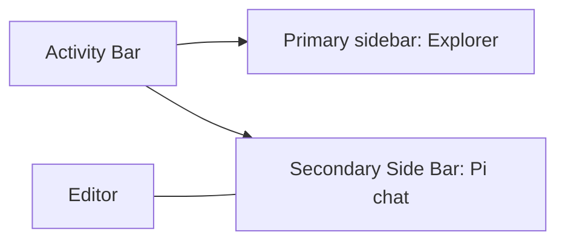

# Named parts of the Pi VS Code extension

English | [中文](plugin-parts.zh.md)

- Type: Reference
- Status: Living
- Created: 2026-10-01
- Authority: maintainer-facing names for visible surfaces; does not replace the [PRD](../product-requirements.md), [anatomy](sidebar-ui-anatomy.md), or [domain glossary](../../CONTEXT.md)
- Inspection: browser preview screenshots, 2026-10-01, synthetic host data. These are not F5 or installed-VSIX evidence. Number badges are study annotations and do not appear in the product.

## How to use this page

When you want to change something, open this page, match the screenshot, and say the **Chinese everyday name** plus the **English name** in parentheses. Example: “消息编辑区里的模型芯片（model chip）不要显示供应商.”

Code mapping and agent demonstration wording stay in the [sidebar anatomy](sidebar-ui-anatomy.md). Product rules stay in the [PRD](../product-requirements.md). Domain terms such as Live session stay in [CONTEXT.md](../../CONTEXT.md).

The screenshots come from the in-repo webview preview (Chinese UI except the empty-session capture). Preview session titles and model names are fake sample data.

## Three names that are easy to mix up

| Say this | English | Means | Do not use it for |
|---|---|---|---|
| 这个 VS Code 扩展 | this VS Code **extension** | pi-vscode: the thing you installed that draws the sidebar | pi’s loadable extensions |
| pi | **pi** / upstream runtime | the coding agent this extension talks to | the sidebar itself |
| pi 扩展 | **pi extension** | extra code pi may load (the Trusted choice in Execution profile) | this VS Code extension |

In chat, “插件” is ambiguous. Prefer the row above. A Settings “plugin manager” would manage **pi extensions**, not the VS Code extension.

## Where Pi sits in VS Code

<!-- docs-i18n: localized-mermaid -->

VS Code owns the Activity Bar, Explorer, editor tabs and window chrome. **Pi Chat Sidebar** is this extension’s Webview in the Secondary Side Bar (right) when the host supports it. An editor-title Pi icon is a host entry, not part of Pi’s session navigation.

You do not need host/adapter layer names to point at the UI. Those layers are in the [architecture](../architecture/vscode-extension-architecture.md).

## The chat sidebar

Three regions are always in the layout. A fourth region, **Task status and actions**, appears above the composer only when something needs attention.

| # | Everyday name | English | What it is |
|---|---|---|---|
| 1 | 会话导航栏 | **Session navigation** | Top strip: current title, History, New, Settings |
| 2 | 会话内容区 | **Conversation area** | Reading space: welcome, messages, or history |
| 3 | 消息编辑区 | **Message composer** | Bottom card: input, attachments, model, permissions, Send/Stop |

Do not call (3) 作曲区. That was a bad calque of *composer*. Do not call (1) a title bar: VS Code already has one.

The three icons on the right of (1):

| Icon | Everyday name | English |
|---|---|---|
| Clock | 历史 | **Session history** button |
| Plus | 新建对话 | **New conversation** |
| Gear | 设置 | **Settings** (opens the editor Settings page) |

### Empty session

When there are no messages yet, (2) is the **welcome state**: Pi mark + one greeting. Chinese copy is 「今天想做些什么？」. The capture below is the English preview default.

| # | Everyday name | English |
|---|---|---|
| 1 | 会话导航栏 | Session navigation |
| 2 | 欢迎区 | **Welcome state** (inside the conversation area) |
| 3 | 消息编辑区 | Message composer |

## Message composer

This is the bottom card. “Input” is only the text field; the composer includes the toolbar.

| # | Everyday name | English | What a click does |
|---|---|---|---|
| 1 | 消息输入框 | **Message input** | Type the task |
| 2 | 添加按钮 / 加号 | **Add context** | Opens the add-context **menu** |
| 3 | 模型芯片 | **Model chip** (trigger) | Opens the **model picker** |
| 4 | 权限入口 / 盾牌 | **Permissions** | Opens **Execution profile** (and session grants) |
| 5 | 发送 | **Send** | Same slot becomes **Stop** while a task runs |

The row under the input is the **composer toolbar**.

## Model picker

Opened from the model chip. In everyday speech call the whole floating card the **model picker**, not a popover, 弹出层, or dropdown. Inside it there is a model list and a thinking slider.

| # | Everyday name | English |
|---|---|---|
| 1 | 模型选择器 | **Model picker** (the card) |
| 2 | 当前模型名 | Model name row (click to open the list) |
| 3 | 推理强度滑条 | **Thinking** / reasoning **slider** |
| 4 | 模型芯片 | Model chip that opened it |

Clicking the name row opens the **model list**:

| # | Everyday name | English |
|---|---|---|
| 1 | 模型列表 | **Model list** (display names) |
| 2 | 供应商名 | **Provider** on the right of a row (`anthropic`, `openai`, …) |
| 3 | 推理强度滑条 | Thinking slider |

A parked presentation change will hide the provider on the chip and in this list. The screenshot is current behavior.

## Execution profile

Opened from the shield. Call this **Execution profile**, not a second settings page.

| # | Everyday name | English |
|---|---|---|
| 1 | 执行配置 | **Execution profile** (the card) |
| 2 | 受控执行 | **Controlled** execution |
| 3 | 受信执行 | **Trusted** execution (may load a **pi extension** after a native file picker) |
| 4 | 权限入口 / 盾牌 | Permissions control that opened it |

**Notes** and **Session grants** fold out inside the same card. Grants are this session’s tool allowances, not VS Code workspace trust.

Parked direction: opening the model picker or Execution profile should show only one card at a time.

## Add-context menu

Opened from +. This is a **menu** (a list of actions), not the model picker.

| # | Everyday name | English |
|---|---|---|
| 1 | 添加菜单 | **Add-context menu** |
| 2 | 添加按钮 | Add context button |

Typical items: add file, add selection. Attachment chips then appear above the input (**context attachments**).

## Session history panel

Opened from the clock. It **replaces** the conversation in the middle; the composer stays. This list is “which conversation?”, not “what did we already say in this one?”.

| # | Everyday name | English |
|---|---|---|
| 1 | 历史会话面板 | **Session history panel** (Back + title + refresh) |
| 2 | 已保存会话列表 | **Saved session** list |
| 3 | 消息编辑区 | Message composer (still present) |

Restored messages, if you open a saved session, are read in the conversation area. **Attachment history** is a different list, from the add-context menu, not from this panel.

## Settings page

The gear opens an **editor-area Settings page**, not a card above the composer. Categories are on the left.

| # | Everyday name | English |
|---|---|---|
| 1 | 设置分类 | Settings **categories** (General / Default model / Providers) |
| 2 | 语言 | **Language** (in-memory until the host restarts) |

| # | Everyday name | English |
|---|---|---|
| 1 | 默认模型分类 | **Default model** category |
| 2 | 已保存的默认模型 | **Saved default** model list |

This list is the pi-global default for new chats. It is not the same object as the live session’s current model, even when the names match.

| # | Everyday name | English |
|---|---|---|
| 1 | 供应商分类 | **Providers** category |
| 2 | 添加端点 | **Add endpoint** |
| 3 | 供应商列表 | Provider rows (configured / not) |

API keys are typed in a **VS Code password prompt**, not inside this page.

A Settings **Plugins** category lists remembered local pi extensions (WI-063: add, remove and enable) and is **not in these screenshots**. Runtime apply remains a later REQ-010 slice. Current Trusted loading still uses Execution profile.

## Surfaces that appear only when needed

No screenshot in this set. They show **above the composer** in the task-status region, or as a dialog:

| Everyday name | English | When |
|---|---|---|
| 工具审批 | **Tool approval** card | pi wants a covered tool allowed or denied |
| 修改审阅 | **Change review** | inspect already-applied captured diffs |
| 交互请求 | **Interaction** request | an extension asks for a choice or input |
| 运行恢复 | **Runtime recovery** | the runtime needs an explicit intervention |
| 项目资源同意 | **Project-resource consent** | whether to load project-local pi resources |
| 打开文件夹提示 | Open-folder prompt | an action needs a workspace folder |

**Stop** cancels the running task. Dismissing one interaction is not Stop.

## Words you will hear in conversation

| Everyday name | English | One-line meaning |
|---|---|---|
| 供应商 | **Provider** | who serves the model (`anthropic`, a custom endpoint name, …) |
| 模型 | **Model** | the selectable model id / display name |
| 推理强度 | **Thinking** / reasoning level | slider steps such as 低／中／高 (`low` / `medium`) |
| 活跃运行会话 | **Live session** | the conversation running now |
| 已保存默认 | **Saved default** | persisted default model + thinking for new chats |
| 已保存会话 | **Saved session** | a conversation you can restore later |
| 授权 | **Grant** | a session tool allowance you can inspect/revoke |
| 停止 | **Stop** | stop the task; does not undo finished edits |

Full definitions: [CONTEXT.md](../../CONTEXT.md).

## How to point at something you want changed

Use **region + control + state + desired result**:

- “消息编辑区的模型芯片（model chip），收起时不要显示供应商。”
- “打开模型选择器（model picker）时，如果执行配置已经开着，先关掉执行配置。”
- “设置页供应商分类（Providers）里，添加端点按钮再靠右一点。”

## Related documents

| Need | Document |
|---|---|
| Everyday names and pictures | this page |
| Code files for a region | [Sidebar anatomy](sidebar-ui-anatomy.md) |
| Required behavior | [PRD](../product-requirements.md) |
| Domain terms | [CONTEXT.md](../../CONTEXT.md) |
| Layers (host, adapter, runtime) | [Architecture](../architecture/vscode-extension-architecture.md) |
