# 这个 VS Code 扩展里各部分叫什么

[English](plugin-parts.md) | 中文

- 翻译状态：Machine Draft
- 权威原文：[plugin-parts.md](plugin-parts.md)
- 原文版本：Uncommitted baseline
- 最近同步：2026-10-01

- 类型：参考
- 状态：Living
- 创建：2026-10-01
- 权威：给维护者对照界面用的日常名称；不替代 [PRD](../product-requirements.zh.md)、[区域说明](sidebar-ui-anatomy.zh.md) 或[领域词汇表](../../CONTEXT.zh.md)
- 截图：2026-10-01 浏览器预览、合成数据，不是 F5 或安装包证据。图上的编号只用于讲解，产品里不会出现。

## 怎么用这份说明

以后要改界面时，打开这份说明，对上截图，用 **中文日常叫法**，需要时补上括号里的英文。例如：「消息编辑区里的模型芯片（model chip）不要显示供应商。」

找代码仍看[侧栏区域说明](sidebar-ui-anatomy.zh.md)。行为对错以 [PRD](../product-requirements.zh.md) 为准。Live session 这类领域词以 [CONTEXT.zh.md](../../CONTEXT.zh.md) 为准。

截图来自仓库里的 Webview 预览（除空状态那张是英文预览外，其余是中文界面）。标题和模型名是假数据。

## 三个特别容易混的词

| 请这样说 | 英文 | 指什么 | 不要拿它去指 |
|---|---|---|---|
| 这个 VS Code 扩展 | this VS Code **extension** | 你安装的 pi-vscode，画出侧栏的那一层 | pi 可以加载的那些扩展 |
| pi | **pi** / upstream runtime | 这个扩展去对接的编程代理 | 侧栏自己 |
| pi 扩展 | **pi extension** | pi 可能加载的额外代码（执行配置里选「受信」后出现） | 这个 VS Code 扩展 |

口头说「插件」容易混。设置里若做「插件管理」，管的是 **pi 扩展**，不是这个 VS Code 扩展。

## Pi 在 VS Code 里的位置

<!-- docs-i18n: localized-mermaid -->
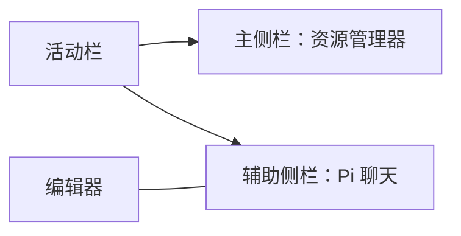

活动栏、资源管理器、编辑器标签和窗口边框是 VS Code 自己的。**Pi 聊天侧栏**是这个扩展画在辅助侧栏（右侧）里的 Webview。编辑器标题上的 Pi 图标只是宿主入口，不算会话导航栏的一部分。

指界面时不必说 host／adapter。分层见[架构](../architecture/vscode-extension-architecture.zh.md)。

## 聊天侧栏

平时能看到三块。第四块 **任务状态与操作区** 只在有事要处理时出现在消息编辑区上方。

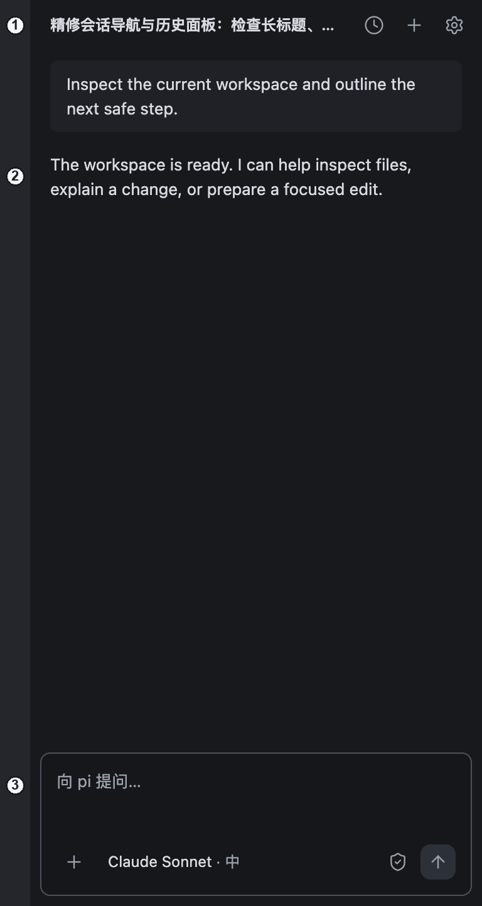

| # | 日常叫法 | 英文 | 是什么 |
|---|---|---|---|
| 1 | 会话导航栏 | **Session navigation** | 顶栏：当前标题、历史、新建、设置 |
| 2 | 会话内容区 | **Conversation area** | 阅读区：欢迎、消息或历史列表 |
| 3 | 消息编辑区 | **Message composer** | 底部卡片：输入、附件、模型、权限、发送／停止 |

不要把 (3) 叫「作曲区」，那是 composer 的误译。也不要把 (1) 叫标题栏，VS Code 自己已有标题栏。

(1) 右侧三个图标：

| 图标 | 日常叫法 | 英文 |
|---|---|---|
| 时钟 | 历史 | **Session history** 按钮 |
| 加号 | 新建对话 | **New conversation** |
| 齿轮 | 设置 | **Settings**（打开编辑区设置页） |

### 空会话

还没有消息时，(2) 是 **欢迎区**：Pi 标志 + 一句问候。中文是「今天想做些什么？」。下面这张是英文预览的默认文案。

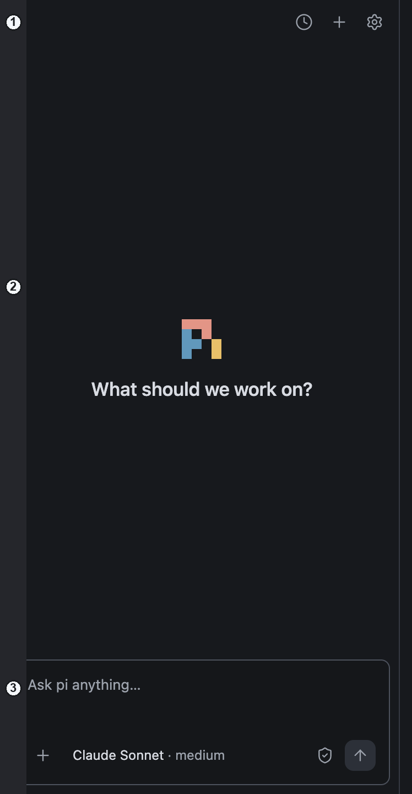

| # | 日常叫法 | 英文 |
|---|---|---|
| 1 | 会话导航栏 | Session navigation |
| 2 | 欢迎区 | **Welcome state**（属于会话内容区的一种状态） |
| 3 | 消息编辑区 | Message composer |

## 消息编辑区

这是底部那张卡片。「输入框」只指打字的地方；消息编辑区还包括下面一排按钮。

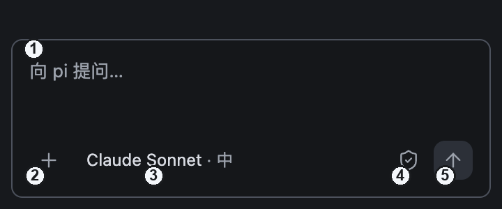

| # | 日常叫法 | 英文 | 点下去会怎样 |
|---|---|---|---|
| 1 | 消息输入框 | **Message input** | 写任务 |
| 2 | 添加按钮／加号 | **Add context** | 打开添加菜单 |
| 3 | 模型芯片 | **Model chip**（触发器） | 打开模型选择器 |
| 4 | 权限入口／盾牌 | **Permissions** | 打开执行配置（以及会话授权） |
| 5 | 发送 | **Send** | 任务进行中同一位置变成 **停止（Stop）** |

输入框下面那一排叫 **输入工具栏**。

## 模型选择器

从模型芯片打开。整张浮卡请叫 **模型选择器**，不要叫弹出层、弹层或下拉框。里面再分成模型列表和推理强度滑条。

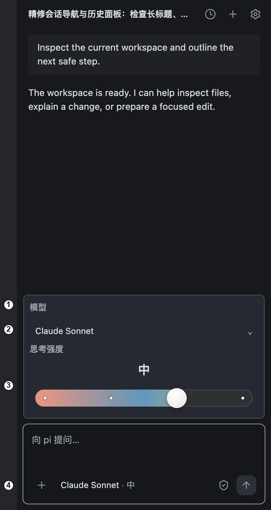

| # | 日常叫法 | 英文 |
|---|---|---|
| 1 | 模型选择器 | **Model picker**（整张卡片） |
| 2 | 当前模型名 | 模型名称行（再点一次打开列表） |
| 3 | 推理强度滑条 | **Thinking**／推理 **slider** |
| 4 | 模型芯片 | 打开它的那颗芯片 |

点名称行会展开 **模型列表**：

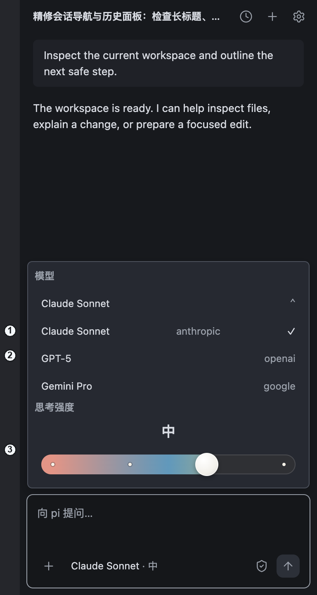

| # | 日常叫法 | 英文 |
|---|---|---|
| 1 | 模型列表 | **Model list**（显示名） |
| 2 | 供应商名 | 行右侧的 **Provider**（`anthropic`、`openai` 等） |
| 3 | 推理强度滑条 | Thinking slider |

已停放的展示改动会让芯片和列表都不显示供应商。截图是**现在**的样子。

## 执行配置

从盾牌打开。请叫 **执行配置**，不是第二个设置页。

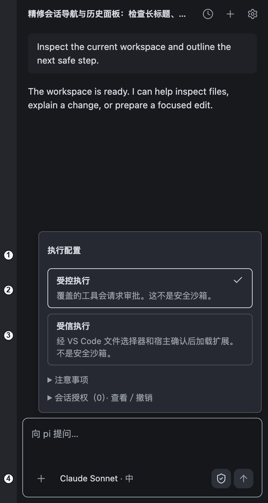

| # | 日常叫法 | 英文 |
|---|---|---|
| 1 | 执行配置 | **Execution profile**（整张卡片） |
| 2 | 受控执行 | **Controlled** execution |
| 3 | 受信执行 | **Trusted** execution（确认后可加载 **pi 扩展**） |
| 4 | 权限入口／盾牌 | 打开它的权限按钮 |

**注意事项** 和 **会话授权** 叠在同一张卡片里。授权是这场会话的工具许可，不是 VS Code 的工作区信任。

已停放的方向：模型选择器和执行配置一次只开一张。

## 添加菜单

从 ＋ 打开。这是一份 **菜单**（动作列表），不是模型选择器。

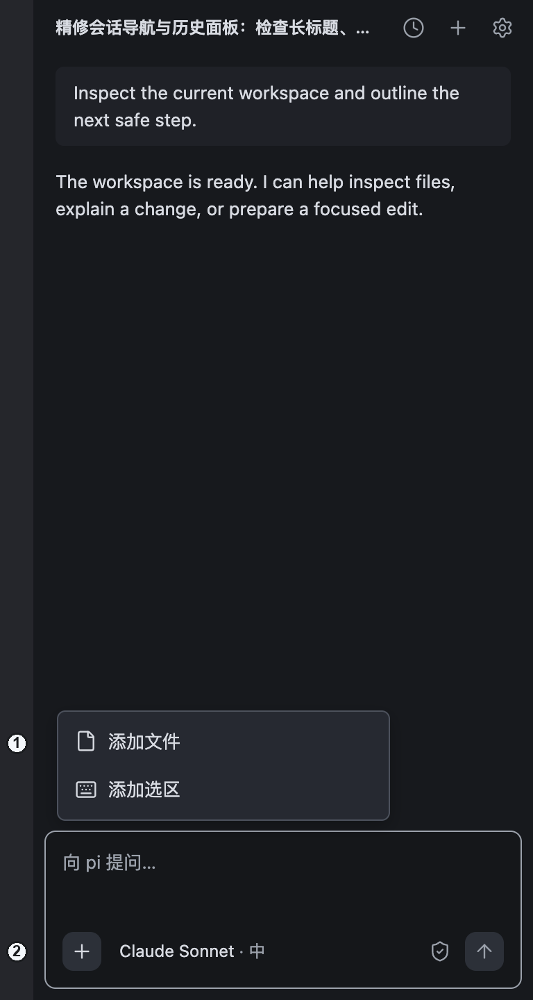

| # | 日常叫法 | 英文 |
|---|---|---|
| 1 | 添加菜单 | **Add-context menu** |
| 2 | 添加按钮 | Add context 按钮 |

常见项：添加文件、添加选区。选中后会在输入框上方出现附件芯片（**上下文附件**）。

## 历史会话面板

从时钟打开。它会**替换**中间的会话内容，底部消息编辑区还在。这张列表回答「打开哪场对话」，不是「这场对话以前说了什么」。

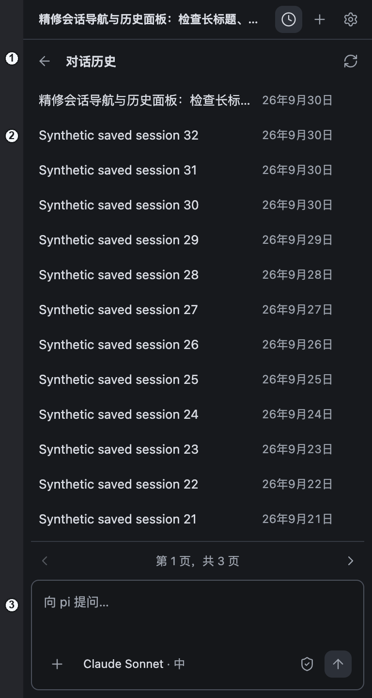

| # | 日常叫法 | 英文 |
|---|---|---|
| 1 | 历史会话面板 | **Session history panel**（返回、标题、刷新） |
| 2 | 已保存会话列表 | **Saved session** 列表 |
| 3 | 消息编辑区 | Message composer（仍然在） |

恢复某场会话后，旧消息在会话内容区阅读。**附件历史**是添加菜单里的另一类记录，不是这张面板。

## 设置页

齿轮打开的是 **编辑区设置页**，不是消息编辑区上方的卡片。左边是分类。

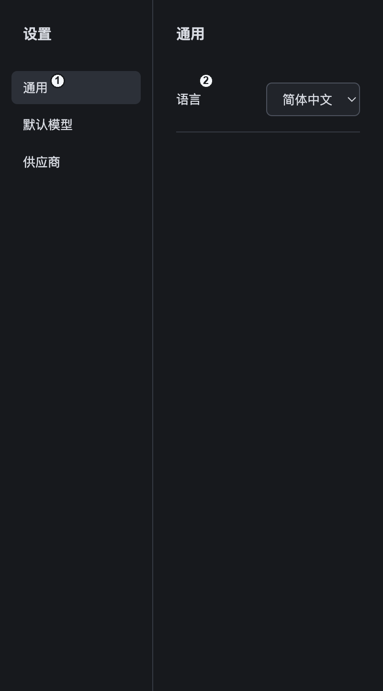

| # | 日常叫法 | 英文 |
|---|---|---|
| 1 | 设置分类 | Settings **categories**（通用／默认模型／供应商） |
| 2 | 语言 | **Language**（只记在宿主内存，重启后回到默认） |

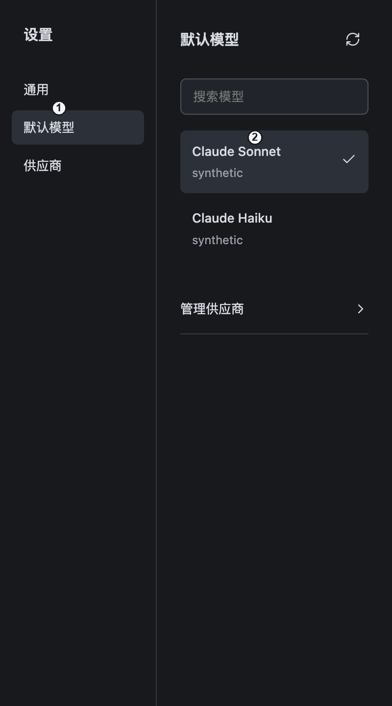

| # | 日常叫法 | 英文 |
|---|---|---|
| 1 | 默认模型分类 | **Default model** 分类 |
| 2 | 已保存的默认模型 | **Saved default** 模型列表 |

这是新对话用的 pi 全局默认，即使名字相同，也不等于当前这场活跃会话正在用的模型。

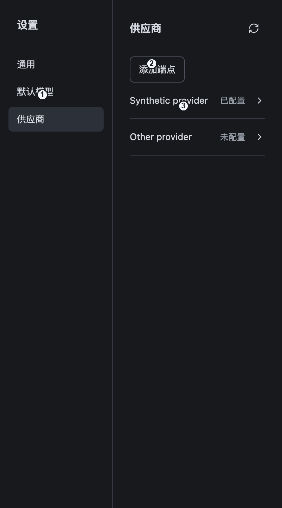

| # | 日常叫法 | 英文 |
|---|---|---|
| 1 | 供应商分类 | **Providers** 分类 |
| 2 | 添加端点 | **Add endpoint** |
| 3 | 供应商列表 | 供应商行（已配置／未配置） |

API key 是在 **VS Code 密码框**里输入的，不在这个页面里。

设置里的 **插件** 分类会列出已记住的本机 pi 扩展（WI-061：空列表＋从磁盘添加），**不在这些截图里**。移除、启用和运行时应用仍属后续 REQ-010 切片。当前受信加载仍走执行配置。

## 只在有需要时才出现的界面

这组没有截图。它们出现在消息编辑区**上方**的任务区，或作为对话框：

| 日常叫法 | 英文 | 什么时候出现 |
|---|---|---|
| 工具审批 | **Tool approval** 卡片 | pi 请求允许或拒绝某个被覆盖的工具 |
| 修改审阅 | **Change review** | 查看已经发生、并捕获到的差异 |
| 交互请求 | **Interaction** 请求 | 扩展要你做选择或输入 |
| 运行恢复 | **Runtime recovery** | 运行时需要你明确处理 |
| 项目资源同意 | **Project-resource consent** | 是否加载项目本地的 pi 资源 |
| 打开文件夹提示 | Open-folder prompt | 当前操作需要一个工作区文件夹 |

**停止（Stop）** 停的是正在跑的任务。关掉一次交互请求不等于 Stop。

## 聊天里还会听到的词

| 日常叫法 | 英文 | 一句话 |
|---|---|---|
| 供应商 | **Provider** | 模型从哪来（`anthropic`、自定义端点名等） |
| 模型 | **Model** | 可选的模型 id／显示名 |
| 推理强度 | **Thinking**／reasoning level | 滑条档位，如低／中／高（`low`／`medium`） |
| 活跃运行会话 | **Live session** | 现在正在进行的这场对话 |
| 已保存默认 | **Saved default** | 给新对话用的、已记住的默认模型和推理强度 |
| 已保存会话 | **Saved session** | 以后可以再打开的一场对话 |
| 授权 | **Grant** | 这场会话里可以查看／撤销的工具许可 |
| 停止 | **Stop** | 停任务；不会撤销已经改完的文件 |

完整定义见 [CONTEXT.zh.md](../../CONTEXT.zh.md)。

## 以后怎么指给我看要改哪

用 **区域 + 控件 + 状态 + 期望**：

- 「消息编辑区的模型芯片（model chip），收起时不要显示供应商。」
- 「打开模型选择器（model picker）时，如果执行配置已经开着，先关掉执行配置。」
- 「设置页供应商分类（Providers）里，添加端点按钮再靠右一点。」

## 相关文档

| 需要 | 文档 |
|---|---|
| 日常名称和图片 | 本页 |
| 某一区域对应的代码 | [侧栏区域说明](sidebar-ui-anatomy.zh.md) |
| 规定的行为 | [PRD](../product-requirements.zh.md) |
| 领域术语 | [CONTEXT.zh.md](../../CONTEXT.zh.md) |
| 分层（host、adapter、runtime） | [架构](../architecture/vscode-extension-architecture.zh.md) |
